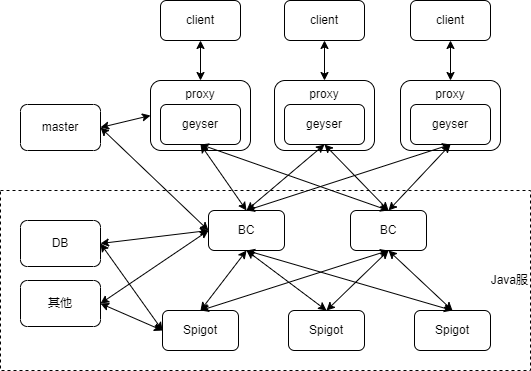

---
front:
hard: 入门
time: 60分钟
---

# 支持基岩版客户端的Java版网络游戏概述

## 目的

- 本文档旨在阐述通过Apollo工具，搭建并部署Java版网络游戏的流程

- 玩家能够通过基岩版手机客户端进入Java版网络游戏中进行游玩

- 开发者可以使用基岩版已有的模组SDK和附加包Json制作客户端的玩法逻辑和表现，需要的技术与中国版基岩版组件开发相似。部分功能可能无法生效

## 前置知识

### 名词介绍
- Spigot、Spigot服

	> Spigot是一个开源的、高效的Java版MC服务器，并且提供了丰富的api可以编写插件。他是由第三方提供的，并非官方提供，是由官方的minecraft server反编译后，打进去一些patch后而来

- BC、BungeeCord、BC服

	> BungeeCord（后面简称BC）是一个代理，提供了切服、数据包转发、插件编写、BC指令等等

- Geyser、Geyser服、协议服

	> Geyser是第三方开源的MC协议转换工具，它能把MC-Bedrock版本协议转换为MC-java版本协议，也就是说通过Geyser，我们能实现基岩版客户端进入Java版服务器游玩的效果

- Master服、Proxy服

	> 见[名词解释](../课程2：Apollo基础知识/第2节：Apollo框架.md)

## 框架示例和讲解

如框架图所示，为了尽可能地兼容不同服主Spigot服框架，我们把整体的Java版网络游戏分为两部分：

- 负载/协议转换部分(上半部分)

- Java服部分(下半部分)

接着阐述每个部分的具体作用

- 负载/协议转换部分
    - 这一部分包括了Master服、Proxy服、Geyser服
    - Master和Proxy服作用和基岩版网络游戏一致
    - 由于基岩版和Java版的游戏数据协议包格式并不相同，因此，Geyser服则扮演着协议转换者的角色，它负责把基岩版的协议转换为Java版的协议

- Java服部分
    - 这一部分为Java游戏服，它的作用相当于基岩版网络游戏中，Lobby服和Game服的结合体，是存储玩家实际游玩数据以及世界数据的服务器
    - 它主要由两部分组成，BC服和Spigot服
    - 架构图中的DB则指额外数据库（可选）、其他则是指用于进一步管理BC、Spigot或者其他更多功能的第三方应用程序（可选）

为了可扩展地连接起上下两部分，框架中，我们会把Java服视为黑盒，并为BC服提供名为**BungeeMaster**的插件，这个插件安装在BC服上，负责建立起BC服和Master服的通信连接。

## 常见问题

Q：如何申请使用Spigot开服

A：在开发者平台提交入驻申请，选择作品管理-上架与资源管理-网络游戏-基岩版开服工具游戏-入驻申请，使用框架勾选spigot，认真填写入驻申请。

Q：服务端可以使用Spigot插件么？

A：理论上可以使用来自Spigot插件市场的插件，目前已有一批广泛使用的插件经过了测试。

Q：我需要使用哪个版本的Spigot？是否支持Paper-Spigot？

A：推荐使用1.12.2版本的spigot，其他版本不保证可以运行且官方不做技术支持。

Q：是否支持手机和电脑同服？

A：目前仅支持手机端，如果您需要双端同服，可以选择使用Apollo进行开服。

Q：使用的客户端是什么？支持forge么？

A：使用的客户端是中国版的《我的世界》基岩版，目前是1.18；很遗憾，基岩版客户端不支持forge，推荐使用官方推出的模组SDK替代。

Q：我是否可以将Spigot PC服移植到PE？

A：可以，我们欢迎您这么做。但是对于客户端逻辑来说，您需要重写逻辑。