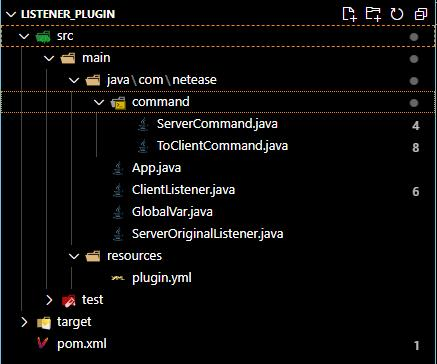
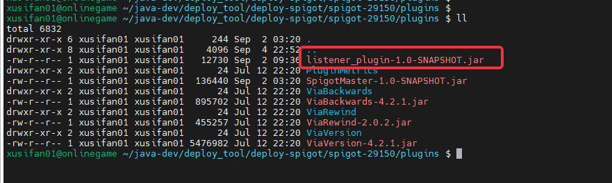
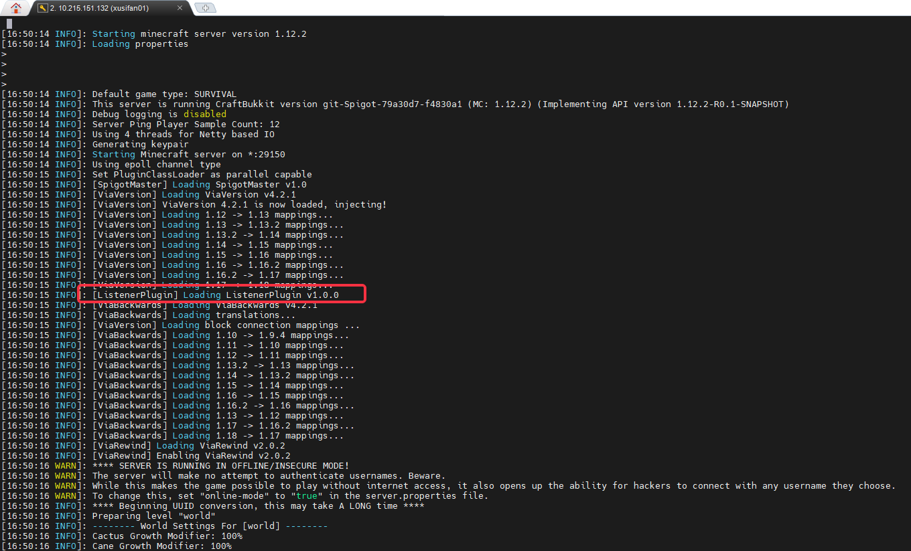

---
front:
hard: 入门
time: 60分钟
---

# Spigot插件结构与部署

### Spigot插件目录结构样例

	listen_plugin
		main
	        java\com\netease
	            command
	                ServerCommand.java
	                ToClientCommand.java
	            App.java
	            ClientListener.java
	            GlobalVar.java
	            ServerOriginalListen.java
	        resouces
	            plugin.yml

| 文件/文件夹               | 解释                                                         |
| -------------------------              | ------------------------------------------------------------ |
| java\com\netease                | 插件逻辑代码目录                                              |
| command                         | 指令处理类目录                          |
| App.java                        | 插件入口                                                       |
| ClientListener.java             | 客户端事件监听处理函数 |
| GlobalVar                       | 通用数据储存类 |
| ServerOriginalListen            | Spigot原生事件监听处理函数 |
| resouces                        | 插件资源版本信息                                                     |
| plugin.yml                      | mod资源版本信息                                                     |

## Spigot插件加载流程
- 如图所示，把mvn clean install编译出的xxx.jar放入Spigot的Plugin文件夹
  

- Spigot加载插件后，会有输出，具体命名由plugin.yml决定
  