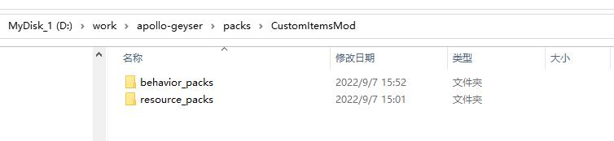

---
front:
hard: 入门
time: 60分钟
---

# 客户端Mod结构与部署

## 客户端Mod的目录结构样例

我们以demoMod为示例介绍游戏服Mod目录结构：

	demoMod
		behavior_packs
	            behavior_pack_geyser_demo_mod
	                    geyserDemoMod
	                        geyserDemoModScript
	                            modClient
	                            modCommon
	                            modMain.py
	                            __init__.py
	                    entities
	                    manifest.json
		resource_packs
			resource_pack_geyser_demo_mod
	                    manifest.json

| 文件/文件夹               | 解释                                                         |
| -------------------------              | ------------------------------------------------------------ |
| demoMod                                | 游戏服Mod根目录                                              |
| behavior_packs                         | 存放客户端行为包，可以包含多个行为包                           |
| behavior_pack_geyser_demo_mod          | 行为包                                                       |
| geyserDemoMod                          | python脚本的根目录，该目录的脚本会被加到python运行环境下，可以从该路径开始import脚本文件，例如from geyserDemoMod import modMain |
| modClient                              | pytho客户端行为逻辑，包含GeyserDemoModClientSystem|
| modCommon                              | 通用数据，包含Modname、自定义事件等定义 |
| resource_packs                         | 存放客户端资源，可以包含多个资源包                           |
| resource_pack_geyser_demo_mod          | 资源包                                                       |
| pack_manifest.json          | mod资源版本信息                                                     |

更多模组SDK内容详见:
<a href="../../20-玩法开发/13-模组SDK编程/2-Python脚本开发/0-脚本开发入门.html#modmain-py是什么" target="_blank">mod开发简介</a>

## 客户端Mod上传加载流程
- 如图所示
  - mod目录结构
  
  - studio配置
  

- Geyser读取客户端Mod后，会有如下输出

