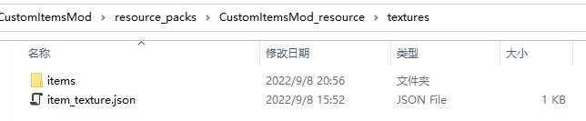

---
front:
hard: 入门
time: 60分钟
---

# 自定义物品Demo详解

## 前置知识

[Spigot服自定义物品原理简介](../22-Spigot服自定义物品原理简介.md)

### DEMO详解

[示例Demo](../99-下载内容.html#示例demo)中的CustomItemDemo包含了客户端mod及spigot插件。

Demo实现了11个不同的自定义物品：
- 剑 (customitem:item_1)

    当鼠标右键方块时，方块所在位置发生半径为1.5格的爆炸
- 斧 (customitem:item_2)

    当鼠标右键方块时，方块所在位置出现落雷效果，并随机生成物品，必定掉落**铲**
- 铲 (customitem:item_3)

    当鼠标右键方块时，方块所在位置出现落雷效果，并随机生成物品，必定掉落**剩余自定义物品**
- 锄 (customitem:item_4)

    自定义物品的耐久度, 2/60(剩余耐久/总耐久)
- 弓 (customitem:item_5)

    自定义弓箭，无特殊效果
- 稿 (customitem:item_11)

    自定义弓箭，无特殊效果
- 胸甲 (customitem:item_6)

    自定义胸甲，无特殊效果
- 腿甲 (customitem:item_7)

    自定义护腿，无特殊效果
- 鞋甲 (customitem:item_8)

    自定义鞋子，无特殊效果
- 头甲 (customitem:item_9)

    自定义头盔，无特殊效果
- 盾甲 (customitem:item_10)

    自定义盾牌，无特殊效果

### 开发流程

#### 客户端Mod编写

##### 目的
    为了让Geyser能加载新增的自定义物品，我们需要编写客户端Mod

##### 流程

- 在behavior文件夹中新建**netease_item_beh**目录，如下图所示

    

- 在**netease_item_beh**目录下新增11个物品Json，其中"java_identifier"字段用于标识自定义物品的原生Java换皮物品。样例如下：

    

- 在**resource**文件夹中新建**netease_item_res**、**texts**、**textures**目录，如下图所示

    

    这三个目录的作用分别如下：
    - **netease_item_res**用于存放自定义物品客户端贴图表现Json
    - **texts**用于存放自定义内容的中文命名
    - **textures**用于存放自定义内容的贴图文件

- 在**netease_item_res**目录下新增三个物品Json，样例如下：

   样例中，我们通过**minecraft:icon**这个**Component**为物品设置贴图

    

- 在**texts**目录下新增**zh_CN.lang**文件，设置自定义物品的名称，样例如下：

    

- 在**textures**目录下新增**item_texture.json**文件，设置物品贴图对应的贴图路径，样例如下：

    

    

- 至此，客户端Mod中自定义物品完成

#### Spigot插件编写

##### 目的
    为了让自定义物品能有不同的效果、功能，我们还需要编写Spigot插件，实现不同物品的不同效果逻辑

##### 流程

1. 安装SpigotMaster插件

    详见[下载内容](../99-下载内容.md)

2. 如App.java所示，实例ServerOriginalListener监听了Spigot原生事件

    通过下述接口实现
    ```
    getServer().getPluginManager().registerEvents(new ServerOriginalListener(), this);
    ```

3. 实例**ServerOriginalListener**监听了Spigot原生的事件，**ServerOriginalListener**监听方法如图：
示例中，**ServerOriginalListener**一共监听了两个事件，如下:
   - 玩家加入事件(PlayerJoinEvent), 效果为玩家加入游戏时，给玩家自动发放两个物品
   - 玩家交互事件(PlayerInteractEvent)，效果为玩家和方块右键交互时，根据不同自定义物品，触发不同的效果

        

4. 创建物品
- 通过Spigot提供的Api，创建物品ItemStack
    ```
    @Param material 物品material(自定义物品的material通过下一步获取)
    @Param amount 物品数量
    ItemStack customItem1 = new ItemStack(material, amount);
    ```
- 在创建ItemStack时，自定义物品的Material必须与"java_identifier"字段一致

- 同时，通过下述接口，为物品设置基岩版中对应的Identifier
    **PS: 这一步为必须步骤，缺少这一步时，会导致客户端无法正常生成自定义物品**
    ```
    @Param itemStack 通过Spigot接口生成的ItemStack
    @Param itemIdentifier 自定义物品Identifier,需要和客户端Mod中定义一致
    SpigotMaster.setCustomItemIdentifier(itemStack, itenIdentifier)
    ```
- 根据需要，再进一步修改ItemStack的其他属性，如样例中的lore

5. 使用物品
- 通过事件参数获取ItemStack：
    ```
    ItemStack item = event.getItem();
    ```
- 通过接口获取物品的Identifier:
    ```
    @Param itemStack 通过Spigot接口生成的ItemStack
    @Return String itemIdentifier，非自定义物品返回null
    SpigotMaster.getCustomItemIdentifier(itemStack)
    ```
    根据获取到的Identifier实现不同的逻辑,如图所示

    

6.运行mvn clean install，会在插件target下生成插件.jar,把生成的jar放置于Spigot服的plugin文件夹下

7.最终实现的效果如下：
- 玩家进入游戏即可获取两个自定义物品

    

- 使用剑时发生爆炸
- 使用斧时有打雷效果，并生成物品，其中物品必掉落铲
- 使用铲时有打雷效果，并掉落剩余所有自定义物品

### Q&A

- **SpigotMaster插件**简要API文档

  [SpigotMaster插件API文档](../81-SpigotMasterAPI文档.md)


### **需要注意的是**
- 由于目前自定义物品为Java换皮物品，因此字段工具挖掘速度、挖掘等级需要和Java物品对应，不然会出现方块破坏速率不一致导致的卡方块现象。
      ```
      "netease:weapon":{
        "type":"shovel",
        "level":0,
        "speed":2
      }
      ```

具体对应关系如下：

| 键            | 类型 | 默认值 | 解释                                                         |
| ------------- | ---- | ------ | ------------------------------------------------------------ |
| type          | str  |        | 武器/工具的类型,目前支持类型有：<br>sword：剑<br>shovel：铲<br>pickaxe：镐<br>hatchet：斧<br>hoe：锄头 |
| level         | int  |        | level为0：当速度为2对应木板,否则对应金锭 <br>level为1：对应石头<br>level为2：对应铁锭<br>level为3：对应钻石<br>level大于3：无法使用铁砧修复 |
| speed         | int  | 0      | 对采集工具生效，表示挖掘方块时的基础速度<br>木头：2<br>石头：4<br>铁：6<br>钻石：8<br>金：12 |


样例中，为木头工具换皮，因此为level：0, speed：2

- 同理，盔甲字段，需要和Java物品对应
      ```
      "netease:armor":{
        "armor_slot":2
      }
      ```
    盔甲槽位，详见<a href="../../../../mcdocs/1-ModAPI/枚举值/ArmorSlotType.html" rel="noopenner"> ArmorSlotType </a>
