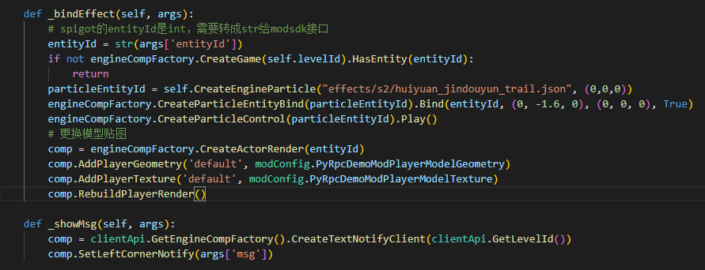
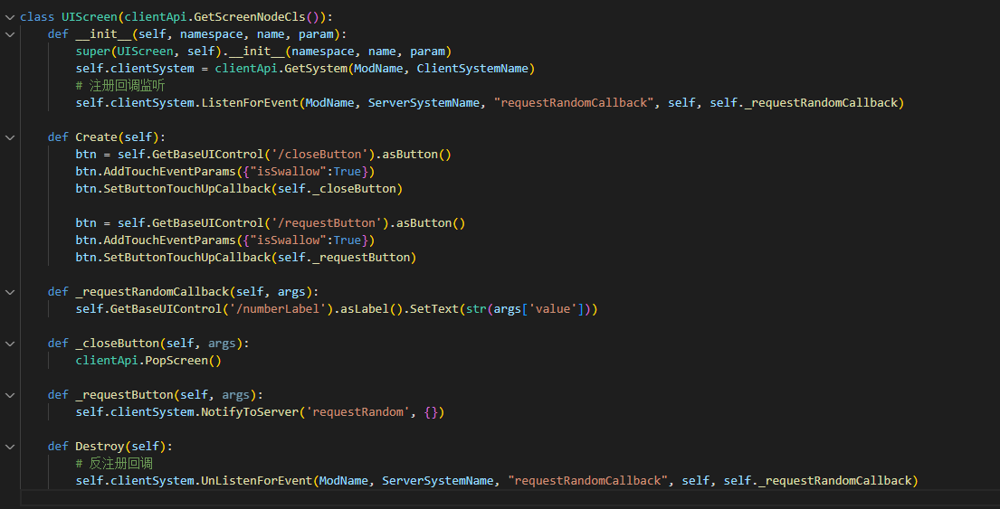

---
front:
hard: 入门
time: 30分钟
---

# PyRpcDemo详解

## 前置知识

[Spigot服与客户端python通信原理简介](../21-Spigot服与客户端python通信原理简介.md)

## DEMO详解

[示例Demo](../99-下载内容.html#示例demo)中的PyRpcDemo包含了客户端mod及spigot插件。

进入游戏后会在右侧显示3个按钮

* 点击“打开窗口”会弹出一个UI，再点击“获取随机数”会从spigot获取一个0-9的随机数并显示在ui上。点击x关闭
* 点击“绑定特效”会通知当前world内所有玩家，给发起玩家替换模型并挂接一个特效

* 点击”广播消息“会在spigot内所有玩家的聊天栏显示一条消息

### 客户端部分

1. 在客户端初始化时注册UiInitFinished事件，并在UiInitFinished事件中创建三个按钮的ui，注册后续将要使用的弹出窗口ui

   注册两个自定义事件：

   - bindEffect：给entityId参数对应实体更换模型以及创建特效
   - showMsg：在本地显示聊天栏消息

2. 在为三个按钮注册回调函数

   ”打开窗口“按钮抬起时弹出随机数的ui

   ”绑定特效“和”广播消息“按钮抬起时给spigot发送自定义消息

   

3. 在随机数的ui创建时监听获取随机数的回调事件，将参数中的值显示到label控件上

   注册按钮回调：”获取随机数“按钮抬起时向spigot发送一个自定义消息，关闭按钮抬起时弹出界面

   界面销毁时反监听获取随机数的回调事件

### spigot部分

- 初始化时注册自定义事件，分别为：
  - requestRandom：给玩家返回随机数获取回调
  - requestBindEffect：给本人返回-2的entityId，给world内其他人返回spigot的entityId
  - requestMsg：给spigot内所有人返回消息

