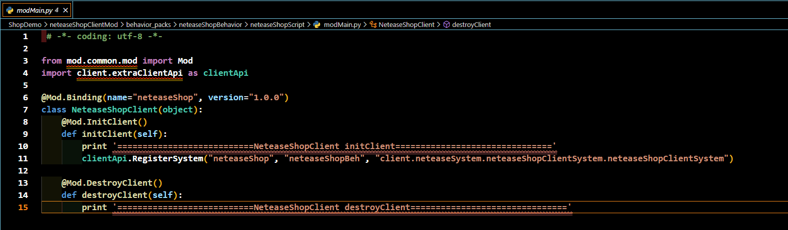
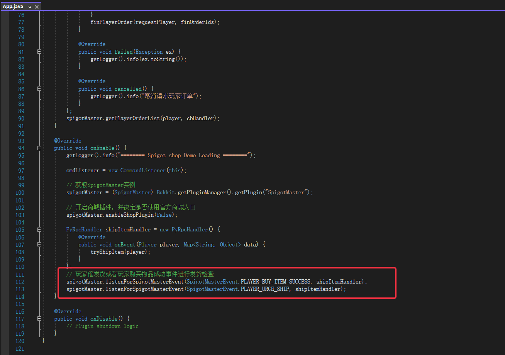
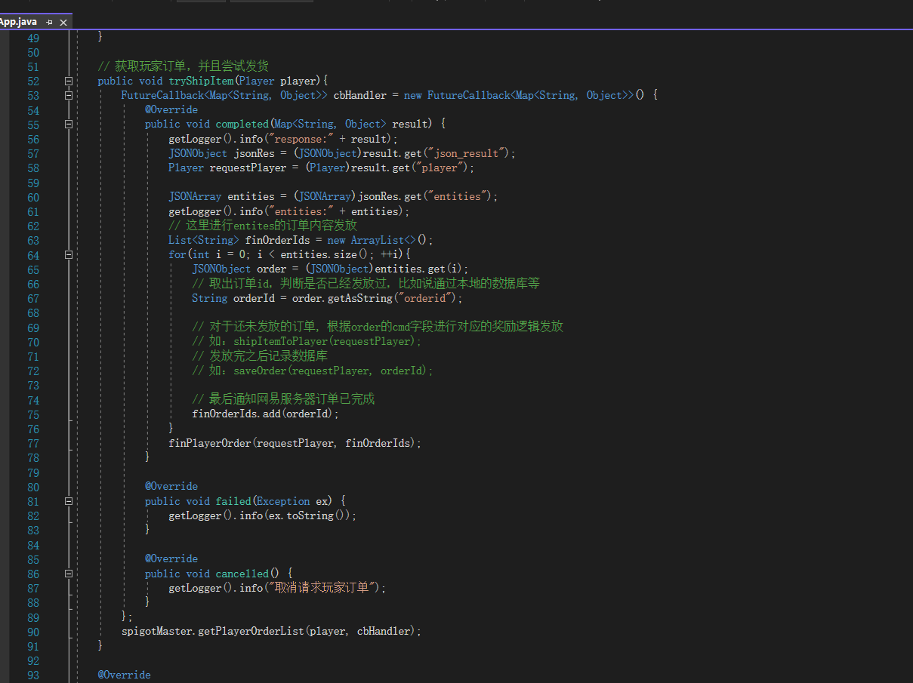

---
front:
hard: 入门
time: 30分钟
---

# 商城Demo详解

Demo给出了基于目前SpigotMaster提供的接口接入商场的基础方案

- 提供了四个命令
    - openShop

        打开玩家商城界面
    - closeShop

        关闭玩家商城界面
    - showOne tips

        弹出冒泡提示
    - showTwo tipHead tipsTail

        弹出拼接后冒泡提示


- 客户端部分很简单，只需简单地注册客户端即可

    

- Spigot插件部分主要包含两个接口的调用

    - spigotMaster.getPlayerOrderList(player, callback)
     该接口用于获取指定玩家尚未发货的所有订单

    - spigotMaster.finPlayerOrder(player, callback)
     该接口用于通知网易服务器标记指定订单已发货

    值得注意的是，目前两个接口采用http异步请求，意味着调用**finPlayerOrder**后，订单不一定已经标记完成。

    如果出现已经通知过网易服务器完成发货的订单，请调用**finPlayerOrder**再次通知网易服务器

# 插件逻辑流程

- 通过enableCustomShopEntry接口决定是否使用自定义的入口，参数为false时，开启官方商城入口。参数为true时，官方商城入口不显示，由开发者自行决定入口ui逻辑

    注意，该接口为首次初始化调用即可，重复调用多次无效

- 首先是调用listenForSpigotMasterEvent接口，监听SpigotMaster抛出的事件
    分别为：玩家购买物品成功事件、玩家催促发货事件
    

- 收到两个事件其中之一时，调用getPlayerOrderList接口，请求获取玩家订单
    

# 重要提醒：
- 如果mc游戏已经对订单发货，但**getPlayerOrderList**仍然返回了该条订单，请不要重复发货。请mc游戏服务必再次调用接口**finPlayerOrder**，再次通知网易服务器修改订单状态
- 强烈建议mc服务器对订单发货进行排队处理，避免并发时发生重复发货的情况
- 返回的订单列表数量上限为100，如果玩家未发货订单超过100，则超出的订单下次请求返回

# getPlayerOrderList返回Json样例
```
{
    // code为0表示成功返回，否则失败，错误码参考错误码列表
    "code": 0,
    "message": "正常返回",
    "details": "",
    "entities": [
        {
            // item_id:商品id，仅记录用
            "item_id": 90027446413343740,

            // uuid:玩家的唯一编号
            "uuid": "8a0886b5-eeb5-41f0-b517-f65691a2ce3b",

            // item_num:玩家购买的道具数量
            "item_num":1,

            // orderid:订单编号
            "orderid":1234,

            // cmd:实现指令（商品唯一标识，请以此判断玩家购买的是什么商品，空字符串为官方预留，服务器自己设置的cmd内容是不允许为空字符串的）
            "cmd":"test",

            // buy_time:购买时间戳
            "buy_time":1230782400,

            // group:道具分类
            "group" : 1

            // type:道具类型（保留，一般默认为空字符串，官方活动奖励会用到）
            // extra:额外数据（保留，一般默认为空字典，官方活动奖励会用到）

        },
        {
            "item_id": 90027446413343740,
            "uuid": "8a0886b5-eeb5-41f0-b517-f65691a2ce3b",
            "item_num":1,
            "orderid":1234,
            "cmd":"test",
            "buy_time":1230782400,
            "group" : 1
        }
    ]
}
```

# finPlayerOrder返回Json样例
```
{
    // code为0表示成功返回，否则失败，错误码参考错误码列表
    "code": 0,
    "message": "正常返回",
    "details": "",
    "entities": []
}
```

# 错误码列表

- 0：成功返回
- 4：参数为空
- 12：参数错误
- 18：数据库内部错误
- 52：订单不存在
- 53：签名错误
- 54：订单状态错误，原因是该订单未扣费或mc游戏中已经发过货
- 55：玩家未购买该网络游戏
- 56：秘钥未分配