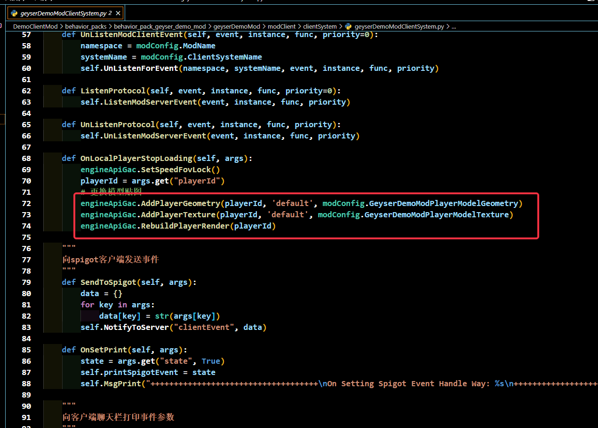
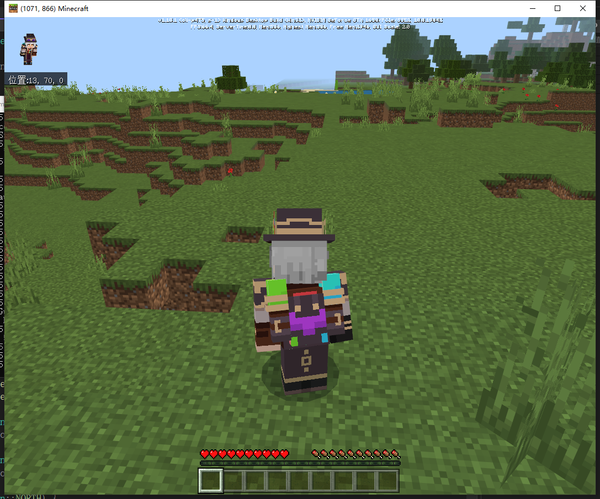
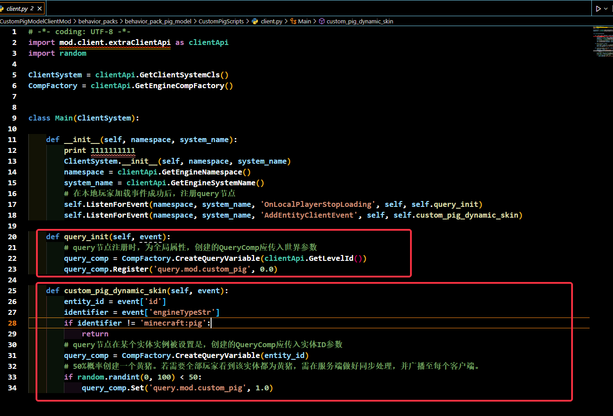
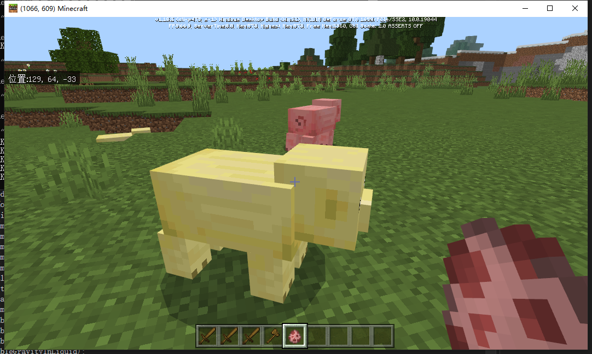

---
front:
hard: 入门
time: 40分钟
---

#  自定义生物模型详解

[示例Demo](../99-下载内容.html#示例demo)中的包含CustomHumanModelDemo和CustomPigModelDemo。其中

修改玩家模型的demo为：CustomHumanModelDemo
- 修改玩家模型

修改原版猪生物模型的demo为：CustomPigModelClientMod
由于修改猪为存客户端逻辑，因此不需要Spigot插件即可
- 50%几率生成黄皮肤猪（修改原生生物模型）

## 修改玩家模型流程
- 自定义模型以及json详细参数详见：
    [自定义生物](../../../20-玩法开发/15-自定义游戏内容/3-自定义生物/01-自定义基础生物.md)

- 具体生效逻辑为：
    

- 最终效果图如下：
    

## 修改原生猪模型流程
- 具体生效逻辑为：
    - 初始化molang变量
    - 当生成生物时，根据生物entityid创建molang变量，最终赋值

        
    - 赋值后，由于自定义猪的render_controller中根据猪molang值判断，若符合条件，则为变色猪
- 最终效果如下：
    
