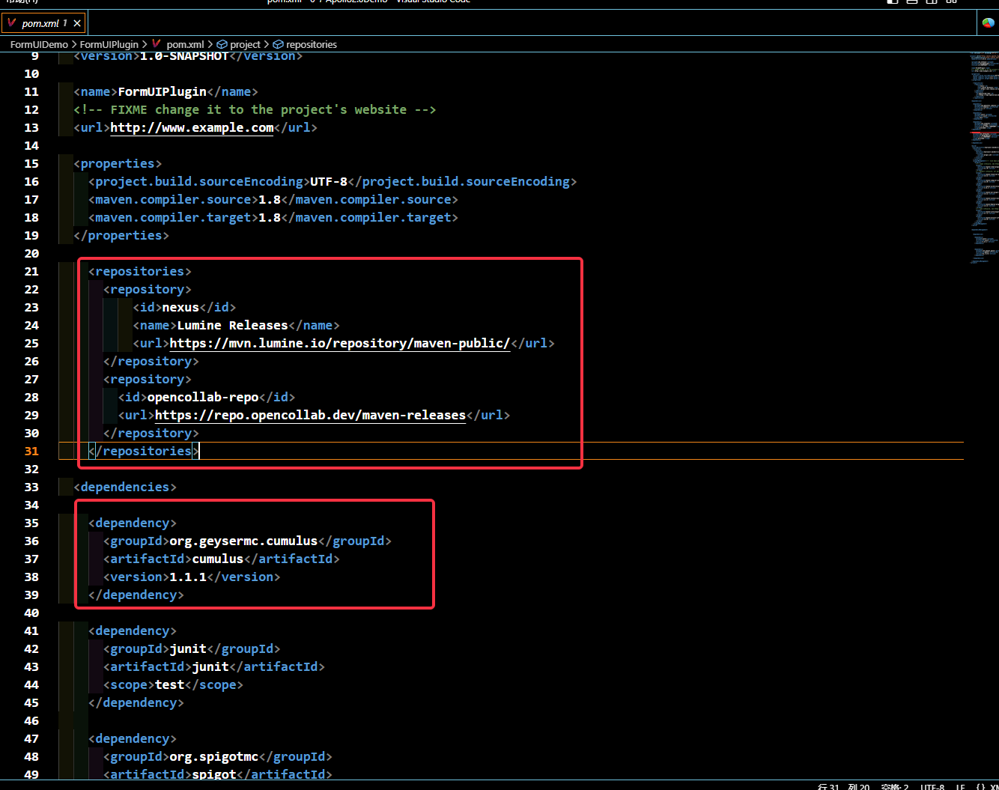
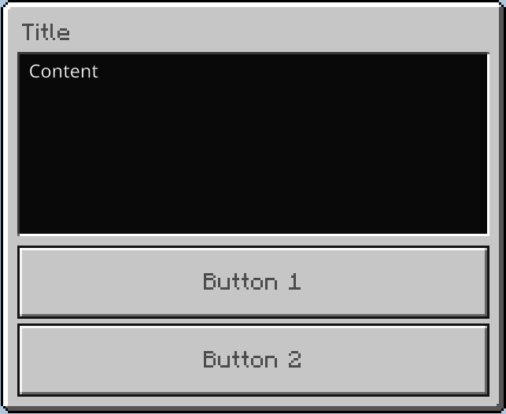
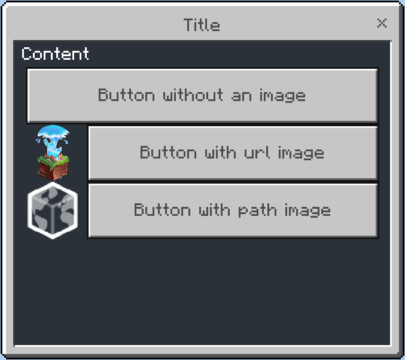
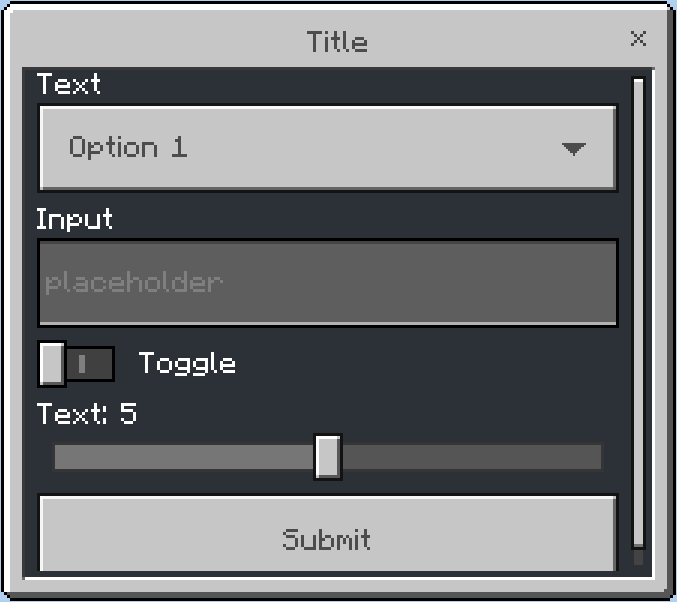
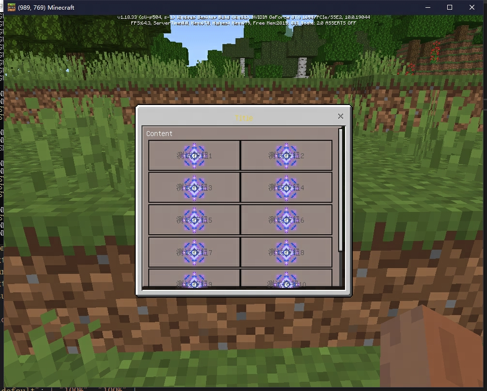
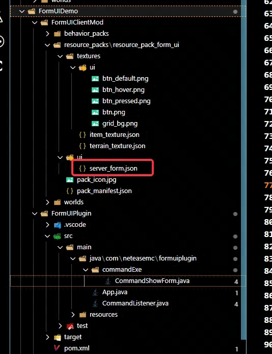
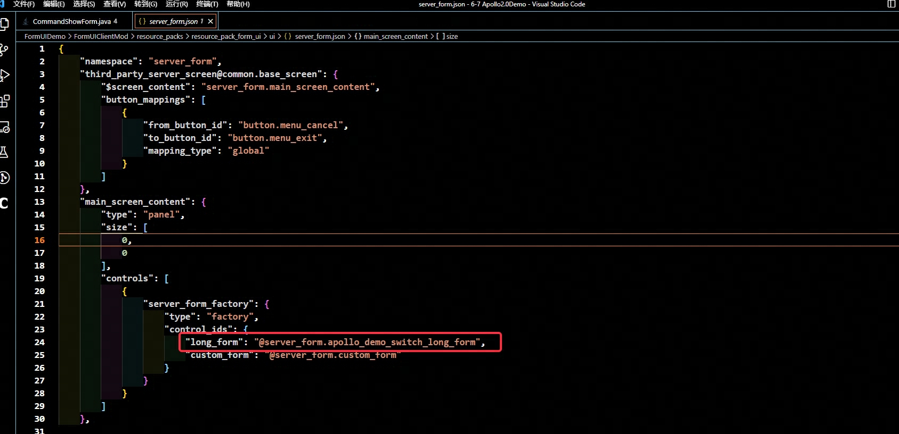
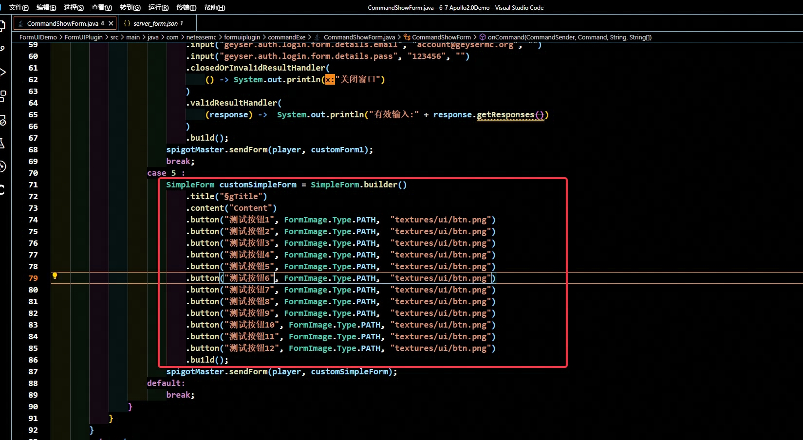

---
front:
hard: 入门
time: 40分钟
---

#  ServerFormDemo详解

## 概要
Geyser的服务端FormUI基于Cumulus，允许开发者直接通过服务端接口生成客户端UI，不需要编写客户端Mod。

基础的用法和 [Geyser官方文档](https://wiki.geysermc.org/geyser/forms/) 中演示的相差不大，只是发送逻辑需要通过SpigotMaster调用，而不是Floodgate插件


## 准备工作
在编写FormUI逻辑前，需要先添加依赖，具体如下图所示:

  ```
    <repositories>
      <repository>
          <id>nexus</id>
          <name>Lumine Releases</name>
          <url>https://mvn.lumine.io/repository/maven-public/</url>
      </repository>
      <repository>
        <id>opencollab-repo</id>
        <url>https://repo.opencollab.dev/maven-releases</url>
      </repository>
    </repositories>

    <dependency>
      <groupId>org.geysermc.cumulus</groupId>
      <artifactId>cumulus</artifactId>
      <version>1.1.1</version>
    </dependency>
  ```

  


## Java插件开发流程

Demo中的Java插件演示了三种FormUI及FormUI响应处理逻辑，其具体的适用范围、实际效果我们一一讲述。

### ModalForm

- 应用场景：

  - ModalForm是最简单的表单形式，但可定制程度较低

  - 仅支持标题、内容和两个按钮

- 命令格式为：
  ```
  /showForm 1
  ```

- 具体代码示例如下：
  ```
  ModalForm.Builder builder = ModalForm.builder()
      .title("Title")
      .content("Content")
      .button1("Button 1")
      .button2("Button 2")
      .validResultHandler((response) -> {
        if (response.clickedButtonId() == 0){
            System.out.println("点击了Button 1");
        }
        else{
            System.out.println("点击了Button 2");
        }
      });
  spigotMaster.sendForm(player, builder);
  ```

- 最终效果如下：

  

### SimpleForm

- 应用场景：

  - SimpleForm比ModalForm稍显复杂，但是可定制程度也更高，支持带图片按钮

  - 仅支持标题、内容和不限数量的按钮

- 命令格式为：
  ```
  /showForm 2
  ```

- 具体代码示例如下：
  ```
  SimpleForm simpleForm = SimpleForm.builder()
      .title("Title")
      .content("Content")
      .button("Button without an image", FormImage.Type.PATH, "")
      .button("Button with URL image", FormImage.Type.URL, "https://github.com/GeyserMC.png?size=200")
      .button("Button with path image", FormImage.Type.PATH, "textures/map/map_background.png")
      .build();
  spigotMaster.sendForm(player, simpleForm);
  ```

- 最终效果如下：

  

### CustomForm

- 应用场景：

  - 最为复杂，但是可定制程度最高

  - 支持标题、内容、标签列表、滑块、输入等等

- 命令格式为：

  ```
  /showForm 3
  ```

- 具体代码示例如下：
  ```
  CustomForm customForm = CustomForm.builder()
      .title("Title")
      .dropdown("Text", "Option 1", "Option 2")
      .input("Input", "placeholder")
      .toggle("Toggle")
      .slider("Text", 0, 10, 1, 5)
      .validResultHandler(
          (response) -> {
              System.out.println("option:" + response.asDropdown(0));
              System.out.println("input:" + response.asInput(1));
              System.out.println("toggle:" + response.asToggle(2));
              System.out.println("input1:" + response.asInput(3));
              System.out.println("slider:" + response.asSlider(4));
          }
      )
      .build();
  spigotMaster.sendForm(player, customForm);
  ```

- 最终效果如下：

  

### Form表单响应处理函数

- 命令格式为：

  ```
  /showForm 4
  ```

- 具体代码示例如下：
  ```
  CustomForm customForm1 = CustomForm.builder()
      .title("geyser.auth.login.form.details.title")
      .label("geyser.auth.login.form.details.desc")
      .input("geyser.auth.login.form.details.email", "account@geysermc.org", "")
      .input("geyser.auth.login.form.details.pass", "123456", "")
      .closedOrInvalidResultHandler(
          () -> System.out.println("关闭窗口")
      )
      .validResultHandler(
          (response) ->  System.out.println("有效输入:" + response.getResponses())
      )
      .build();
  ```

## 进一步扩展

### 上述方案的局限性

  从上面几种form的效果我们可以看到，在不修改客户端Json配置的情况下，FormUI的布局、贴图等表现效果十分受限，排序只能从头列到尾，控件效果也只有单调的一种

### 扩展方案

  我们可以通过修改客户端JSON配置文件，来让FormUI的样式更丰富，同时不需要编写额外的客户端Python代码。

  在阅读下述内容前，默认开发者已阅读过 [客户端ui开发相关知识](../../../18-界面与交互/2-从零开始创建UI.md)

  同时默认开发者已阅读过 [客户端基础ui知识](https://wiki.bedrock.dev/json-ui/json-ui-intro.html)

### 样例效果

- 命令格式为：

  ```
  /showForm 5
  ```

  

### 修改流程

- 复制一份引擎中的server_form.json(具体位于开发包/data/resource_packs/vanilla/ui/下)，到自定义mod中
  

- 首先我们在中间插入一份自定义控件**apollo_demo_switch_long_form**，**注意代码中注释**
  ```
    "apollo_demo_switch_long_form" : {
        "type" : "panel",
        "size" : [
            "100%",
            "100%"
        ],
        "layer": 1,
        "anchor_from": "top_left",
        "anchor_to": "top_left",
        // 首先定义标志位变量，用于标题的判断
        "$flag_grid" : "§g",
        "controls": [
            {
                "long_form@long_form" : {
                    "enabled" : false,
                    "visible" : false,
                    // 通过绑定，我们可以判断标题，当标题不以**§g**开头时，显示原生long_form
                    "bindings" : [
                        {
                            "binding_type" : "global",
                            "binding_condition" : "none",
                            "binding_name" : "#title_text",
                            "binding_name_override" : "#title_text"
                        },
                        {
                            "source_property_name" : "(((#title_text - $flag_grid) = #title_text))",
                            "binding_type" : "view",
                            "target_property_name" : "#visible"
                        },
                        {
                            "source_property_name" : "(((#title_text - $flag_grid) = #title_text))",
                            "binding_type" : "view",
                            "target_property_name" : "#enabled"
                        }
                    ]
                }
            },
            {
                "grid_long_form@grid_long_form" : {
                    "enabled" : false,
                    "visible" : false,
                    // 通过绑定，我们可以判断标题，当标题以**§g**开头时，显示我们自定义的grid_long_form
                    "bindings" : [
                        {
                            "binding_type" : "global",
                            "binding_condition" : "none",
                            "binding_name" : "#title_text",
                            "binding_name_override" : "#title_text"
                        },
                        {
                            "source_property_name" : "(not ((#title_text - $flag_grid) = #title_text))",
                            "binding_type" : "view",
                            "target_property_name" : "#visible"
                        },
                        {
                            "source_property_name" : "(not ((#title_text - $flag_grid) = #title_text))",
                            "binding_type" : "view",
                            "target_property_name" : "#enabled"
                        }
                    ]
                }
            }
        ]
    },
  ```


- 定义五个自定义控件
  - grid_long_form@server_form.long_form

    继承自原生server_form.long_form
  - grid_long_form_panel

    为内容面板增加了背景贴图
  ```
                {
                "bg" : {
                    "type" : "image",
                    "size": [
                        "100%",
                        "100%"
                    ],
                    "layer" : 1,
                    "fill" : true,
                    "nine_slice_buttom" : 4,
                    "nine_slice_left" : 3,
                    "nine_slice_right" : 4,
                    "nine_slice_top" : 4,
                    "nineslice_size" : [ 3,3,4,4 ],
                    "is_new_nine_slice" : false,
                    "texture" : "textures/ui/grid_bg"
                }
            },
  ```

  - grid_long_form_scrolling_content@server_form.long_form_scrolling_content

    继承自原生**server_form.long_form_scrolling_content**的滚动面板，内容填充为**grid_long_form_dynamic_buttons_panel@server_form.grid_long_form_dynamic_buttons_panel**

  - grid_long_form_dynamic_buttons_panel

    自定义的grid面板，用于生成动态按钮，从配置中可以见到，我们定义该面板由6行2列组成，每项控件模板为**server_form.grid_dynamic_button**
  ```

    "grid_dimensions" : [2, 6],
    "grid_item_template": "server_form.grid_dynamic_button"
  ```


  - grid_dynamic_button
    自定义的按钮面板，除了原生按钮外，还增加了按钮的背景贴图
  ```

            {
                "bg" : {
                    "type" : "image",
                    "size": [
                        32,32
                    ],
                    "layer" : 4,
                    "texture" : "#form_button_texture",
                    // 通过绑定，我们把Form中的icon参数传给image的texture
                    // 详细到代码即为：.button("测试按钮7", FormImage.Type.PATH,  "textures/ui/btn.png")中的第三个参数
                    "bindings": [
                        {
                            "binding_name": "#form_button_texture",
                            "binding_name_override": "#texture",
                            "binding_type": "collection",
                            "binding_collection_name": "form_buttons"
                        }
                    ]
                }
            },
            {
                "form_button@common_buttons.light_text_button": {
                    "$pressed_button_name": "button.form_button_click",
                    "anchor_from": "top_left",
                    "anchor_to": "top_left",
                    "size": [
                        "100%",
                        32
                    ],
                    // 此处把按钮的三种贴图都设为空，因为我们不希望原生按钮的贴图显示出来
                    "$default_button_texture" : "",
                    "$hover_button_texture" : "",
                    "$$pressed_button_texture" : "",
                    "$button_text": "#form_button_text",
                    "$button_text_binding_type": "collection",
                    "$button_text_grid_collection_name": "form_buttons",
                    "$button_text_max_size": [
                        "100%",
                        20
                    ]
                }
            }
  ```


  - 最后，我们把原生的long_form的定义改为我们自定义的控件**@server_form.apollo_demo_switch_long_form**

     long_form对应的是SimpleForm，custom_form对应的是CustomForm
    

  - Spigot中我们构造如下的Form，把Title设置为**§g**开头
    

  - 至此，扩展FormUI结束，不同样式的FormUI我们增加不同的标题前缀

## 鸣谢

  感谢 **布吉岛（妖猫）** 团队对扩展FormUI功能的支持