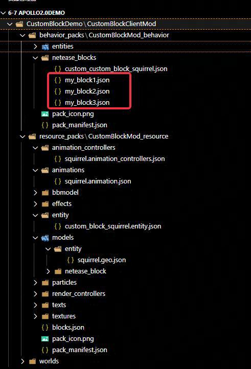
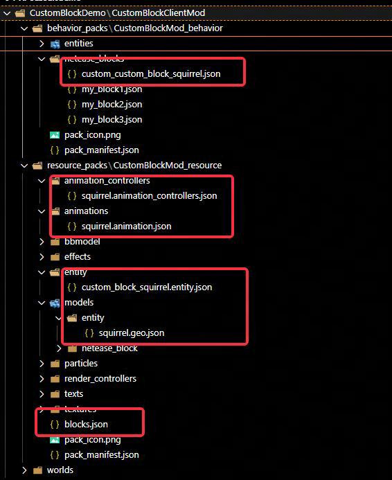

---
front:
hard: 入门
time: 40分钟
---

#  自定义方块Demo详解

## 概要
[示例Demo](../99-下载内容.html#示例demo)中的CustomBlockDemo包含客户端Mod

客户端Mod自定义了四种方块：

- custom:custom_block_squirrel

  使用了自定义松鼠模型的方块

- custom:my_block1

  破坏时间为10s的自定义方块

- custom:my_block2

  自发光方块，发光强度为1.0

- custom:my_block3

  四面向方块，根据玩家摆放方向不同而不同

## 开发流程
- 自定义方块1-3
    1. 参照[自定义方块实体概述](../../../20-玩法开发/15-自定义游戏内容/2-自定义方块/0-自定义方块概述.md) 、[自定义方块Json组件](../../../20-玩法开发/15-自定义游戏内容/2-自定义方块/1-JSON组件.md),增加对应方块定义、Json组件
        

    2. 使用原生Spigot命令，获取带SkullOwner的头颅
      ```
        /give @s minecraft:skull 64 3 {SkullOwner: { "Name" : "geyser_custom_block_custom:my_block1"}}
        /give @s minecraft:skull 64 3 {SkullOwner: { "Name" : "geyser_custom_block_custom:my_block2"}}
        /give @s minecraft:skull 64 3 {SkullOwner: { "Name" : "geyser_custom_block_custom:my_block3"}}
      ```

    3. 最终效果如下:
        

- 自定义松鼠方块
    1. 参照[自定义方块实体外观](../../../20-玩法开发/15-自定义游戏内容/2-自定义方块/4.1-自定义方块实体外观.md)，定义方块实体、动画controller、动画、骨骼模型、贴图等
        

    2. 需要注意的是，基于头颅换皮的情况下，方块本身即带有服务端方块实体。若加上**netease:block_entity**字段，则同时会生成客户端方块实体；不加**netease:block_entity**字段则无客户端方块实体。
      ```
        "netease:block_entity": {
          "tick": true, // 无效字段，可以不填
          "movable": false // 无效字段，可以不填
        },
      ```

    3. 使用Spigot原生命令
      ```
        /give @s minecraft:skull 64 3 {SkullOwner: { "Name" : "geyser_custom_block_custom:custom_block_squirrel"}}
      ```

    4. 最终效果如下：
        

## 目前支持组件详解

1. Q: **netease:aabb** 组件在使用上有没有限制?

   A: 由于方块实际上为头颅换皮，因此目前**netease:aabb**设置值应大于头颅的aabb，否则会出现服务端客户端不一致的挖掘表现，头颅aabb具体为
      ```json
      {
      "netease:aabb": {
        "collision": {
            "min": [0.25, 0.0, 0.25],
            "max": [0.75, 0.5, 0.75]
        },
        "clip": {
            "min": [0.25, 0.0, 0.25],
            "max": [0.75, 0.5, 0.75]
        }
      }
      }
      ```

    PS:另外需要注意的是，在apollo2.0中**collision**和**clip**均为必须字段，缺少时Geyser会报错！

2. Q: **netease:face_directional** 组件在使用上有没有限制?

   A: 由于头颅方块并没有细致到上下朝向的区分，因此目前组件只支持四方向类型，即只支持 **type: "direction"**

3. Q:**netease:block_entity**使用时有什么需要注意的地方？

   A:对于Apollo2.0来说，服务端本身就自带了Skull方块实体，而只需要有这个组件即可保证客户端同时生成方块实体。

   由于子字段中的 **tick** 、 **moveable** 为服务端逻辑，在Apollo2.0中为无效字段，需要自行通过Spigot插件的方式，修改Skull方块实体进行兼容。

   **tick** 、 **moveable** 为无效字段可以理解成不配置相应字段也不会出现问题

4. Q:**minecraft:destory_time**使用时有什么需要注意的地方吗？

   A:目前**destory_time** 可以设置方块所需的挖掘时间，由于服务端仍然是头颅 **destory_time**设置小于原生头颅时，会出现挖掘纹理和挖掘时间不一致问题。

   因此，不建议**destory_time**值小于 **1.5**
