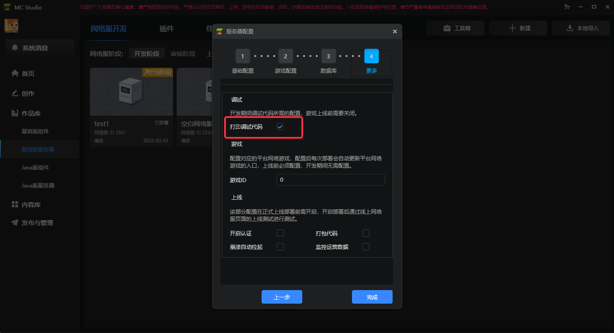
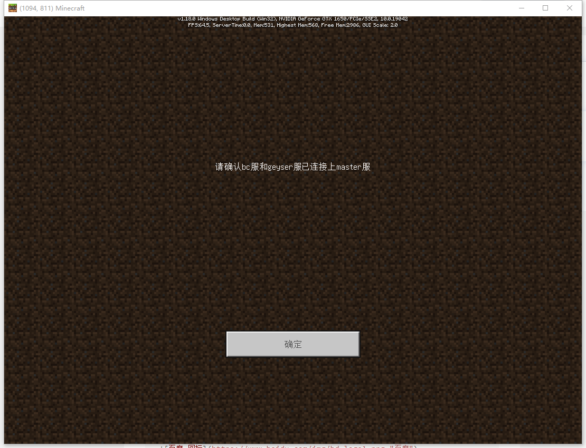
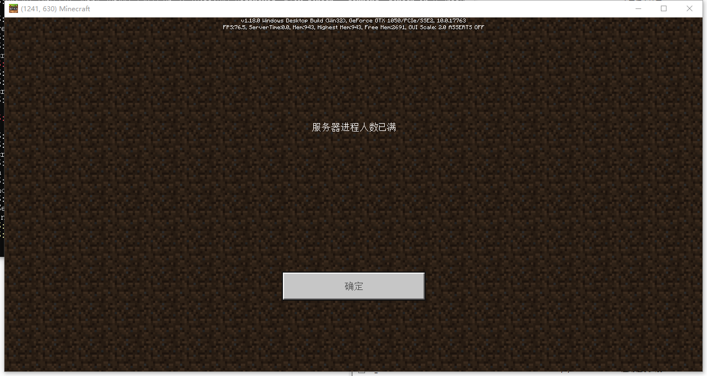
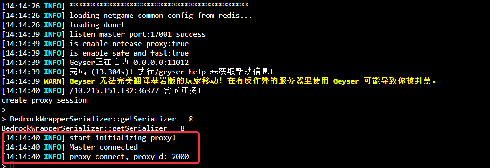
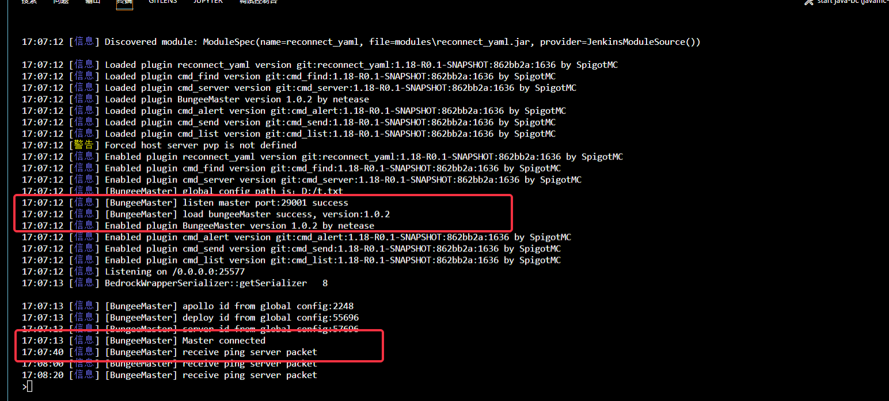
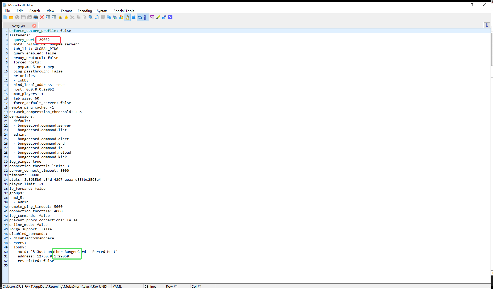
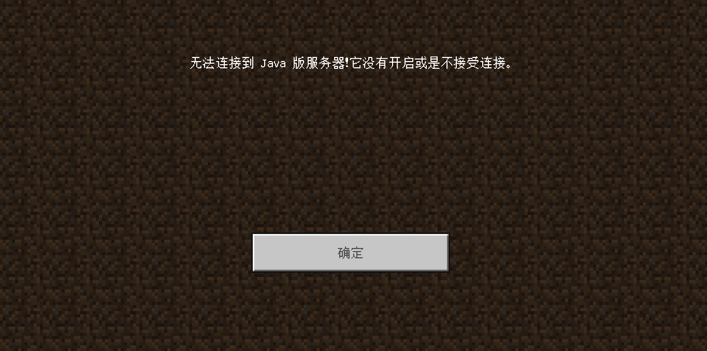

---
front:
hard: 入门
time: 60分钟
---

# 常见问题合集
## 1、开发机上是否有对外开放的tcp端口？
目前开发机上没有对外开放的tcp端口，只有[10000,20000]的udp端口允许外部访问

## 2、能否支持连接相同Geyser的玩家加载不同的Mod？

目前Mod经过Geyser加载并分发，因此当前版本中，通过同一个Geyser连接的玩家，加载的Mod都相同，如果需要实现不同bc或者spigot加载不同的Mod效果，可通过配置不同的geyser连接不同的bc实现

## 3、开发机上Java命令怎么调用？

由于目前Geyser和Spigot使用的java版本不同，因此开发机上存在两个版本的java，对应的命令分别是 **java18** 以及 **java8**，因此，在启动Spigot时，请使用命令视情况自行选择java版本
     

## 4、Geyser服日志怎么查看？
使用ssh登录服务器后，查看对应网络id下的geyser目录，可以查看geyser的日志

## 5、部署测试时，遇到玩家连接不上问题怎么排查？
部署测试时，遇到玩家连接不上的问题请根据如下步骤排查
### (1) 首先确定下调试标识
  - 部署时，开启了如下标识

    

    > 则在bc服和master未成功连接时，登录会有如下提示

    

  - 当对应标识未开启时，提示如下：

    

### (2) 排查Geyser与Master、Proxy服是否正常连接

- 当geyser与proxy及master正常连接时，Geyser服会输出如下日志

    

- 当玩家正常连接上proxy及geyser时，会输出如下日志
    

- 当玩家登录时没有上述输出，证明Geyser和Master、Proxy连接异常，请对照文档检查配置

  [Apollo2.0简述](./10-支持基岩版客户端的Java版网络游戏概述.md)

### (3) 排查BC服及BungeeMaster插件是否正常加载

- 当确定Geyser服连接正常时，请查看BC服日志，排查BungeeMaster插件是否正常加载以及master服是否正常连接上，正常连接会有如下日志打印:

- 当遇到没有上述输出时，证明Geyser服、Master服、Bungee服组网失败。请根据文档排查以下几种常见原因
[Apollo2.0简述](./10-支持基岩版客户端的Java版网络游戏概述.md)
  - 首先检查BC服的**config.yml**配置中，**master_port**是否和Studio配置的一致

  - 再检查Studio配置的BC服端口是否为BC的**config.yml**中的**query_port(红框)**，请不要配置成**servers**里具体**Spigot服(绿框)**监听的端口
    

  - 若一致，请通过netstat命令排查端口是否冲突，被多个应用监听

  - 若上述结果都显示正常，请联系官方，提供网络id、机器ip以供排查

### (4) 排查Spigot服是否正常连接

- 当出现如下截图信息时，一般是Spigot无法连接到

- 请检查BC服与Spigot服配置以及日志，确定BC服能正常连接上Spigot服

## 6、SpigotMaster是否必须加载?
目前Spigotmaster是强制要求加载，虽然不加载不会报错，但是会有部分功能无法支持。如皮肤防作弊、聊天插件控制、商城接口等。因此强烈要求必须加载SpigotMaster
**另外目前SpigotMaster不支持reload指令，使用后会不正常，建议不使用Spigot等端的reload指令**

## 7、Geyser的config.tpl如果有需要该如何修改?
目前暂不支持直接修改config.tpl，如果有需要，目前deploy.json文件提供了几个参数，用于修改config.tpl中的常用参数。详见[其他部署时可配置字段](./13-其他部署时可配置字段.md)

