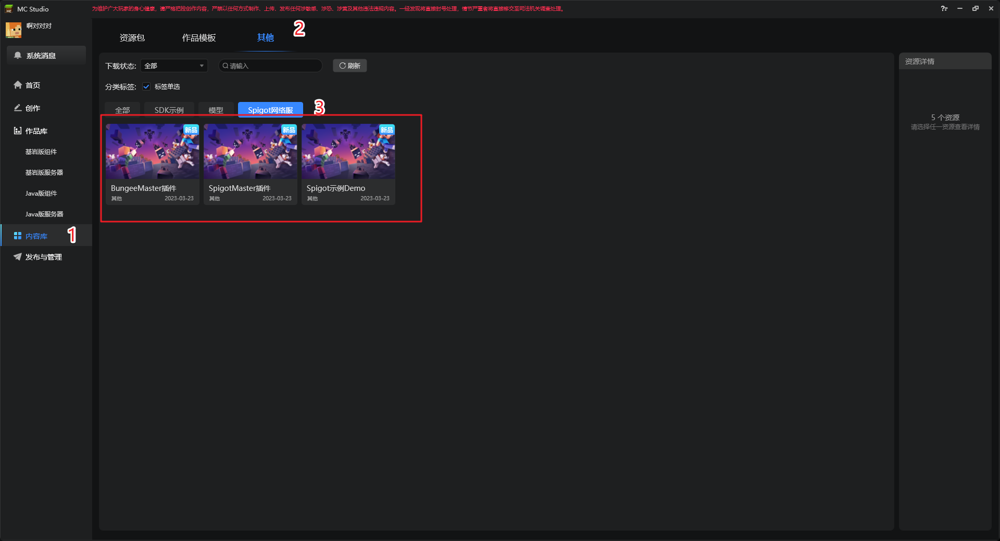
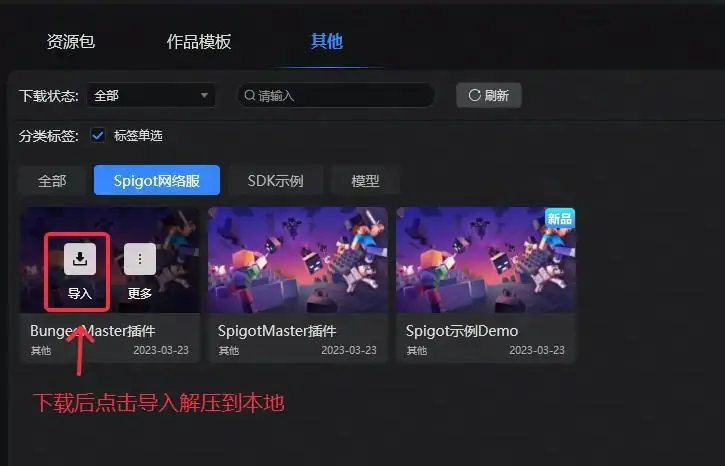

---
front:
hard: 入门
time: 分钟
---

# 下载内容

下载方式如下：



下载后导入解压到本地，获取.jar文件：



## BungeeMaster插件

bc服插件，必须，用于bc服组网


## SpigotMaster插件

spigot服插件，必须，用于客户端python通信，自定义物品


### 使用方式

下载 **SpigotMaster** 的jar包，然后执行以下指令，**path-to-jar**替换为jar路径

```shell
mvn install:install-file -Dfile=path-to-jar
						 -DgroupId=com.neteasemc
						 -DartifactId=SpigotMaster
						 -Dversion=x.x.x-SNAPSHOT
						 -Dpackaging=jar
```

- 插件编写时

1. 在pom.xml中添加依赖

   ```xml
   <dependency>
       <groupId>com.neteasemc</groupId>
       <artifactId>SpigotMaster</artifactId>
       <version>x.x.x-SNAPSHOT</version>
       <scope>provided</scope>
   </dependency>
   ```

2. 在plugin.yml中添加依赖

   ```yml
   depend:
     - SpigotMaster
   ```

## 示例Demo

包含以下内容：
1. CustomItemDemo：客户端新自定义物品示例
2. CustomPigModelDemo：客户端为随机的猪更改颜色的示例
3. CustomHumanModelDemo: 客户端为更改玩家模型的示例
4. PyRpcDemo：客户端python通信示例
5. ShopDemo：商业化插件示例
6. CustomEntityDemo：自定义实体示例
7. FormUIDemo：ServerFormUI示例
8. CustomBlockDemo: 自定义方块示例
9. InventoryToFormUIDemo:原生箱子UI转FormUI示例