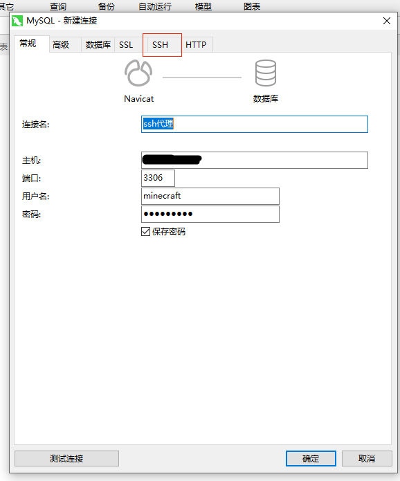
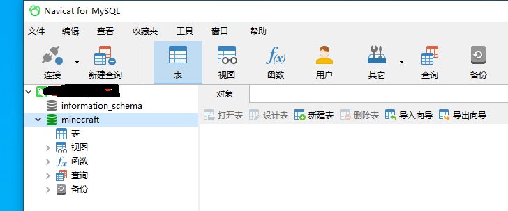

---
front:
hard: 入门
time: 5分钟
---

# 使用数据库前端连接数据库

* 基于数据安全的需要，为Apollo服主提供的MySQL数据库，无论是正式服还是测试服，均只支持从服务器本地、或同项目的另外几台服务器上连接（没有对外网开放数据库连接的3306端口）；因此可视化的数据库前端软件，无法直接从服主的本地开发机，连接上Apollo提供的数据库。

* 想要在本地开发机通过可视化数据库前端连接Apollo的后台数据库，需要使用支持ssh代理的可视化数据库前端

* 注意：只要是支持SSH代理的数据库前端，均可通过代理的方式连接Apollo为服主提供的数据库，**Navicat for MySQL**仅为示例

## 以Navicat for MySQL为例，展示如何连接Apollo的数据库
- 启动**Navicat for MySQL**后，点击左上角的【新建连接】
- 
- 选择连接【MySQL】数据库
- 
- 先配置【常规】分页，这里的【连接名】可以随意，【主机】填写数据库所在的IP，【端口】填写3306，【用户名】填写数据库的用户名（申请数据库成功后提供，一般是minecraft），密码填写数据库的访问密码（同样是申请数据库成功后提供）
- 
- 然后切换到【SSH】分页，在这个分页填写SSH代理需要的配置参数。
- 
- 首先勾选【使用SSH隧道】；如果是测试服，【主机】填写开发机的IP，如果是正式服，【主机】填写正式机器的IP；【端口】固定填写32200；【用户名】固定填写fuzhu；【验证方法】选择使用公钥；【私钥】选择本地保存的私钥的路径，与**MobaXterm**等SSH工具选择相同的私钥；【通行短语】保持为空；也不要勾选【保存通行短语】；最后点击【确定】完成配置。
- 
- 然后双击刚刚新建的数据库连接，即可连接上远端的数据库。（与使用SSH工具连接远端服务器一样，这里需要先访问添加白名单的URL，把你机器的IP地址加入到IP白名单中）
- 
- 开始连接后会弹出输入通行短语的界面，直接点击【确定】跳过即可
- 

