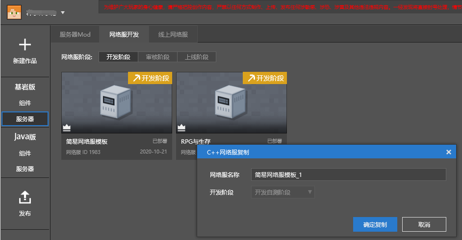

# 多账号协作

### 综述

当开发内容比较庞大的时候，我们建议开发者多人协作。McStudio提供了多账号协作功能，由主账号关联一系列子账号，实现**保密且便捷**的多人开发、测试。

建议**规模≥3人**的团队采用此功能。

### 子账号权限

- 子账号登录后，可看到主账号的云端组件，线上服务器，以及开发、审核、上线阶段的网络服。
- 子账号在手机测试端中，能够查看和进入主账号的组件和网络服，并可以自身玩家账号的身份下载和进入。

### 子账号条件

- 只能是网易163邮箱账号。
- 不能是开发者账号或者UP主账号。
- 不能够申请成为开发者或者UP主（除非取消开发者子账号）。
- 不能是其他账号的开发子账号。

### 设置子账号

要成为子账号，必须先成为开发者成员，步骤如下：

- 步骤1：如下图所示，主账号在[开发者平台](https://mcdev.webapp.163.com)选择“成员管理”，在上方输入要添加的子账号昵称，点击“添加成员”，即发起**开发者成员**邀请。

- 步骤2：被邀请的成员可登录《我的世界》电脑或手机端，查看邀请邮件并**同意**。

  

- 步骤3：上述步骤同意后，将成为主账号的开发者成员，如下图所示，在成员列表中选择“设为开发子账号”，即可让成员**成为子账号**。

  

### 子账号详细说明

*（该部分涉及大量Apollo概念与操作，建议熟悉后再进行阅读。）*

- 基岩版、Java版**组件**的云端列表中，为主账号的云端作品。

- 基岩版服务器中，子账号可以对自己**开发阶段**的网络服进行所有操作。

- 基岩版服务器中，开发阶段、审核阶段和上线阶段里，均会显示主账号的网络服，但只有“**开发测试**“、”**查看服务器日志**“权限。

  

- 基岩版服务器中的复制界面中，开发阶段下拉列表中**不提供“审核阶段”**和**“上线阶段”**。

  

- Java服务器中，显示主账号的线上网络服信息。

- 子账号无法登陆McStudio的**发布页面**。

  

- 在移动端测试时，子账号能看到主账号的所有组件和网络服，并可以自身玩家账号的身份下载和进入。

### 子账号协同提交内容

- 团队开发过程中，可能需要协同提交代码、美术资源等内容，而这些内容可能涉及一定的查看权限，使用[**自动部署**](../课程7：开发技巧/第2节：多账号协同部署.html)功能可便捷解决该问题。

