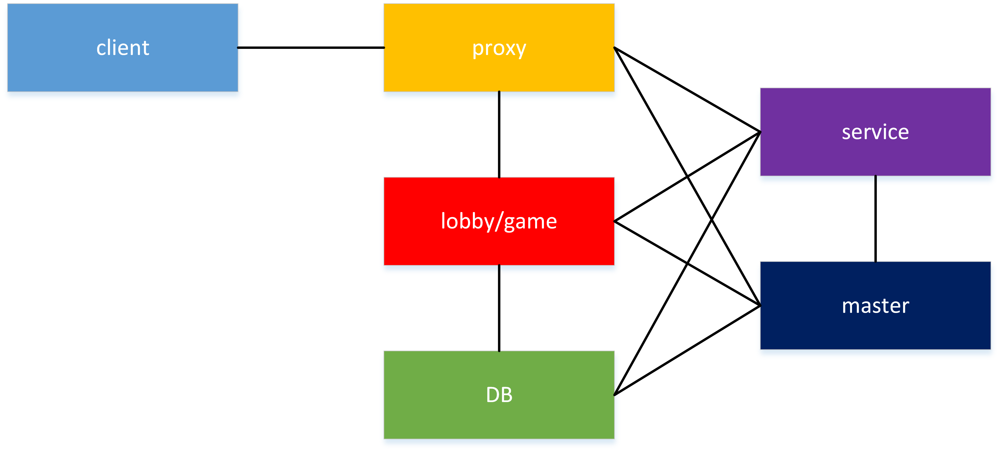

---
front:
hard: 入门
time: 15分钟
---

# Apollo框架
## 框架介绍

- **DB**是全局存储系统，所有游戏服共享，可以是redis、mysql或mongodb等。其中，redis用于缓存临时数据，比如玩家在线状态、当日在线时长等，mysql和mongo用于持久化存储游戏数据。开发者根据需求自选。
- **proxy**是代理服，功能包括消息的加密和解密，消息的压缩和解压缩，登录认证和消息转发。它保持客户端到服务端的连接。 开发者不能对proxy进行开发。
- **game**是游戏服，提供游戏逻辑功能，一个在线玩家只存在于一个game或lobby中。 开发者在game上进行游戏玩法开发，比如实现酷跑游戏、射击游戏、战斗游戏。
- **lobby**是大厅服，提供大厅各项功能。 开发者在lobby开发大厅的功能，比如提供NPC选服入口，提供战斗副本入口。
- **master**是控制服，用于管理其他服，是全服单点，对外提供http服务。http服务是运营指令（gm指令）入口。 开发者可以在master开发运营指令，比如发奖励指令、禁止发言指令。下面通过禁言指令需求介绍master功能：
  - 需求：某玩家言词不当，需要禁止他聊天。
  - 实现：在master添加禁言指令。开发者使用http给master发送禁言请求，master会把禁言信息记录到db，然后给玩家所在服务器发消息，禁止玩家发言。玩家下次登陆时，从db中读取禁言信息，判断是否还可以聊天。
- **service**是功能服，用于提供分布式单点服务。开发者可以在service开发公会、全服boss、全服匹配等功能。下面通过全服匹配需求介绍service功能：
  - 需求：存在lobby1和lobby2两个大厅服，两个大厅服内玩家要按照等级、战力等属性进行匹配，进入同一个副本游戏。
  - 实现：玩家申请匹配时，lobby1或lobby2向service申请匹配，service维护一个匹配队列，记录所有正匹配玩家，service会定时取出队列玩家，按照等级和战力匹法，将匹配后玩家分配到指定副本游戏。

## 使用示例

通过一个简单网络游戏需求介绍Apollo框架的使用。
### 需求
玩家可以在大厅签到领取奖励，然后体验两种游戏：起床战争和对战pvp，另外游戏提供禁言指令。对战pvp要求一场战斗最多两个玩家，玩家等级最多相差2。
### 实现

下面介绍开发者需要开发内容：

- master mod：实现禁言指令。master接收禁言消息并将它记录到mysql，然后通知玩家所在服务器，告知禁止玩家聊天。
- service mod：实现全服匹配。service维护匹配队列，记录所有正在匹配玩家，接着按照玩家等级匹配，将匹配成功的两个玩家分配到pvp服，
- game mod：分别实现起床战争和对战pvp；接收master禁言消息禁止玩家聊天；登陆读取玩家数据判断是否禁言。
- lobby mod：
  - 提供签到功能，使用mysql记录玩家的物品和签到奖励时间
  - 提供两个NPC，点击NPC进入起床战争游戏或向service申请匹配进入对战pvp
  - 接收master禁言消息禁止玩家聊天；登陆读取玩家数据判断是否禁言。
### 功能执行过程

说明玩家体验游戏过程中，引擎（开服工具框架）和开发者mod分别完成的功能。

#### 签到过程
1. 玩家登陆lobby：引擎会将玩家分配到lobby。
2. 玩家领取签到奖励：开发者lobby mod完成签到功能。
#### 禁言过程(假设玩家在lobby1)
1. 开发者给master发送http请求：引擎会接收http请求，然后将请求传递给开发者master mod
2. 禁止玩家聊天：开发者master mod处理禁言消息，开发者game/lobby mod实现禁言功能
3. http请求返回：开发者master mod将执行结果告知引擎，引擎将结果返回给请求发起方
#### 进入起床战争
1. 玩家登陆进入lobby：引擎会将玩家分配到lobby。
2. 玩家点击NPC，玩家切服到起床战争的game：开发者lobby mod实现NPC和切服功能
3. 体验起床战争：开发者game mod实现起床战争玩法
4. 游戏结束，玩家退回到lobby：开发者game mod将玩家切服到lobby
#### 进入对战pvp
1. 玩家A和玩家B登陆到lobby：引擎会将玩家分配到对应lobby
2. 玩家A和玩家B点击NPC申请匹配：开发者lobby mod向service申请匹配，开发者service mod完成匹配，将玩家分配到战斗pvp游戏服
4. 体验pvp战斗：开发者game mod实现pvp战斗玩法
4. 游戏结束，玩家退回到lobby：开发者game mod将玩家切服到lobby