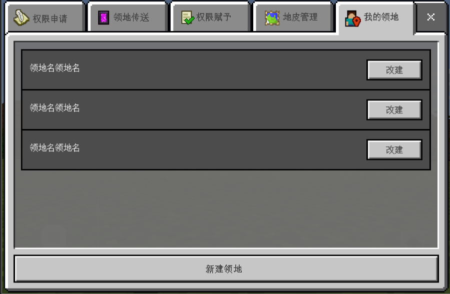
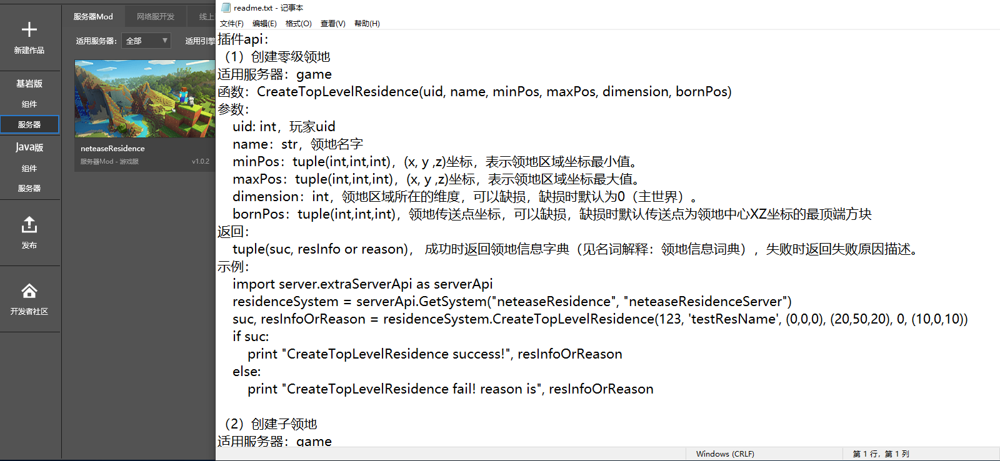
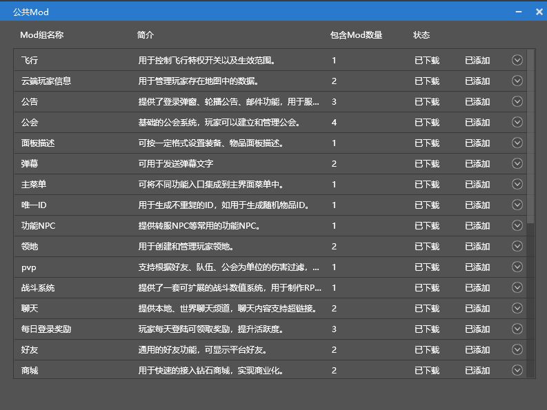
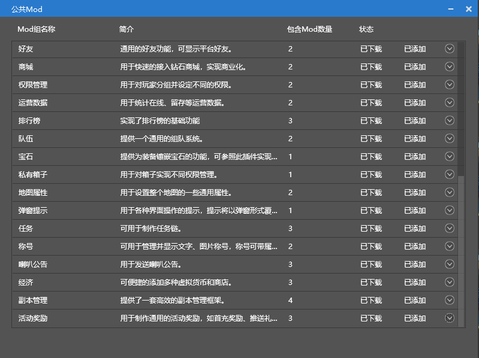

# 网络服插件

### 什么是插件

​		在Apollo开服工具中，插件是一系列网络服Mod的集合，这些网络服Mod集合共同实现比较独立完整的系统功能。每个插件具有配套的**API**和**运营指令**，便于开发者在开发阶段产出更丰富的功能，也便于在运营阶段查询游戏数据。

​		例如开发者调用了领地插件，则可以在游戏中直接打开界面，操作创建领地、权限管理等相关功能，无需关注实现的细节部分。

​		如果需要调整官方插件功能，则可以使用领地插件提供的API。

### 官方插件概述

​		目前官方具有30多个插件，这些插件会**长期维护**，开发者不用担心版本升级导致插件失效。另外官网也会持续拓展插件库的**数量**与**功能**，让开发者能便捷开发网络服。

