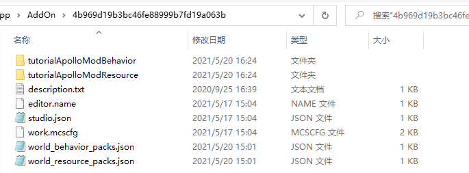

---
front:
hard: 进阶
time: 20分钟
---

# Mod和网络游戏Mod相互转换

​		本教材介绍如何将Mod转换成网络游戏Mod，然后再将网络游戏Mod转换成Mod。与“Mod到网络游戏Mod入门”教材不同，本教材介绍的方法可以实现Mod和网络游戏Mod的相互转换，而“Mod到网络游戏Mod入门”只能实现Mod到网络游戏Mod的单向转换。本教材要求开发者已经申请到了开发机（按照“网络游戏入驻”流程申请），且会使用部署工具（参考“使用部署工具”），已经阅读“Mod到网络游戏Mod入门”

​	   网络游戏Mod绝大部分时间花在Mod开发上，服主可以使用Mod API开发调试，实现大部分客户端和服务端逻辑，还可以本地查看效果，大大提升开发效率。本地开发完成后再转换成网络游戏Mod，使用Apollo SDK实现网络游戏相关的功能。服主也可以把网络游戏Mod转换成Mod，使用本机开发调试。相互转换的条件是：不允许使用Apollo SDK中的API。下面我们以基岩版“入门脚本模板”为例说明他们之间的转换。


## Mod转化成网络游戏Mod

这里以入门脚本模板为例，介绍从入门脚本模板Mod转化成入门脚本网络游戏Mod的步骤。

1、入门脚本模板中，点击“更多-->转换为服务端Mod”，Mod名字为tutorialApolloMod，


在服务端Mod中可以找到tutorialApolloMod


2、打开tutorialApolloMod所在目录，修改tutorialApolloMod脚本根目录名，将tutorialScripts改为tutorialScriptsDev


由于改了根目录名，所以需要将tutorialApolloMod/tutorialScriptsDev目录中，所有使用“tutorialScripts”的python包都改为“tutorialScriptsDev”。在tutorialScriptsDev目录下搜索tutorialScripts，发现只需改modMain.py文件，替换之后核心代码如下：

```python
class TutorialMod(object):
    ...

    @Mod.InitServer()
    def TutorialServerInit(self):
        #serverApi.RegisterSystem("TutorialMod", "TutorialServerSystem", "tutorialScripts.tutorialServerSystem.TutorialServerSystem") #包含了tutorialScripts的python包，需要改名为tutorialScriptsDev
        serverApi.RegisterSystem("TutorialMod", "TutorialServerSystem", "tutorialScriptsDev.tutorialServerSystem.TutorialServerSystem")

    @Mod.InitClient()
    def TutorialClientInit(self):
        #clientApi.RegisterSystem("TutorialMod", "TutorialClientSystem", "tutorialScripts.tutorialClientSystem.TutorialClientSystem")#包含了tutorialScripts的python包，需要改名为tutorialScriptsDev
        clientApi.RegisterSystem("TutorialMod", "TutorialClientSystem", "tutorialScriptsDev.tutorialClientSystem.TutorialClientSystem")
	...
```

3、ModMain.py中注释不相关的代码。客户端ModMain.py文件只包含客户端的入口和退出函数，需要屏蔽TutorialServerInit和TutorialServerDestroy函数

```python
@Mod.Binding(name = "TutorialMod", version = "0.0.1")
class TutorialMod(object):

    # 类的初始化函数
    def __init__(self):
        print "===== init tutorial mod ====="

    # # InitServer绑定的函数作为服务端脚本初始化的入口函数，通常是用来注册服务端系统system和组件component
    # @Mod.InitServer()
    # def TutorialServerInit(self):
    #     print "===== init tutorial server ====="
    #     # 函数可以将System注册到服务端引擎中，实例的创建和销毁交给引擎处理。第一个参数是MOD名称，第二个是System名称，第三个是自定义MOD System类的路径
    #     # 取名名称尽量个性化，不能与其他人的MOD冲突，可以使用英文、拼音、下划线这三种。
    #     serverApi.RegisterSystem("TutorialMod", "TutorialServerSystem", "tutorialScripts.tutorialServerSystem.TutorialServerSystem")

    # # DestroyServer绑定的函数作为服务端脚本退出的时候执行的析构函数，通常用来反注册一些内容,可为空
    # @Mod.DestroyServer()
    # def TutorialServerDestroy(self):
    #     print "===== destroy tutorial server ====="

    # InitClient绑定的函数作为客户端脚本初始化的入口函数，通常用来注册客户端系统system和组件component
    @Mod.InitClient()
    def TutorialClientInit(self):
        print "===== init hugo fps client ====="
        # 函数可以将System注册到客户端引擎中，实例的创建和销毁交给引擎处理。第一个参数是MOD名称，第二个是System名称，第三个是自定义MOD System类的路径
        # 取名名称尽量个性化，不能与其他人的MOD冲突，可以使用英文、拼音、下划线这三种。
        clientApi.RegisterSystem("TutorialMod", "TutorialClientSystem", "tutorialScripts.tutorialClientSystem.TutorialClientSystem")

    # DestroyClient绑定的函数作为客户端脚本退出的时候执行的析构函数，通常用来反注册一些内容,可为空
    @Mod.DestroyClient()
    def TutorialClientDestroy(self):
        print "===== destroy hugo fps client ====="
```

服务端ModMain.py只包含服务端的入口和退出函数，屏蔽TutorialClientInit和TutorialClientDestroy函数。

4、转换完成，部署后点击“大厅服”中“大厅服4000”可以查看服务器日志，日志包含“===== init tutorial server =====”，它是执行服务端modMain.py文件中TutorialServerInit函数打印出来的


## 网络游戏Mod转化成Mod

这里以入门脚本模板为例，介绍从入门脚本网络游戏Mod转化成入门脚本Mod的步骤。

为了查看转换效果，分别在客户端Mod和服务端Mod中新增一条日志。在服务端Mod的tutorialServerSystem.py文件中新增一条日志

```python
class TutorialServerSystem(ServerSystem):

    # ServerSystem的初始化函数
    def __init__(self, namespace, systemName):
        # 首先调用父类的初始化函数
        super(TutorialServerSystem, self).__init__(namespace, systemName)
        print "===== TutorialServerSystem init ====="
        print "===== server test init ====="
```

在客户端Mod的tutorialClientSystem.py文件中新增一条日志

```python
class TutorialClientSystem(ClientSystem):

    # 客户端System的初始化函数
    def __init__(self, namespace, systemName):
        # 首先初始化TutorialClientSystem的基类ClientSystem
        super(TutorialClientSystem, self).__init__(namespace, systemName)
        print "==== TutorialClientSystem Init ===="
        print "===== client test init ====="
```

**转换前需要确保没有使用任何Apollo SDK中API**，下面介绍转换过程：

1、创建一个空白的AddOn（针对没有使用地图的网络游戏），删除behavior、resource相关目录，删除world_behavior_packs.json和world_resource_packs.json

2、将网络服behavior_packs、resource_packs、worlds/level 目录下所有内容拷贝到入门Mod所在目录下：




3、将developer_mods/tutorialApolloMod 下内容拷贝到入门Mod的tutorialApolloModBehavior目录下

4、转换完成，然后开发测试，发现打印了“===== server test init =====”和“===== client test init =====”日志


5、tutorialApolloModBehavior目录下包含两个脚本目录：tutorialScripts和tutorialScriptsDev。要求服主在tutorialScripts中开发客户端逻辑，在tutorialScriptsDev中开发服务端逻辑。再次将Mod转换成网络游戏Mod时，只需将tutorialScriptsDev到拷贝网络服developer/tutorialApolloMod目录，将tutorialApolloModBehavior拷贝到网络服behavior_packs目录，将tutorialApolloModResource拷贝到网络服resource_packs目录，将world_behavior_packs.json、world_resource_packs.json拷贝到网络服worlds/level 目录


## 网络游戏Mod和Mod相互转换

上面是处理不带地图的网络游戏，下面介绍如何将带地图的网络服Mod转出Mod，以入门脚本网络游戏Mod（新增了地图）为例做说明

1、新建一个空白的**地图Mod**（针对有使用地图的网络游戏），删除Mod所在目录中behavior_packs、db、resource_packs目录

2、将网络服Mod中behavior_packs、resource_packs目录拷贝到Mod所在目录，将level目录下全部内容拷贝到Mod所在目录，将developer_mods中脚本根目录（developer_mods/tutorialApolloMod/tutorialScriptsDev）拷贝到任意一个behavior_packs的Mod里面，也即将网络服developer_mods/tutorialApolloMod/tutorialScriptsDev拷贝到Mod的behavior_packs/tutorialApolloModBehavior 目录中


执行上面步骤后就完成了网络游戏Mod到Mod转换，完成开发调试后，可以进行逆向转换，也就是将上面Mod转换成网络游戏Mod。具体过程是：

1、将behavior_packs、resource_packs拷贝到网络服tutorialApolloMod目录下，将behavior_packs/tutorialApolloModBehavior/tutorialScriptsDev拷贝到tutorialApolloMod/developer_mods目录

2、将db、level.dat、level.dat_old、levelname.txt、world_behavior_packs.json、world_resource_packs.json拷贝到worlds/level目录下

