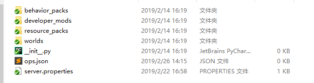

---
front:
hard: 入门
time: 10分钟
---

# 服务器Mod目录

## Mod类型

服务器Mods通常由控制服Mod，功能服Mod，大厅服Mod与游戏服Mod等组成，各种类型的Mod概念如下：

- 控制服Mod：包含控制服(master)的developer_mods目录下所有mod。

- 功能服Mod：包含功能服(service)的developer_mods目录下所有mod。

- 大厅服Mod：包含大厅服的 behavior_packs、resource_packs、developer_mods目录下所有的mod以及worlds（地图存档）。

- 游戏服Mod：包含游戏服的 behavior_packs、resource_packs、developer_mods目录下所有的mod以及worlds（地图存档）。

  一个游戏服Mod的**标准目录格式**如下：



## developer_mods

服务端加载的mod目录，不会被传送到客户端。
下面以neteaseAnnounce为例介绍其目录结构：

		neteaseAnnounceDev
			netease_require.json
			neteaseAnnounceScript
				__init__.py
				announceConsts.py
				announceServerSystem.py
				modMain.py
				timermanager.py
			mod.json

|文件/文件夹|解释|
|--------|----------|
|neteaseAnnounceDev| 顶层neteaseAnnounceDev，表示mod的名字；第二级neteaseAnnounceScript表示行为包的目录，开发者从从该目录开始import module，比如import neteaseAnnounceScript.announceConsts as announceConsts |
|`__init__.py`| 是python module的标识，表示这是一个可以import的module，同时也可以做一些初始化的操作,内容可为空，但是文件必须有。 |
|announceConsts.py| mod中的一些宏定义|
|announceServerSystem.py|mod业务逻辑|
|modMain.py|该文件名称不可以更改，用来初始化我们的Mod，具体使用参考<a href="../../20-玩法开发/13-模组SDK编程/2-Python脚本开发/0-脚本开发入门.html#modmain-py是什么" target="_blank">mod开发简介</a>|
|timermanager.py|实现了一个定时器，提供了一次性定时器和循环定时器（当前ModSDK中已经有实现相同功能的组件，不再需要自己实现）|
|netease_require.json| 用于控制服务器Mod加载顺序的配置文件，非必须，具体内容见《1-9 控制服务器Mod加载顺序的办法》|
|mod.json| 用于配置mod的具体功能实现细节行为的配置文件，非必须|

developer_mods和behavior_packs区别：

- developer_mods控制服务端行为，behavior_packs控制客户端行为。
- behavior_packs会下载给客户端，developer_mods不会。
- developer_mods可以使用Server Mod SDK全部接口和MOD SDK中服务端相关接口，behavior_packs使用MOD SDK中客户端相关接口。
- behavior_packs必须包含manifest.json文件，且需要在地图目录下world_behavior_packs.json文件中配置pack id和version。

developer_mods支持多个mod，每个mod对应一个目录，下面是neteaseAnnounce和neteaseAlert两个mod的目录结构：

		neteaseAnnounceDev
			netease_require.json
			neteaseAnnounceScript
				__init__.py
				announceConsts.py
				announceServerSystem.py
				modMain.py
				timermanager.py
			mod.json
		neteaseAlertDev
			neteaseAlertScript
				__init__.py
				alertConst.py
				alertServerSystem.py
				modMain.py
			mod.json

## resource_packs
- 存放客户端资源

- 资源版本信息存放在manifest.json：

```json
{
	"format_version": 1,
	"header": {
		"description": "By tnm",
		"name": "tnm_glove_pve",
		"uuid": "1c850d23-64f4-46be-aec0-16c8e4618072",
		"version": [0, 0, 1]
	},
	"modules": [
		{
			"description": "By tnm",
			"type": "resources",
			"uuid": "637ff742-7003-4a8b-8d99-722a1b704f12",
			"version": [0, 0, 1]
		}
	]
}
```


​
- 并非所有resource_packs都会被客户端下载

- 需要将`manifest.json`配置header中uuid配置到worlds/level/`world_resource_packs.json`中才会被客户端下载

- `world_resource_packs.json`内容如下：
```python
[
	{
		"pack_id" : "1c850d23-64f4-46be-aec0-16c8e4618072",
		"version" : [ 0, 0, 1 ]
	}
]
```


​

## behavior_packs
- 存放客户端MOD
- manifest.json& world_behavior_packs.json配置与resource_packs类似
- behavior_packs里只允许有一个目录，如果有多个，则只有第一个会被使用，请按*behavior格式命名，大小写不敏感
- `*behavior`目录内脚本需要存放在*scripts目录内，且只允许有一个
- `*behavior`目录内需包含版本信息配置`manifest.json`

## worlds
- 只允许有一个子目录，如demo中的level
- 目录名作为地图名称，不允许使用中文
- 不要忘了配置`world_behavior_packs.json`等两个json

一个示例的目录结构如下：

		worlds
			level
				db
				level.dat
				levelname.txt
				world_behavior_packs.json
				world_resource_packs.json

|文件/文件夹|解释|
|--------|----------|
|worlds| 存放服务器地图目录，名字不可以更改|
|level| 存放一个地图存档目录，目录名也就是地图名|
| db| 地图存档目录|
| level.dat| 存储关于地图的全局信息|
|levelname.txt|地图的名字|
|world_behavior_packs.json|配置客户端需要下载的behavior mods|
|world_resource_packs.json|配置客户端需要下载的resource mods|
