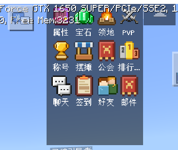
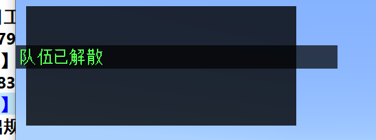
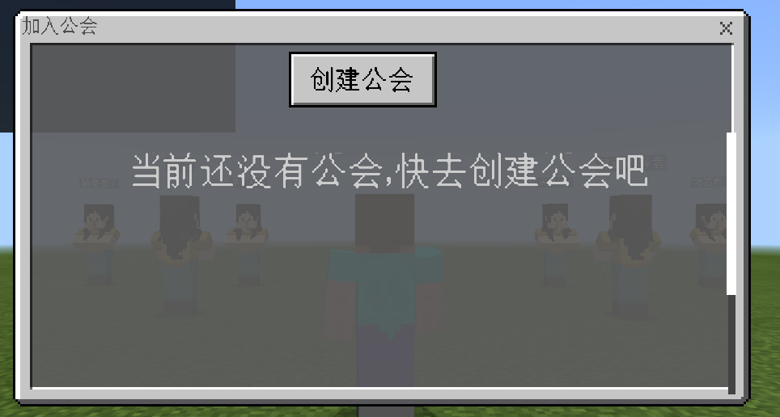
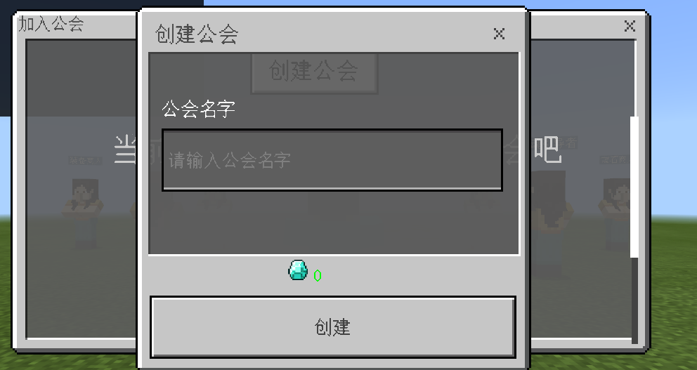
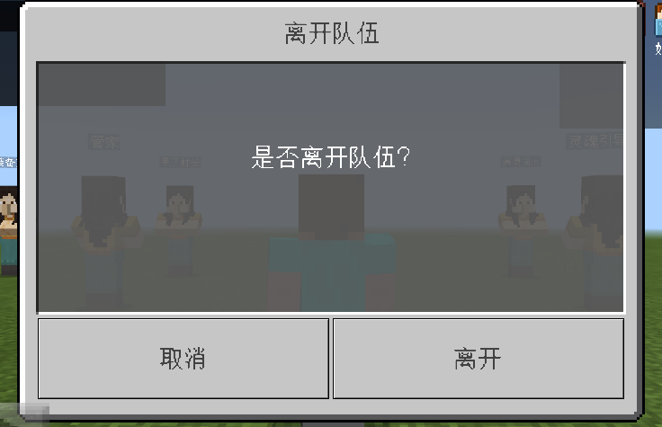
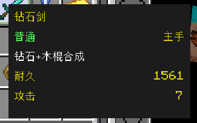

# 官网插件规范
这个文档描述了官网公开插件（即公开下载并许可任意服主使用的插件）的开发规范，自用插件也建议参照此规范。

## 规范主旨
* 减少插件间的冲突问题（如界面重叠、目录或文件冲突、无法加载等）
* 统一规范，增加可读性
* 便于使用和二次开发

## 重要名词解释

### 团队名
* 每个官网公开插件的开发团队，都需要一个全局唯一的团队名，比如官方的团队名为**netease**
* 团队名仅能使用小写英文字符+数字，并且不能以数字开头，团队名限制最大字符数为10
### 插件名
* 每个插件都需要有一个与插件具体实现的功能相关的插件名，比如官方的公告插件的插件名为**announce**
* 插件名仅能使用小写英文字符+数字，并且不能以数字开头，插件名限制最大字符数为20


## 插件目录命名规范
### 根目录命名
插件【强制要求】按照运行的具体服务器类型（游戏服、功能服等）分目录，【强制要求】每种服务器都需要创建一个目录，目录【强制要求】使用驼峰法命名，【强制要求】以**团队名**开头，具体规范如下：

- 大厅服/游戏服 插件目录名规范：团队名（全小写）+ 插件名（首字母大写）
- 控制服 插件目录名规范：团队名（全小写）+ 插件名（首字母大写） + Master
- 功能服 插件目录名规范：团队名（全小写）+ 插件名（首字母大写） + Service

假设**团队名**为**lovecraft**，**插件名**为**guild**，功能涉及到master、service和lobby，目录结构如下所示：

```

    ├─lovecraftGuildMaster
    ├─lovecraftGuild
    ├─lovecraftGuildService

```
### 大厅服/游戏服目录命名
【强制要求】大厅服/游戏服的目录结构类似。以**团队名**为**lovecraft**，**插件名**为**guild**为例介绍目录结构，其目录结构如下所示：
```
lovecraftGuild
    │  mod.sql
    │  readme.txt
    │  server.properties
    │
    ├─behavior_packs
    ├─developer_mods
    ├─resource_packs
    ├─worlds
    └─studio_res

```
各个目录和文件的说明如下：
名字|含义|是否必须
---|:---|---:
mod.sql|记录需要执行的sql语句，使用utf-8编码|否
readme.txt|mod介绍，使用utf-8编码|是
server.properties|mc server配置|否
behavior_packs|存放行为包|否
developer_mods|存放服务端mod|否
resource_packs|存放资源包|否
worlds|存放地图|否
studio_res|存放美术资源工程|否
#### behavior_packs目录
* 行为包使用的根目录【强制要求】以**团队名**+**插件名**开头，并以**Behavior**（或**behavior**）结尾、中间可以添加任意英文字符+数字，【建议】以驼峰法区隔（首字符大写），【建议】在非必须的情况下，直接以**团队名**（全小写）+**插件名**（首字母大写）+**Behavior**命名。
* 代码的根目录，【强制要求】以**团队名**+**插件名**开头，并以**Script**（或**script**）结尾、中间可以添加任意英文字符+数字，【建议】以驼峰法区隔（首字符大写），【建议】在非必须的情况下，直接以**团队名**（全小写）+**插件名**（首字母大写）+**Script**命名。

假设**团队名**为**lovecraft**，**插件名**为**guild**，示例如下：
```
behavior_packs
    └─lovecraftGuildBehavior
        │  manifest.json
        │
        └─lovecraftGuildScript
```
各个目录和文件的说明如下：
名字|含义
---|:---
lovecraftGuildBehavior|行为包的根目录。
manifest.json|行为包manifest配置
lovecraftGuildScript|代码文件的根目录，从此目录开始import模块。
#### developer_mods目录
* 根目录【强制要求】以**团队名**+**插件名**开头，并以**Dev**（或**dev**）结尾、中间可以添加任意英文字符+数字，【建议】以驼峰法区隔（首字符大写），【建议】在非必须的情况下，直接以**团队名**（全小写）+**插件名**（首字母大写）+**Dev**命名。
* 代码的根目录，【强制要求】以**团队名**+**插件名**开头，并以**Script**（或**script**）结尾、中间可以添加任意英文字符+数字，【建议】以驼峰法区隔（首字符大写），【建议】在非必须的情况下，直接以**团队名**（全小写）+**插件名**（首字母大写）+**Script**命名。

假设**团队名**为**lovecraft**，**插件名**为**guild**，示例如下：
```
developer_mods
    └─lovecraftGuildDev
        │  mod.json
        └─lovecraftGuildScript
```
名字|含义
---|:---
lovecraftGuildDev|服务端mod的根目录。
lovecraftGuildScript|代码文件的根目录，从此目录开始import模块。
mod.json|记录插件的全部配置，该配置能被开发者改动。
#### resource_packs目录
* 根目录【强制要求】以**团队名**+**插件名**开头，并以**Res**（或**res**）结尾、中间可以添加任意英文字符+数字，【建议】以驼峰法区隔（首字符大写），【建议】在非必须的情况下，直接以**团队名**（全小写）+**插件名**（首字母大写）+**Res**命名。
```
resource_packs
    └─lovecraftGuildRes
        |  manifest.json
        └─ui
        └─textures
```
名字|含义
---|:---
lovecraftGuildRes|资源包的根目录。
manifest.json|资源包manifest配置
ui|UI的JSON文件的根目录。
textures|各种贴图资源的根目录。
#### worlds目录
* 【强制要求】在**worlds**目录下创建命名为**level**的目录
* 【强制要求】在level目录下，如果有行为包则必须有**worlds/level/world_behavior_packs.json**；如果有资源包则必须有**worlds/level/world_resource_packs.json**
```
worlds
    └─level
        |  world_behavior_packs.json
        |  world_resource_packs.json
```
* 【强制要求】world_behavior_packs.json 文件中定义必须与行为包中 manifest.json 的modules对应
```
[
    {
        "pack_id" : "d09c6ae2-e9b7-4640-b850-942678294b72",
        "version" : [ 0, 0, 1122]
    }
]
```
* 【强制要求】world_resource_packs.json 文件中定义必须与资源包中 manifest.json 的modules对应
```
[
    {
        "pack_id" : "bab4cb59-b369-45b1-abbd-3ab43b6f86fa",
        "version" : [ 0, 0, 1122]
    }
]
```
#### studio_res目录
* 【强制要求】这个目录对服务器或客户端MOD运行没有任何影响，只是用于保存当前插件所使用到的资源工程导出文件
* 【强制要求】其目录结构如下，直接放置对应的资源工程导出文件
```
studio_res
    ├─主菜单插件.zip

```

### 控制服/功能服目录命名
只会包含developer_mods，与大厅服/游戏服的developer_mods目录规范相同

### mod.sql文件编写规范
* 【强制要求】若插件功能涉及多个服务器，则mod.sql只用放到一种类型服务器的下面，mod.sql存放优先级是：功能服>大厅服/游戏服>控制服。
* 【强制要求】请使用Mysql数据库实现长时效信息存储
* 【强制要求】使用InnoDB，编码为utf8mb4
* 【建议】每个字段必须有注释。
* 【强制要求】文件要求是utf-8编码。
* 表名【强制要求】**团队名**+**插件名**开头，中间可以使用**下划线**连接，但【建议】以驼峰法区隔（首字符大写）；【建议】比如说**团队名**为**lovecraft**，**插件名**为**guild**的插件，数据库表名均应类似于**lovecraftGuildXx**
* 【强制要求】所有版本sql语句都放到mod.sql中，用注释分割不同mod版本的使用到的sql。一个示例如下：
```sql
-- ###########################version1.0.0####################
create table lovecraftGuild(
    id int unsigned not null COMMENT '唯一id'
) ENGINE=InnoDB DEFAULT CHARSET=utf8mb4;
-- ###########################version1.0.1####################
create table lovecraftGuild2(
    id int unsigned not null COMMENT '唯一id'
) ENGINE=InnoDB DEFAULT CHARSET=utf8mb4;
```
### mod.json文件编写规范
通常需要包含下面配置：
属性|含义
---|:---
netgame_mod_name|插件名字
netgame_mod_version|插件版本，版本要求从“1.0.0”开始
min_app_version|最低引擎版本
max_app_version|最高版本引擎，没配置则表示不限
support_server_type|列表，支持的服务器类型，包括game/lobby/master/service几种类型
author|团队名
group|可以不配置，表示插件隶属的功能。若一个功能涉及多个插件，则建议将多个插件group设置成一样的。
module_names(service mod需要)|配置当前service mod的模块名，要求与插件名一样，并且能够在deploy.json中service下module_names配置中找到。用于Service的RPC调用，对应RegisterRpcMethodForMod和RequestToService中的参数module。

【强制要求】所有能被改动属性都配置到该文件，可以用"_comment"给字段加注释。
假设**团队名**为**lovecraft**，**插件名**为**guild**，一个简单示例如下：

```json
{
    "netgame_mod_name":"lovecraftGuild",
    "netgame_mod_version":"1.0.0",
    "min_app_version":"1.15.0",
    "support_server_type":["lobby"],
    "author":"lovecraft",
    "group":"lovecraftGuild",

    "_comment":"公会名称最多支持多少个字符",
    "guild_name_limit":20,
    ...
}
```
### readme.txt文件编写规范
【强制要求】"type"用法规范：它是python变量的类型名，统一使用下列类型名 bool、int、float、double、str、dict、tuple、list(str)、list(int)、object、function、User Defined Class Name。

【强制要求】文件格式：缩进用空格，不用tab；要求用utf-8格式。

【强制要求】文件构成如下：

- 插件介绍
- 插件构成
- 使用步骤
- 插件api
```
（1）api功能描述
适用范围：客户端/大厅服/游戏服/控制服/功能服
函数：funcname(arg1,args2...)
参数：
    （如果没有参数，也写 无 ）
    arg1: type，描述
    arg2: type，描述
返回:
    （如果没有返回，也写 无 ）
    int, test的返回值
示例：
    a = funcname(1,2)
```
- 插件event
```
（1）event名字
适用范围：客户端/大厅服/游戏服/控制服/功能服
命名空间：namespace = 'xxx', systemname = 'xxx'
描述：event的描述
参数：
    （如果没有参数，也写 无 ）
    arg1: type, arg1描述
```
- 运营指令
```
运营指令功能介绍
post url: http:masterip:masterport/baseurl
post body:{
    "key" : value#注释
}
response:
{
    "code": 1, #code=1表示成功，其他表示失败
    "entity": {
        "key": value #注释
    },
    "message": ""
}
```
- 更新记录

假设**团队名**为**lovecraft**，**插件名**为**guild**，一个示例如下：
```
插件介绍：这是个公会插件

插件构成：
（1）lovecraftGuild: 部署于大厅服或游戏服。
（2）lovecraftGuildMaster: 部署于控制服。
（3）lovecraftGuildService: 部署于功能服。

使用步骤：
1、请在mysql中执行mod.sql
2、配置mod.json，请按照文件mod.json中"_comment"注释配置对应内容。
3、MCStudio把lovecraftGuild添加到大厅服或游戏服。
4、MCStudio把lovecraftGuildMaster添加到控制服。
5、MCStudio把lovecraftGuildService添加到功能服。

插件api：
（1）获取玩家昵称api
适用范围：大厅服/游戏服
函数：GetNickname(uid)
参数：
    uid: int，玩家id
返回：
    string，玩家的昵称
示例：
    import server.extraServerApi as serverApi
    system = serverApi.GetSystem("lovecraftGuild", "lovecraftGuildDev")
    system.GetNickname(123)#获取玩家的昵称

插件event：
（1）GuildEvent
适用范围：大厅服/游戏服
命名空间：namespace = 'lovecraftGuild', systemname = 'lovecraftGuildDev'
描述：测试的event
参数：
    uid: int,玩家id
    nickname: str,玩家昵称
示例：
    def __init__(self, namespace, systemName):
        self.ListenForEvent('lovecraftGuild', 'lovecraftGuildDev', 'GuildEvent', self, self.OnGuildEvent)

    def OnGuildEvent(self, data):
        uid = data['uid']
        nickname = data['nickname']

运营指令：
（1）test指令
post url: http:masterip:masterport/test
post body:{
    "uid" : 123#玩家id
}
response:
 {
     "code": 1,
     "entity": {
         "name": "player_name" #玩家昵称
       },
       "message": ""
 }

更新列表：
1.0.1版本：
新增指令/test
```

### server.properties文件编写规范

原版minecraft server中含有一个同名的设置文件，里面可配置的字段可参考[wiki文档](https://zh.minecraft.wiki/w/%E6%9C%8D%E5%8A%A1%E7%AB%AF%E9%85%8D%E7%BD%AE%E6%96%87%E4%BB%B6%E6%A0%BC%E5%BC%8F)

可以在插件中放置一个server.properties，在部署时会自动拼接到服务器的server.properties中，这意味着您可以只写一部分所需的属性

需要注意在文件的**末尾需要有一个空行**

需要特别提一下client-side-chunk-generation-enabled这个属性：这是2.5版本后新增的字段，用来控制是否开启客户端本地的地图生成。如果您的服务器地图大部分都不是自然生成的（除了生存服应该都是这种情况），请把这个属性配置为false

以下是一个server.properties示例（注意最后有一个空行）：

```yml
client-side-chunk-generation-enabled=false

```


## 美术资源命名规范

由于Windows的操作系统，文件名与路径名是无视大小写的，但是手机的操作系统，文件名和路径名都是区分大小写的，考虑到studio的开发环境和最终手机环境的一致性，所以在美术资源的命名中，在目录和文件名命名规则中不使用驼峰法，【强制要求】使用**小写英文字符**并以**下划线**连接。
### UI界面
#### JSON文件
* 【强制要求】务必使用studio自带的界面编辑器生成UI的JSON文件，并保留UI的工程文件
* 【强制要求】所有的UI的JSON文件，均需要以**团队名**（全小写）+**下划线**+**插件名**（全小写）+**下环线**开头

假设**团队名**为**lovecraft**，**插件名**为**guild**，示例如下：
```
resource_packs
    └─lovecraftGuildRes
        |  manifest.json
        └─ ui
            |  _ui_defs.json
            |  lovecraft_guild_create.json
            |  lovecraft_guild_info.json
            └─ ui
        └─ textures
```
名字|含义
---|:---
_ui_defs.json|记录了一共有哪些json文件，由studio的界面编辑器自动生成。
lovecraft_guild_create.json|界面的json描述文件，对应编辑器中的【lovecraft_guild_create】界面。
lovecraft_guild_info.json|界面的json描述文件，对应编辑器中的【lovecraft_guild_info】界面。
#### 界面贴图资源
【强制要求】所有UI使用到的贴图资源，均需要放置在以**团队名**（全小写）+**下划线**+**插件名**（全小写）命名的子目录下

假设**团队名**为**lovecraft**，**插件名**为**guild**，示例如下：
```
resource_packs
    └─lovecraftGuildRes
        |  manifest.json
        └─ ui
        └─ textures
            └─ ui
                └─ lovecraft_guild
                        |  btn01@3x.png
                        |  ...
                        └─ ...
```
名字|含义
---|:---
lovecraft_guild|插件UI贴图的根目录。
btn01@3x.png|某个按钮用到的图片。

### 模型与特效资源
* 【强制要求】模型资源经过编辑器导出之后，会分解到多个目录且各个文件中有一定的相关性，命名依旧要求以**团队名**（全小写）+**下划线**+**插件名**（全小写）+**下环线**开头。
* 【强制要求】特效资源同样要经过编辑器导出，命名依旧要求以**团队名**（全小写）+**下划线**+**插件名**（全小写）+**下环线**开头。

假设**团队名**为**lovecraft**，**插件名**为**guild**，那么要求的前缀为**lovecraft_guild_**，示例如下：
```
resource_packs
    └─lovecraftGuildRes
        |  manifest.json
        └─ ui
        └─ textures
        └─ effects
            |  lovecraft_guild_guanghuan_01.json
            └─ ...
        └─ models
            └─ animation
                |  lovecraft_guild_chibang_animation_idle.json
                └─ ...
            └─ mesh
                |  lovecraft_guild_chibang_mesh.json
                └─ ...
            └─ skeleton
                |  lovecraft_guild_chibang_skeleton.json
                └─ ...
        netease_models.json
```
名字|含义
---|:---
lovecraftGuildRes/effects|放置序列帧特效与粒子特效文件的根目录
lovecraft_guild_guanghuan_01.json|描述一个序列帧特效的json文件
lovecraftGuildRes/effects/models/animation| 放置模型动作文件的根目录
lovecraft_guild_chibang_animation_idle.json|描述一个翅膀模型的idle动作的json文件
lovecraftGuildRes/effects/models/mesh|放置模型mesh文件的根目录
lovecraft_guild_chibang_mesh.json|描述一个翅膀模型的mesh的json文件
lovecraftGuildRes/effects/models/skeleton|放置模型骨骼文件的根目录
lovecraft_guild_chibang_skeleton.json|描述一个翅膀模型的骨骼的json文件
netease_models.json|模型信息统合文件，由studio编辑器生成和维护

## 自定义物品与实体命名规范
* 自定义物品/实体的namespace，【强制要求】使用**团队名**+**插件名**的方式命名，中间可以使用**下划线**连接，但【建议】以驼峰法区隔（首字符大写）；【建议】假设**团队名**为**lovecraft**，**插件名**为**guild**，那么此插件的自定义物品/实体的**identifier**必须类似于**lovecraftGuild:xx**
* 自定义物品/实体的各种json配置文件，【强制要求】以**团队名**（全小写）+**下划线**+**插件名**（全小写）+**下环线**开头；【强制要求】假设**团队名**为**lovecraft**，**插件名**为**guild**，那么描述此插件的自定义物品/实体的json文件，必须类似于**lovecraft_guild_xx.json**

## 界面开发注意事项
### 注意隐藏/显示界面的方式
【强制要求】需要使用``uiNode.SetScreenVisible(True/False)``的方式，显示/隐藏整个json界面，而不是使用SetVisible界面中的全部控件的方式
### 注意界面分层
* 【强制要求】插件的所有**弹出**界面（即会阻挡游戏默认的摇杆、攻击操作的界面）都需要根据所处的位置和用途，分类到不同界面层中，并在初始化后使用``uiNode.SetLayer("", int)``设置自身的所在的层次
* 界面层次的宏定义位于minecraftEnum.py中
```python
class UiBaseLayer(object):
    """
    @description 自定义UI界面的层次宏定义，用于在多个插件之间协调UI界面的遮挡关系
    @author xltang
    @version 1.21
    @state 1.21 新增 xltang 自定义UI界面的层次宏定义
    """
    Desk = 0				        # 主界面常驻，无需SetLayer
    DeskFloat = 15000		 # 主界面浮动提示（浮动提示信息），无需SetLayer，使用编辑器设置layer的方式调整层次
    PopUpLv1 = 25000	   # 一级弹出界面，必须SetLayer
    PopUpLv2 = 45000	   # 二级弹出界面，必须SetLayer
    PopUpModal = 60000	 # 模态弹出界面（弹出提示），必须SetLayer
    PopUpFloat = 75000	   # 模态弹出之上的浮动提示（大喇叭），无需SetLayer，使用编辑器设置layer的方式调整层次
```
* 界面创建的示例代码
```python
import client.extraClientApi as clientApi
clientApi.RegisterUI("neteaseAppear","shop","neteaseAppearScript.appearShopUi.ShopScreen","netease_appear_shopUI.main")
clientApi.CreateUI("neteaseAppear", "shop", {"isHud" : 1})
shopUI = clientApi.GetUI("neteaseAppear", "shop")
shopUI.SetLayer("", clientApi.GetMinecraftEnum().UiBaseLayer.PopUpLv1)
shopUI.SetScreenVisible(False)
```
####  界面所属层次示例
* 界面到底应该属于哪一个层和具体的需求、界面交互逻辑相关，并没有唯一的标准。
* 二级弹出界面与模态弹出界面，并没有明确的区分标准，一般来说只在某个特定一级弹出界面上出现的是二级弹出界面，而在多种情况下都可能显示的通用提示确认界面是模态弹出界面
* 二级弹出界面可以与对应的一级弹出界面位于同一个JSON上，而不是独立的一个JSON，具体是否要分离，需要考虑具体界面的复杂度与易用性。
* 以下是一些常见界面的所属界面层次示例
##### 主界面常驻
主菜单插件中的按钮面板


##### 主界面浮动提示
默认聊天提示信息

##### 一级弹出界面
公会插件的创建公会界面

##### 二级弹出界面
公会插件的创建公会输入公会名、确认的子界面

##### 模态弹出界面
组队插件的离开队伍确认界面

##### 浮动提示界面
物品属性提示tips


## 建议规范
以下规范为建议采用，不强制要求
### 编码规范
【建议】名字命名尽量用驼峰法命名。具体如下：
* mod中所有目录和文件都是用驼峰法命名，首字母小写，比如目录modClient。
* 所有类名都是用驼峰法命名，首字母大写，比如类 GameObjectType。
* 常量都使用驼峰法命名，首字母大写，比如 ModVersion = "0.0.1"
* 类非静态成员函数使用驼峰法命名，以“m”开头，例如 mLevel。
* 类非静态成员函数使用驼峰法命名，首字母大写，例如 Init()。
* event使用驼峰法命名，首字母大写，例如“PlayerTransactionFromClientEvent”
* 统一用tab而不是四个空格缩进。
* system中namespace+systemName要求是唯一，namespace要求与插件名一样，systemName根据自己要求定义。
* service使用到的module name要求与插件名一样。
示例：
```python
# 公告插件service system定义
class AnnounceServiceSystem(ServiceSystem):
    def __init__(self, namespace, systemName):
        for moduleName in serviceConf.get_module_names():
            # ModNameSpace = "neteaseAnnounce"
			if moduleName.startswith(announceConsts.ModNameSpace):
				mgr = self.CreateAnnounceMgr(moduleName)
			else:
				continue
			self.mActionMgrs[moduleName] = mgr
```
