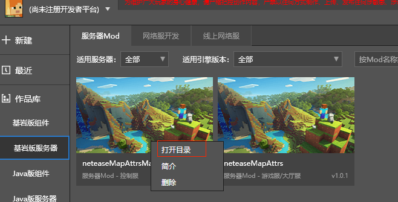

# 地图插件调整（上）
## 了解与试用插件

* 打开studio，选择【新建】-->【基岩版网络服】

*  修改网络服名称为【地图属性插件微调】
*  账号、用户名、机器配置等信息，请根据申请获取到的开发服务器信息填写

* 选择【游戏配置】-->【大厅服】-->【Mod的下拉菜单】-->【获取公共Mod】

* 选择**地图属性插件**，点击【全部下载】，等待下载完成后关闭此弹出界面

* 再次点击【Mod的下拉菜单】，选中【neteaseMapAttrs】插件

* 点击【下一步】开始配置游戏服

* 存粹为了体验**地图属性插件**的部分功能，不需要部署游戏服，直接点击【下一步】，开始配置控制服

* **地图属性插件**包含控制服插件，点击【Mod的下拉菜单】，选中【neteaseMapAttrsMaster】插件

* 控制服配置完成，点击下一步配置功能服

* **地图属性插件**不包含控制服插件，直接点击【下一步】，配置代理服

* 代理服不支持插件功能，直接点击【完成】，结束【游戏配置】
* 【数据库】分页的配置信息，请根据申请获取到的开发服务器信息填写
* 【更多】分页的配置信息，在开发阶段直接使用默认即可，无需修改
 
*  在studio选择【基岩版服务器】-->【网络服开发】-->选中【地图属性插件微调】-->点击【部署】，等待服务器部署完成

* 点击【开发测试】即可启动客户端体验**地图属性插件**的功能


## 插件架构分析
### 获取插件的源码
* 下载完成的插件，一般可以在[C:\MCStudioDownload\ApolloMod\{开发者账号}]目录中找到
* 此外，也可以从studio中跳转到插件下载的目录
* 在studio选中【基岩版服务器】-->【服务器Mod】-->选中【neteaseMapAttrsMaster】or 【neteaseMapAttrs】-->点击【更多】

* 在菜单中点击【打开目录】

* 此时会进入到目标Mod的下载目录，点击【上一层】，即可定位到全部Mod的下载目录

* 【neteaseMapAttrs】和【neteaseMapAttrsMaster】就是**地图属性插件**的源码目录

* 把源码复制到自己本地的代码目录，方便随时添加注释与修改调试

### 从readme开始
* 查看**地图属性插件**的readme文件，仔细查看实现的功能点
* 其中并没有需要多个服务器进程协作的功能，再往下发现**地图属性插件**支持一个运营指令，那么大致上可以判断，【neteaseMapAttrsMaster】插件仅仅是作为运营指令的一个入口和驱动，和实际的游戏相关功能并没有特别强的联系。
```
地图属性插件，地图属性插件用于设置整个地图的一些通用属性，包括：
1、是否开启主城保护
2、是否禁止藤蔓生长
3、是否禁止流体流动
4、是否定时清理掉落物 与 定时清理掉落物间隔
5、在地图指定位置设置浮空文字
6、设置地图边界（玩家走出边界会被传送回最近离开的合法位置）
7、设置玩家是否可丢弃物品
8、玩家是否可捡起物品
9、可以根据针对地图编辑器导出的地图文件替换游戏地图
...
...
...
运营指令：
（1）设置指定服务器地图边界。
post url: http:masterip:masterport//mapAttrs/set-area-limit
post body:{
	"type": "gameA",      # 目标服务器类型。每种类型只有一个服务器，通过服务器类型区分不同服务器。
	"minPos" : [-50,0,-50], # 地图边界(x, y, z)坐标的最小值
	"maxPos": [50,20,50] # 地图边界(x, y, z)坐标的最大值
}
response:
{
    "message": "",
    "code": 1, #1表示成功，2表示失败
    "entity": ""
}
```
### 基于目录结构分析
* **地图属性插件**，从最外层看，一共有两个Mod
```
├─neteaseMapAttrs
├─neteaseMapAttrsMaster
```
* 展开各个目录，基于插件的结构，代码文件命名和大小，以及结合**地图属性插件**实现的具体功能，大致可以对每个代码文件有一些定位
```
├─neteaseMapAttrs
  | md5         # 下载用的对比文件，与插件逻辑无关，本地代码目录中可以删除
  | readme.txt  # 功能说明文件，是非常好的信息来源
  ├─behavior_packs      # 行为包总目录
    └─neteaseMapAttrsBehavior    # 插件只有一个行为包
      | manifest.json            # 行为包的UDID
      ├─neteaseMapAttrsScript    # 客户端Mod脚本根目录
        | __init__.py
        | mapAttrsClientSys.py   # 客户端Mod的system类，具体分析见下文
        | mapAttrsConsts.py      # 客户端Mod宏定义
        | modMain.py             # 客户端Mod入口
        | textBoardMgr.py        # 客户端Mod中管理浮空文字的类，具体分析见下文
        └─util.py                # 客户端Mod的一些功能函数
      └─structures
        └─mapStructure           # 结合readme可知，此目录用来放置【功能9】需要的mcstructure文件（由编辑器生成）
  ├─developer_mods      # 服务端Mod总目录
    └─neteaseMapAttrsDev         # 插件只有一个服务端Mod
      | mod.json                 # 插件配置信息文件
      ├─neteaseMapAttrsScript    # 服务端Mod脚本根目录
        | __init__.py
        | coroutineMgrGas.py     # 服务端Mod中的利用yield实现的管理延时执行函数的类，具体分析见下文
        | mapAttrsConsts.py      # 服务端Mod宏定义
        | mapAttrsServerSys.py   # 服务端Mod的system类，具体分析见下文
        | modMain.py             # 服务端Mod入口
        | playerMgr.py           # 服务端Mod中管理玩家的类，主要用于实现【功能6】，具体分析见下文
        └─util.py                # 服务端Mod的一些功能函数
      └─mapStructureConfig
        └─neteaseMapStructueConfig.json  # 此文件是与客户端Mod中mcstructure文件对应的配置文件（内容由编辑器生成）
  ├─resource_packs      # 资源包总目录，插件没有美术资源，所以是空的
  ├─worlds
    ├─level
      | world_behavior_packs.json   # 行为包的UDID描述
      └─world_resource_packs.json   # 资源包的UDID描述（资源包是空的，所以文件的内容也是空的）
├─neteaseMapAttrsMaster
  | md5          # 下载用的对比文件，与插件逻辑无关，本地代码目录中可以删除
  | readme.txt   # 功能说明文件，内容与【neteaseMapAttrs】中一样
  └─developer_mods         # 控制服Mod总目录
    └─neteaseMapAttrsDev   # 插件只有一个控制服Mod
      | mod.json           # 插件配置信息文件
      └─neteaseMapAttrsScript     # 控制服Mod脚本根目录
        | __init__.py
        | mapAttrsConsts.py       # 控制服Mod宏定义
        | mapAttrsMasterSys.py    # 控制服Mod，具体分析见下文
        | modMain.py              # 控制服Mod入口
        └─util.py                 # 控制Mod的一些功能函数
```
### 小结
* 插件的总体结构并不复杂，每个端的Mod（客户端、服务端、控制服）都仅有一个system文件与一两个自定义的管理类
* 结合readme的功能、运营指令描述，插件的控制服Mod功能仅仅是接收和反馈运营指令
* 插件的客户端Mod中，仅有一个管理浮空文字的类，和【功能5】实现强相关
* 插件的服务端Mod中，有一个使用python的yield