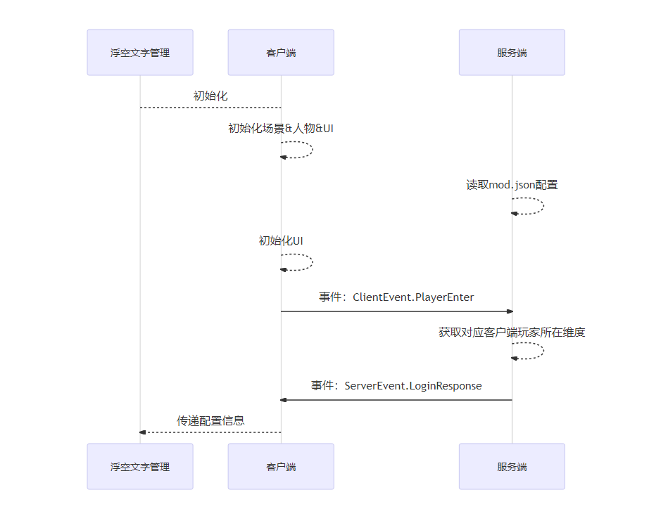
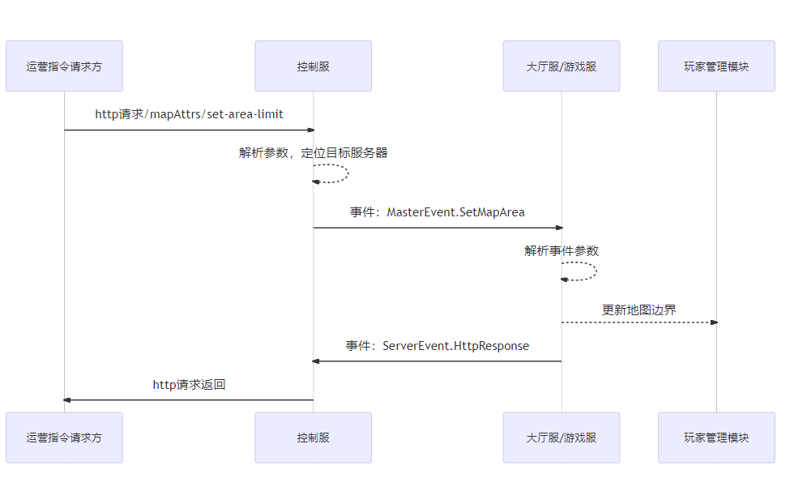

# 地图插件调整（中）


## 插件核心代码解析
* 阅读源码之前，需要对python脚本语言有基础的了解。
* 插件中使用了yield关键字实现了一个延时函数执行机制，具体yield的用法可以自助查询，但是不了解也不影响对逻辑的理解，简单地当成一个延时的Timer就行了。
* 默认对插件的事件、回调机制比较了解，相关基础知识详见[事件简介](../../20-玩法开发/10-基本概念/1-我的世界基础概念.md)。

### mapAttrsClientSys.py
#### 初始化
* 初始化时，生成了一个【textBoardMgr.py】中定义的类【TextBoardMgr】的实例
```python
class MapAttrsClientSys(ClientSystem):
	def __init__(self, namespace, systemName):
		...
		self.mTextMgr = TextBoardMgr(self.mPlayerId, offset=50.0)
```
#### 处理引擎事件【UiInitFinished】
* 回调函数【OnUiInitFinished】中向服务端发送一个自定义事件，用于提示服务端本客户端准备就绪。
* 服务端接收到此事件后会回应客户端自定义事件【ServerEvent.LoginResponse】，事件中会带有客户端玩家初始所在的维度信息与【功能5、在地图指定位置设置浮空文字】相关的配置信息
```python
class MapAttrsClientSys(ClientSystem):
	def __init__(self, namespace, systemName):
		...
		util.ListenClientEngineEvent("UiInitFinished", self, self.OnUiInitFinished)

	def OnUiInitFinished(self, data):
		print 'OnUiInitFinished', data
		requestData = {
			"playerId": self.mPlayerId,
		}
		util.NotifyToServer(ClientEvent.PlayerEnter, requestData)
```
#### 处理引擎事件【DimensionChangeClientEvent】
*  回调函数【OnDimChange】中更新当前自己所在的维度
```python
class MapAttrsClientSys(ClientSystem):
	def __init__(self, namespace, systemName):
		...
		util.ListenClientEngineEvent("DimensionChangeClientEvent", self, self.OnDimChange)

	def OnDimChange(self, data):
		self.mPlayerDim = data["toDimensionId"]
		self.mTextMgr.OnDimChange(data)

	def OnLoginResponse(self, data):
		print 'OnLoginResponse', data
		self.mPlayerDim = data["dim"]
```
#### 处理服务端自定义事件【ServerEvent.LoginResponse】
* 回调函数【OnLoginResponse】中，从服务端返回的信息中，初始化自己当前所在的维度，并提交【功能5、在地图指定位置设置浮空文字】所需的浮空文字配置信息给【TextBoardMgr】实例
```python
class MapAttrsClientSys(ClientSystem):
	def __init__(self, namespace, systemName):
		...
		util.ListenServerEvent(ServerEvent.LoginResponse, self, self.OnLoginResponse)

	def OnLoginResponse(self, data):
		print 'OnLoginResponse', data
		self.mPlayerDim = data["dim"]
		self.mTextMgr.Init(data["configData"])
```
### textBoardMgr.py
* 管理浮空文字，实现【功能5】的类
* 浮空文字的创建，依赖于浮空文字所在位置的区块已经成功加载进客户端的内存中，否则无法创建成功
* 需要一个管理类通过时钟触发的检查逻辑，动态判定哪些浮空文字进入了玩家的【逻辑视野】，并且尝试创建之。
* 需要处理和维度跳转相关的清理、重新创建的逻辑
```python
class TextBoardMgr(object):
	# 创建对象时，初始化参数为玩家自己的entityId，以及逻辑视野（当浮空文字距离玩家小于多少时，便会被创建）
	def __init__(self, playerId, offset=5.0):
		...
		self.mCheckOffset = offset

	def Init(self, configData):
		# 通过服务端自定义事件【ServerEvent.LoginResponse】中的浮空文字配置信息，生成等待创建的浮空文字字典。
		textWithPlaceList = configData.get("text_with_place_list", None)
		...
		# 注册每3秒钟执行一次的timer，触发检查是否有浮空文字需要被创建
		self.mAddTimer = comp.AddRepeatedTimer(3.0, self.CheckAddTextBoard)

	def Destroy(self):
		...
	# 当玩家所处维度变化时，删除位于旧维度的全部浮空文字实例
	def OnDimChange(self, data):
		...
	# 检查是否有浮空文字需要被创建
	def CheckAddTextBoard(self):
		...
		for idx, conf in self.mTextWithPlaceMap.iteritems():
			# 跳过已经创建完成的浮空文字
			if self.mTextIdxToEntityId.has_key(idx):
				continue
			# 跳过维度不一致的浮空文字
			if dim != conf["dim"]:
				continue
			# 跳过逻辑视野之外的浮空文字
			if self.IsFar(pos, conf["pos"]):
				continue
			...
			# 创建浮空文字
			entityId = util.GetSystem().CreateEngineTextboard(
				conf["text"], self.mPlayerId, conf["pos"], conf["textColor"],
				conf["tagColor"], conf["size"], conf["depthTest"])
			if entityId is None or entityId <= 0:
				continue
			# 缓存浮空文字的实体ID，记录已经创建成功了
			self.mTextIdxToEntityId[idx] = entityId
```
### mapAttrsServerSys.py
#### 初始化
* 读取mod.json的配置信息
* 生成【coroutineMgrGas.py】中定义的类【CoroutineMgr】的实例
* 生成【playerMgr.py】中定义的类【PlayerMgr】的实例，假如配置中激活了【功能6、设置地图边界】的话。
```python
class MapAttrsServerSys(ServerSystem):
	def __init__(self, namespace, systemName):
		...
		util.LoadModConf()
		...
		self.Init()
		self.mCoroutineMgr = CoroutineMgr()

	def Update(self):
		self.mCoroutineMgr.Tick()

	def Init(self):
		...
		self.mPlayerMgr = None
		if util.GetModConfByField("map_area_limit"):
			self.mPlayerMgr = PlayerMgr()
			self.mPlayerMgr.Init(util.GetModConfByField("map_area_limit"))
```
#### 功能1、是否开启主城保护
* 直接使用组件API【OpenCityProtect】实现
```python
gameComp = self.CreateComponent(extraServerApi.GetLevelId(), 'Minecraft', 'game')
if util.GetModConfByField("open_map_protect"):
	suc = gameComp.OpenCityProtect()
```
#### 功能2、是否禁止藤蔓生长
* 直接使用组件API【DisableVineBlockSpread】实现
```python
gameComp = self.CreateComponent(extraServerApi.GetLevelId(), 'Minecraft', 'game')
if util.GetModConfByField("forbid_vine_spread"):
	gameComp.DisableVineBlockSpread(True)
```
#### 功能3、是否禁止流体流动
* 直接使用组件API【ForbidLiquidFlow】实现
```python
gameComp = self.CreateComponent(extraServerApi.GetLevelId(), 'Minecraft', 'game')
if util.GetModConfByField("forbid_liquid_flow"):
	gameComp.ForbidLiquidFlow(True)
```
#### 功能4、是否定时清理掉落物 与 定时清理掉落物间隔
* 使用组件API【AddRepeatedTimer】注册一个定时执行的清理函数
* 使用【/kill @e[type=item]】指令清理道具实体
```python
gameComp = self.CreateComponent(extraServerApi.GetLevelId(), 'Minecraft', 'game')
self.mCleanDropTimer = None
if util.GetModConfByField("enable_clean_drop_item"):
	interval = util.GetModConfByField("clean_drop_item_interval")
	if interval > 0:
		self.mCleanDropTimer = gameComp.AddRepeatedTimer(interval, self.CleanDropItem)

def CleanDropItem(self):
	comp = extraServerApi.CreateComponent(extraServerApi.GetLevelId(), "Minecraft", "command")
	comp.SetCommand("/kill @e[type=item]")
```
#### 功能7、设置玩家是否可丢弃物品
* 直接使用组件API【SetDisableDropItem】实现
* 在玩家登录完成后（客户端的初始化完成消息），使用组件API【EnableKeepInventory】保证死亡物品也不掉落
```python
gameComp = self.CreateComponent(extraServerApi.GetLevelId(), 'Minecraft', 'game')
if util.GetModConfByField("forbid_drop_item"):
	gameComp.SetDisableDropItem(True)

if util.GetModConfByField("forbid_drop_item"):
	comp = self.CreateComponent(playerId, "Minecraft", "player")
	suc = comp.EnableKeepInventory(True)
	print "EnableKeepInventory for player=%s suc=%s" % (playerId, suc)
```
#### 功能8、玩家是否可捡起物品
* 注册引擎事件【ServerPlayerTryTouchEvent】和【ServerPlayerGetExperienceOrbEvent】
* 回调函数【OnPlayerPickItem】中设置cancel=True，pickupDelay=100000（取消本次拾取，并设置下次拾取的cd大于97813帧，视作无法拾取）
* 回调函数【ServerPlayerGetExperienceOrbEvent】中设置cancel=True（取消本次拾取）
```python
gameComp = self.CreateComponent(extraServerApi.GetLevelId(), 'Minecraft', 'game')
if util.GetModConfByField("forbid_pickup_item"):
	util.ListenServerEngineEvent("ServerPlayerTryTouchEvent", self, self.OnPlayerPickItem)
	util.ListenServerEngineEvent("ServerPlayerGetExperienceOrbEvent", self, self.OnPlayerPickOrb)

def OnPlayerPickItem(self, data):
	data["cancel"] = True
	data["pickupDelay"] = 100000

def OnPlayerPickOrb(self, data):
	data["cancel"] = True
```
#### 功能9、可以根据针对地图编辑器导出的地图文件替换游戏地图
* 只有对应区块加载进内存的前提下，才能对区块对应的地图方块进行修改，所以需要一个用于【开地图】的玩家，在配置中需要指定一个特定的uid。
* 利用mCoroutineMgr实现的延时执行函数，每隔一定时间执行一块地图区域的覆盖工作
* 单次地图区域的覆盖逻辑：先把【开地图】的玩家传送到需要进行地图覆盖的位置，然后使用【PlaceStructure】函数对地图区域进行覆盖
```python
def SetMapStructure(self, playerId, playerUid):
	if playerUid != util.GetModConfByField("change_uid"):
		return
	needChangeDimension = util.GetModConfByField("change_map_dimension")
	neteaseMapStructureConfigPath = commonNetgameApi.GetModScriptRootDir("neteaseMapAttrsScript") + "/mapStructureConfig" + "/neteaseMapStructueConfig.json"
	neteaseMapStructureConfig = util.read_json(neteaseMapStructureConfigPath)
	print "SetMapStructure",neteaseMapStructureConfigPath, neteaseMapStructureConfig
	if neteaseMapStructureConfig is None:
		return
	for oneConfig in neteaseMapStructureConfig:
		self.mCoroutineMgr.StartCoroutine(self.RealSetMapStructure(playerId, needChangeDimension, oneConfig, neteaseMapStructureConfig.index(oneConfig) + 1))

def RealSetMapStructure(self, playerId, needChangeDimension, oneConfig, delayFrame):
	yield -1 * delayFrame * 60
	tpPos = oneConfig.get("pos")
	#changeDimension = oneConfig.get("change_map_dimension")
	dimensionComp = self.CreateComponent(playerId, "Minecraft", "dimension")
	# playerDimension = dimensionComp.GetEntityDimensionId()
	print "tpPos", tpPos, needChangeDimension
	dimensionComp.ChangePlayerDimension(needChangeDimension, (tpPos[0], tpPos[1] + 3, tpPos[2]))
	strucFile = oneConfig.get("file")[:-12]# 去掉后缀
	strucFile = "mapStructure:" + strucFile
	print "RealSetMapStructureFile", strucFile, tuple(tpPos)
	gameComp = self.CreateComponent(extraServerApi.GetLevelId(), "Minecraft", "game")
	suc = gameComp.PlaceStructure(playerId, tuple(tpPos), strucFile.encode("utf-8"))
	print "RealSetMapStructure", suc
```
#### 处理客户端自定义事件【ClientEvent.PlayerEnter】
* 回调函数【OnClientEnter】中，获取目标客户端的玩家所在的维度，玩家的uid（这两个信息当前仅能通过服务器API获取），以及配置信息中的浮空文字配置（浮空文字显示逻辑由客户端实现），并返回给目标客户端（利用服务器自定义事件【ServerEvent.LoginResponse】）
* 在【OnClientEnter】中，才调用【EnableKeepInventory】保证死亡物品也不掉落，是因为在【AddServerPlayerEvent】中，其实引擎层的player实体还没有彻底创建完毕，有些组件API是没法正常生效的。
```python
util.ListenClientEvent(ClientEvent.PlayerEnter, self, self.OnClientEnter)

def OnClientEnter(self, data):
	...
	playerId = data['playerId']
	uid = netgameApi.GetPlayerUid(playerId)
	responseData = {
		"uid": uid,
		"dim": util.GetEntityDimensionId(playerId),
		"configData": {},
	}
	responseData["configData"]["text_with_place_list"] = self.mCheckedTextWithPlaceList
	util.NotifyToClient(playerId, ServerEvent.LoginResponse, responseData)
	if util.GetModConfByField("forbid_drop_item"):
		comp = self.CreateComponent(playerId, "Minecraft", "player")
		suc = comp.EnableKeepInventory(True)
		print "EnableKeepInventory for player=%s suc=%s" % (playerId, suc)
```
#### 实现运营指令（1）设置指定服务器地图边界。
* 注册控制服自定义事件【MasterEvent.SetMapArea】
* 回调函数【OnSetMapArea】中修改实际生效的地图边界，并返回结果给控制服
* 传递新的地图边界信息给【mPlayerMgr】对象，【功能6、设置地图边界】的逻辑有此对象负责管理。
```python
util.ListenMasterEvent(MasterEvent.SetMapArea, self, self.OnSetMapArea)

def OnSetMapArea(self, data):
	bSuc, reason = self.TryChangeAreaLimit(data.get("minPos", None), data.get("maxPos", None))
	...
	self.NotifyToMaster(ServerEvent.HttpResponse, httpRes)

def TryChangeAreaLimit(self, minPos, maxPos):
	if not self.mPlayerMgr:
		return False, "not support area limit this server"
	if minPos is None or maxPos is None:
		return False, "must set minPos and maxPos first"
	try:
		for i in xrange(3):
			if minPos[i] >= maxPos[i]:
				return False, "minPos must larger than maxPos"
	except:
		return False, "minPos and maxPos must like (x, y, z)"
	self.mPlayerMgr.UpdateAreaLimit(minPos, maxPos)
	return True, ""
```
### playerMgr.py
* 管理玩家的对象
* 用于实现【功能6、设置地图边界（玩家走出边界会被传送回最近离开的合法位置）】
#### SinglePlayer类
* 保留最近一段时间内的，玩家的移动轨迹（以定时坐标采样的形式）
* 当玩家走出边界，需要被传送时，从近期的移动轨迹中找出最近的合法位置，并强制传送
```python
class SinglePlayer(object):
	def __init__(self, playerId):
		...
	# 缓存玩家的移动轨迹且去重
	# 当缓存数据超过30个点的时候，一次性的裁剪到剩余最新的15个点
	def CacheLastSafePos(self, x, y, z):
		if self.mLastSafePos and self.mLastSafePos[0] == x and self.mLastSafePos[1] == y and self.mLastSafePos[2] == z:
			return
		pos = (x, y, z)
		self.mLastSafePos = pos
		self.mCanUseSafePosList.insert(0, pos)
		if len(self.mCanUseSafePosList) > 30:
			self.mCanUseSafePosList = self.mCanUseSafePosList[:15]
	# 从移动轨迹中，获取最近离开的合法位置
	# 由于地图边界是可以动态设置的，过去缓存的轨迹现在就不一定合法了，所以最终用地图范围的中心点保底
	def FindUsableSafePos(self):
		for pos in self.mCanUseSafePosList:
			if util.IsInArea(pos, AABB_MIN, AABB_MAX):
				return pos
		return GetLimitAreaCenter()
	# 强制传送玩家到最近离开的合法位置
	# 强制传送前，需要强制玩家下坐骑
	def SyncToSafePos(self):
		# 如果找不到可以放置的点，就不重新设置了
		safePos = self.FindUsableSafePos()
		if safePos is None:
			return
		rideComp = extraServerApi.CreateComponent(self.mPlayerId, "Minecraft", "ride")
		if rideComp:
			riderId = rideComp.GetEntityRider()
			if riderId != -1:
				rideComp.StopEntityRiding()
				riderPosComp = extraServerApi.CreateComponent(riderId, "Minecraft", "pos")
				riderPosComp.SetPos(safePos)
		posComp = extraServerApi.CreateComponent(self.mPlayerId, "Minecraft", "pos")
		posComp.SetPos(safePos)
```
#### PlayerMgr类
* 注册一个每秒执行一次的循环函数【CheckSafePos】
* 每次执行【CheckSafePos】，都会遍历当前全部在线玩家，判定玩家当前的位置，假如位置没有超出地图边界，那么就缓存，假如维持超出地图边界，那么就触发强制传送
```python
class PlayerMgr(object):
	def __init__(self):
		...

	def Init(self, map_area_limit):
		gameComp = extraServerApi.CreateComponent(extraServerApi.GetLevelId(), 'Minecraft', 'game')
		self.mCheckTimer = gameComp.AddRepeatedTimer(1.0, self.CheckSafePos)
		...

	def CheckSafePos(self):
		for playerId, obj in self.mPlayerMap.iteritems():
			...
			if util.IsInArea((x, y, z), AABB_MIN, AABB_MAX):
				obj.CacheLastSafePos(x, y, z)
			else:
				obj.SyncToSafePos()
```
### coroutineMgrGas.py
* 利用python的yield关键字与迭代器机制，实现的延时执行函数的管理器
* 当yield的返回值为负数时，每个tick都会加1，直到为0时开始执行yield后面的语句，等价于**多少帧后执行**
* 当yield的返回值为正数时，在当前时间+返回值的时刻之后的第一帧，开始执行yield后面的语句，等价于**多少秒后执行**
```python
class CoroutineMgr(object):
    ...
    @classmethod
    def Tick(cls):
        if cls.addCoroutines:
            for c,v in cls.addCoroutines.iteritems():
                cls.coroutines[c] = v
        cls.addCoroutines = {}
        if cls.globalEnd:
            for c in cls.globalEnd:
                if cls.coroutines.get(c):
                    del cls.coroutines[c]
            cls.globalEnd = []
        ended = []
        for c, v in cls.coroutines.iteritems():
            try:
                if v < 0:
                    v += 1
                    cls.coroutines[c] = v
                if v == 0 or (v > 0 and time.time() >= v):
                    newv = c.next()
                    if newv > 0:
                        newv = newv + time.time()
                    cls.coroutines[c] = newv
            except StopIteration:
                ended.append(c)
        for c in ended:
            del cls.coroutines[c]

def DelayDoByFrame(self, delayFrame):
    yield -1 * delayFrame

def DelayDoBySecond(self, delaySec):
    yield delaySec
```
### mapAttrsMasterSys.py
* 仅用于实现【运营指令（1）设置指定服务器地图边界】
* 分析http请求的参数，转发运营指令中的地图边界信息到指定类型的服务器进程（当时设计时，仅支持一种服务器类型单独一个进程）
* 监听来自其他服务器进程的自定义事件【ServerEvent.HttpResponse】，返回最终处理结果给运营指令的请求方
#### 监听http请求【/mapAttrs/set-area-limit】
* 回调函数【OnChangeAreaLimit】中，通过服务器类型定位到对应的服务器ID，并转发新的地图边界信息给对应服务器ID的进程
```python
class MapAttrsMasterSys(MasterSystem):
	def __init__(self, namespace, systemName):
		...
		masterHttp.RegisterMasterHttp("/mapAttrs/set-area-limit", self, self.OnChangeAreaLimit)

	def OnChangeAreaLimit(self, clientId, requestBody):
		eventData = json.loads(requestBody)
		...
		serverId = self.GetServerIdByType(eventData['type'])
		...
		eventData['clientId'] = clientId
		self.NotifyToServerNode(serverId, MasterEvent.SetMapArea, eventData)

	def GetServerIdByType(self, typeKey):
		...
```
#### 处理服务端自定义事件【ServerEvent.HttpResponse】
* 回调函数【OnHttpResponse】中，直接打包返回结果给http请求的发起方
```python
class MapAttrsMasterSys(MasterSystem):
	def __init__(self, namespace, systemName):
		...
		util.ListenServerEvent(ServerEvent.HttpResponse, self, self.OnHttpResponse)

	def OnHttpResponse(self, args):
		res = self.makeResponse(args['code'], args['message'], args['entity'])
		masterHttp.SendHttpResponse(args['clientId'], res)
```
## 多端协作逻辑
* 整个地图属性插件的逻辑都比较简单和原子化，仅少量的逻辑涉及到多端协作
### 客户端登录
* 【功能5、在地图指定位置设置浮空文字】，由每个客户端自主创建浮空文字实现
* 但是对应需要的浮空文字的维度和坐标配置信息，都在服务端的mod.json中，需要从服务端获取
* 此外，创建和维护浮空文字，需要知道当前客户端所在的维度信息，客户端能够通过引擎事件【DimensionChangeClientEvent】，监听到切换维度的事件，但是没有获取刚登录时，初始维度的信息，也需要从服务端获取
* 一般而言，考虑到客户端启动需要加载场景、加载人物、初始化UI等一系列工作，服务端也需要客户端主动给出一个明确的信号，确认客户端已经准备完毕，可以正常运行脚本逻辑。
#### 客户端登录时的多端数据流如下图：


### 运营指令（1）设置指定服务器地图边界
* 运营指令以http请求的方式发送给控制服
* 控制服解析请求参数后定位到具体实现功能的服务器进程，并发送事件给目标游戏服/大厅服
* 服务器根据事件的参数，调整地图边界，并以事件的方式返回结果给控制服
* 控制服返回运营指令执行结果给http的请求方

