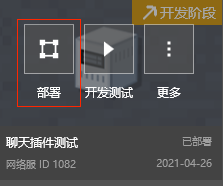
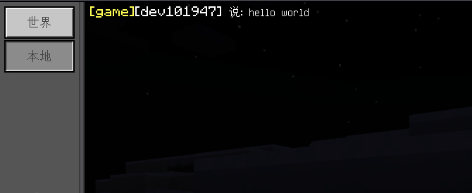

---
front:
hard: 进阶
time: 45分钟
---

# 聊天插件调整

## 概述

本教学文档从官方的聊天插件触发，介绍网络服插件的目录结构，事件侦听、回调流程，功能服（Service）概念，以及微调插件代码增加聊天前缀。

教学文档目录简介如下：

- 插件架构分析：主要说明官方插件的目录结构、功能，以及在具体运行中，事件是如何侦听与回调。
- 功能服概念：功能服（Service）作为连接众多game服、lobby服的中心，若需要在这些服务器之间通信，必须要引入功能服（Service）。
- 聊天插件调整：介绍如何调整插件代码，实现聊天前缀增加服务器名称的功能。


## 插件架构分析

### 目录结构

一共有两个mod,`neteaseChat`和`neteaseChatService`，目录结构如下

```
neteaseChat ------------------------------- 聊天插件(不属于大厅服或游戏服)
│  readme.txt ----------------------------- 说明文件
│
├─behavior_packs -------------------------- 行为包总目录
│  └─neteaseChatBehavior ------------------ 插件行为包
│      │  manifest.json ------------------- 行为包记录文件，用于标识行为包
│      │
│      └─neteaseChatScript ---------------- 客户端Mod脚本根目录
│          │  chatConsts.py --------------- 常量定义
│          │  chatManager.py -------------- 管理聊天信息的类，用于不同channel的聊天管理
│          │  modMain.py ------------------ Mod入口文件
│          │  neteaseChatClientSystem.py -- Mod的system类
│          │  __init__.py ----------------- 初始化文件
│          │
│          └─ui --------------------------- 客户端Mod的UI脚本根目录
│                  neteaseChatUI.py ------- 聊天界面脚本，实现具体逻辑
│                  uiDef.py --------------- UI定义脚本
│                  uiMgr.py --------------- UI管理脚本，用于管理各个界面的接口
│                  __init__.py ------------ 初始化文件
│
├─developer_mods --------------------------- 服务端Mod总目录
│  └─neteaseChatDev ------------------------ 插件开发包
│      │  mod.json ------------------------- 插件配置信息文件
│      │
│      └─neteaseChatScript ----------------- 服务端Mod脚本根目录
│              chatConsts.py --------------- 常量定义
│              chatManager.py -------------- 管理聊天的类
│              modMain.py ------------------ Mod入口文件
│              neteaseChatServerSystem.py -- Mod的system类
│              __init__.py ----------------- 初始化文件
│
├─resource_packs --------------------------- 资源包总目录
│  └─neteaseChatResource ------------------- 插件资源包
│      │  manifest.json -------------------- 行为包记录文件，用于标识资源包
│      │
│      ├─textures -------------------------- 贴图资源
│      │  └─ui ----------------------------- UI贴图目录
│      │      └─netease_chat --------------- 聊天界面UI贴图路径
│      │
│      └─ui -------------------------------- UI配置目录
│              neteaseChatUI.json ---------- 聊天界面UI配置文件
│              _ui_defs.json --------------- UI配置文件，用到的界面，目前只用到聊天界面
│
└─worlds ----------------------------------- 存档目录
    └─level -------------------------------- 存档目录
            world_behavior_packs.json ------ 记录用到的行为包
            world_resource_packs.json ------ 记录用到的资源包

neteaseChatService ------------------------- 聊天插件(部署于功能服)
│  readme.txt ------------------------------ 说明文件
│
└─developer_mods --------------------------- 服务端Mod总目录
    └─neteaseChatDev ----------------------- 插件开发包
        │  mod.json ------------------------ 插件配置信息文件
        │
        └─neteaseChatScript ---------------- 客户端Mod脚本根目录
                chatConsts.py -------------- 常量定义
                chatManager.py ------------- 管理聊天信息的类，用于不同channel的聊天管理
                modMain.py ----------------- Mod入口文件
                neteaseChatServiceSystem.py  Mod的system类
                __init__.py ---------------- 初始化文件
```

### 主要模块

聊天插件主要分为三个部分，各部分说明如下

- 服务端Mod

  - Server System: 服务端Mod System类，负责各节点通信和事件响应，定义于脚本

    `neteaseChat\developer_mods\neteaseChatDev\neteaseChatScript\neteaseChatServerSystem.py`

  - Server Chat Manager: 服务端Mod聊天消息管理类，负责各频道消息管理，定义于脚本

    `neteaseChat\developer_mods\neteaseChatDev\neteaseChatScript\chatManager.py`

- 客户端Mod

  - Client System: 客户端Mod System类，负责与客户端通信与事件响应，定义于脚本

    `neteaseChat\behavior_packs\neteaseChatBehavior\neteaseChatScript\neteaseChatClientSystem.py`

  - Client Chat Manager: 客户端Mod聊天消息管理，负责各频道消息管理,每个频道一个Chat Manager，定义于脚本

    `neteaseChat\behavior_packs\neteaseChatBehavior\neteaseChatScript\chatManager.py`

  - Client UI Manager: 客户端Mod UI管理类，负责客户端UI界面管理，定义于脚本`neteaseChat\behavior_packs\neteaseChatBehavior\neteaseChatScript\ui\uiMgr.py`

  - Client Chat UI: 聊天界面，负责聊天消息显示与按钮响应，定义于脚本

    `neteaseChat\behavior_packs\neteaseChatBehavior\neteaseChatScript\ui\neteaseChatUI.py`

- Service Mod

  - Service System: 功能服Mod System类，负责各节点通信与事件响应，定义于脚本

    `neteaseChatService\developer_mods\neteaseChatDev\neteaseChatScript\neteaseChatServiceSystem.py`

  - Service Chat Manager: 功能服Mod聊天消息管理，负责转发各频道消息，定义于脚本

    `neteaseChatService\developer_mods\neteaseChatDev\neteaseChatScript\chatManager.py`


### 运行流程


#### 初始化


初始化流程如上图所示，主要步骤为：

1. **System 与 Chat Manager初始化**：

   1.1 Server System 初始化，创建世界频道和本地频道，本地频道为服务器id，世界频道为0

   ```python
   # ChatServerSystem
   def Init(self):
   		self.modConfig = commonNetgameApi.GetModJsonConfig('neteaseChatScript')
   		self.mServerid = netgameApi.GetServerId()
   		self.mChatManagers[self.mServerid] = chatManager.ChatManager(self, self.mServerid)
   		self.mChatManagers[chatConsts.ALL_SERVER_CHANNEL] = chatManager.ChatManager(self, chatConsts.ALL_SERVER_CHANNEL)
   		self.mChatIntervalCD = {
   			self.mServerid: self.modConfig['localeCD'],
   			chatConsts.ALL_SERVER_CHANNEL: self.modConfig['worldCD']
   		}
   		self.mChatCD = {
   			self.mServerid: {},
   			chatConsts.ALL_SERVER_CHANNEL: {}
   		}
   ```


   1.2 Client System 初始化，创建UI Manager

   ```python
   class ChatClientSystem(ClientSystem):
   	def __init__(self, namespace, systemName):
   		ClientSystem.__init__(self, namespace, systemName)
   		# 省略一些代码
   		self.mUIMgr = uiMgr.UIMgr()
   ```


   1.3 Service System 初始化，响应`NetGameCommonConfChangeEvent`,创建各服频道和世界频道，服务器列表中的每个服务器创建一个频道，频道id为各服务器id，世界频道id为0

   ```python
   # ChatServiceSystem
   def OnNetGameCommonConfChangeEvent(self, args):
   		serverIds = set()
   		ccfg = netServiceApi.GetCommonConfig()
   		print "OnNetGameCommonConfChangeEvent", ccfg
   		for conf in ccfg.get("serverlist", []):
   			if conf.get("app_type") in ("game", "lobby"):
   				serverid = conf.get('serverid')#用serverid来区分频道
   				serverIds.add(serverid)
   				if self.mChatManagers.has_key(serverid) == False:
   					self.mChatManagers[serverid] = chatManager.ChatManager(self, serverid)
   		if self.mChatManagers.has_key(chatConsts.ALL_SERVER_CHANNEL) == False:
   			self.mChatManagers[chatConsts.ALL_SERVER_CHANNEL] = chatManager.ChatManager(self, chatConsts.ALL_SERVER_CHANNEL)

   		self.mCommonConfig = serverIds
   ```


2. **客户端响应 `UiInitFinished` 事件**

   2.1 初始化客户单UI管理器并创建聊天界面

   2.2 发送 `ClientUiInitFinished` 事件到服务端

   ```python
   # ChatClientSystem
   def OnUiInitFinished(self, args):
   	self.mUIMgr.Init(self)
   	data = self.CreateEventData()
   	data["entityId"] = clientApi.GetLocalPlayerId()
   	self.NotifyToServer("ClientUiInitFinished", data)
   ```


   2.3 服务端System响应`ClientUiInitFinished`，获取玩家uid和昵称，发送`ModConfigResponseFromServerEvent`事件和`TellYourPlayerUidAndSidEvent`给客户端

   ```python
   # ChatServerSystem
   def OnClientUiInitFinished(self, args):
   	playerId = args.get("entityId")
   	playerUid = netgameApi.GetPlayerUid(playerId)
   	nickName = lobbyGameApi.GetPlayerNickname(playerId)
   	self.NotifyToClient(playerId, "ModConfigResponseFromServerEvent", self.modConfig)
   	self.NotifyToClient(playerId, "TellYourPlayerUidAndSidEvent", {"playerId":playerId, "playerUid":playerUid, "nickName":nickName, "serverid":self.mServerid, 'exBtnList': self.modConfig.get('exBtnList')})
   ```


   2.4 客户端响应 `ModConfigResponseFromServerEvent`事件，更新聊天插件配置

   ```python
   # ChatClientSystem
   def OnModConfigResponseFromServerEvent(self, modConfig):
   		self.modConfig = modConfig
   ```


   2.5 客户端响应`TellYourPlayerUidAndSidEvent`，创建世界频道和本地频道，本地频道id为连接服务器的id，世界频道id为0

   ```python
   # ChatClientSystem
   def OnTellYourPlayerUidAndSidEvent(self, args):
   	self.mMyPlayerUid = args.get("playerUid")
   	self.mNickName = args.get("nickName")
   	self.mServerid = args.get("serverid")
   	self.mChatManagers[self.mServerid] = chatManager.ChatManager(self, self.mServerid)
   	self.mChatManagers[chatConsts.ALL_SERVER_CHANNEL] = chatManager.ChatManager(self, chatConsts.ALL_SERVER_CHANNEL)
   	self.mCurrentChannel = self.mServerid

   	exBtnList = args.get('exBtnList')
   	if isinstance(exBtnList, list) and exBtnList != self.mExBtnList:
   			self.mExBtnList = exBtnList
   ```


#### 主要流程


主要流程如上图所示，说明如下：

1. **显示聊天主界面**

   1.1 在普通聊天框输入数字1

   1.2 服务端响应 `ServerChatEvent`，检测到数字1,发送 `OpenChatList` 到客户端

   ```python
   # ChatServerSystem
   def OnServerChatEvent(self, args):
   		playerId = args.get("playerId")
   		if args["message"] == "1":
   			self.NotifyToClient(playerId, "OpenChatList", {})
   ```


   1.3 客户端响应 `OpenChatList`，显示聊天主界面

   ```python
   # ChatClientSystem
   def OnOpenChatList(self, args = None):
   		ui = self.mUIMgr.GetUI(uiDef.UIDef.UIChatMain)
   		if ui:
   			ui.Show(True)
   ```


2. **切换频道**

   2.1 在聊天主界面点击本地频道或者世界频道

   2.2 调用Client System的ChangeChannel接口，更新频道信息，并广播`LocalChannelChange`

   ```python
   # ChatMainScreen
   def C0(self, args):
   		touchEvent = args["TouchEvent"]
   		touch_event_enum = extraClientApi.GetMinecraftEnum().TouchEvent
   		if touchEvent == touch_event_enum.TouchUp:
   			if self.mClientSystem.mServerid is not None:
   				self.SetVisible(self.mMenuPanel, False)
   				self.SetVisible(self.mClsBtn, False)
   				self.SetVisible(self.mClsMainBtn, False)
   				if self.mClientSystem.GetPlayerCurrentChannel() != 0:
   					self.SetSprite(self.mChannelBar + '/c0/default', "textures/ui/netease_chat/btn01_select")
   					self.SetSprite(self.mChannelBar + '/c1/default', "textures/ui/netease_chat/btn01")
   					self.mClientSystem.ChangeChannel(0)

   # ChatClientSystem
   def ChangeChannel(self, channel):
   		self.mCurrentChannel = channel
   		self.BroadcastEvent('LocalChannelChange', {"chatChannel": self.mCurrentChannel})
   ```


   2.3 响应`LocalChannelChange`,刷新频道聊天消息

   ```python
   # ChatMainScreen
   def OnLocalChannelChange(self, args):
       # 请查看源代码
   ```


3. **发送消息**

   3.1 聊天主界面发送消息

   3.2 发送 `PlayerChatFromClientEvent`到服务端

   ```python
   # ChatMainScreen
   def OnSendButton(self, args):
   		touchEvent = args["TouchEvent"]
   		touch_event_enum = extraClientApi.GetMinecraftEnum().TouchEvent
   		if touchEvent == touch_event_enum.TouchUp:
   			# 省略一些代码
   			self.mClientSystem.NotifyToServer("PlayerChatFromClientEvent", {"playerId":self.mLocalPlayerId, "message":s, "chatChannel":currentChannel})
               # 省略一些代码
   ```


   3.3 服务端响应`PlayerChatFfromClientEvent`,发送`ChatFromServerEvent`到功能服

   ```python
   # ChatServerSystem
   def OnPlayerChatFromClientEvent(self, args):
       # 省略一些代码
       self.RequestToService(chatConsts.ModNameSpace, "ChatFromServerEvent", chatDict)
       # 省略一些代码
   ```


   3.4 功能服响应`ChatFromServerEvent`,插入消息到对应频道

   ```python
   # ChatServiceSystem
   def OnChatFromServerEvent(self, serverId, callbackId, args):
   	chatChannel = args["chatChannel"]
   	print "OnChatFromServerEvent", self.mChatManagers.keys()
   	if self.mChatManagers.has_key(chatChannel):
   		self.mChatManagers[chatChannel].InsertChatMes(args)

   # ChatManager
   def InsertChatMes(self, args):
   		print "serviceInsertChatMes", args
   		playerUid = args["playerUid"]
   		chatDict = self.GenChatDict(args)
   		# if self.mChatRecords.has_key(playerUid) == False:
   		# 	self.mChatRecords[playerUid] = []
   		self.mChatRecords.append(chatDict)
   		self.TellServerNewChat(chatDict)
   ```


   3.5 功能服Chat Manager发送消息到频道所在服务器，如果是世界频道的消息，则发到所有服务器，通过发送`newChatFromServiceEvent`实现

   ```python
   # ChatManager
   def TellServerNewChat(self, chatDict):
   		if self.mChatChannel != chatConsts.ALL_SERVER_CHANNEL:
   			self.system.NotifyToServerNode(self.mChatChannel, "newChatFromServiceEvent", chatDict)
   		else:
   			serverlist = self.system.GetCommonConfig()
   			for serverid in serverlist:
   				self.system.NotifyToServerNode(serverid, "newChatFromServiceEvent", chatDict)
   ```


   3.6 服务端响应`newChatFromServiceEvent`，插入消息到对应频道

   ```python
   # ChatServerSystem
   def OnNewChatFromServiceEvent(self, chatDict):
   		print "OnNewChatFromServiceEvent", chatDict
   		chatChannel = chatDict["chatChannel"]
   		if self.mChatManagers.has_key(chatChannel):
   			self.mChatManagers[chatChannel].InsertChatMes(chatDict)

   # ChatManager
   def InsertChatMes(self, chatDict):
   		print "ServerInsertChatMes", chatDict
   		playerUid = chatDict["playerUid"]
   		# if self.mChatRecords.has_key(playerUid) == False:
   		# 	self.mChatRecords[playerUid] = []
   		self.mChatRecords.append(chatDict)
   		self.TellClientNewChat(chatDict)
   ```


   3.7 服务端Chat Manager发送消息到所有客户端，通过发送`newChatFromServerEvent`实现

   ```python
   # ChatManager
   def TellClientNewChat(self, chatDict):
   		self.system.BroadcastToAllClient("newChatFromServerEvent", chatDict)
   		print "newChatFromServerEvent", chatDict
   ```


   3.8 客户端响应`newChatFromServerEvent`,插入消息到对应频道

   ```python
   # ChatClientSystem
   def OnNewChatFromServerEvent(self, chatDict):
   		#print "OnNewChatFromServerEvent", chatDict
   		#print "self.mChatManagers", self.mChatManagers
   		chatChannel = chatDict["chatChannel"]
   		if self.mChatManagers.has_key(chatChannel):
   			self.mChatManagers[chatChannel].InsertChatMes(chatDict)
   # ChatManager
   def InsertChatMes(self, chatDict):
   		print "ClientInsertChatMes", chatDict
   		playerUid = chatDict["playerUid"]
   		# if self.mChatRecords.has_key(playerUid) == False:
   		# 	self.mChatRecords[playerUid] = []
   		self.mUnReadChatRecords.append(chatDict)
   		if len(self.mUnReadChatRecords) > chatConsts.MAX_CHAT_LEN:
   			self.mUnReadChatRecords.pop(0)
   		self.mAllChatRecords.append(chatDict)
   		if len(self.mAllChatRecords) > chatConsts.MAX_CHAT_LEN:
   			self.mAllChatRecords.pop(0)
   		self.mDirty = True
   ```


   3.9 客户端Chat Manager定时刷新本频道的未读消息，广播事件`LocalNewChatRecord`

   ```python
   # ChatManager
   def RepeatedTellClientNewChat(self):
   		if self.mDirty == True:
   			self.system.BroadcastEvent('LocalNewChatRecord', {"chatChannel":self.mChatChannel})
   			self.mDirty = False
   ```


   3.10 Chat UI响应`LocalNewChatRecord`，刷新当前频道消息

   ```python
   # ChatMainScreen
   def OnLocalNewChatRecord(self, args):
       # 请查看源代码
   ```


## 功能服概念

调整之前，需要先了解一下功能服(Service)的概念。

功能服连接所有服务器和数据库，能够获取所有服务器的信息，可以处理一些全服操作。比如在聊天插件中，如果在本地频道发消息，不需要经过功能服转发，但如果要在世界频道发消息，就需要在功能服中进行转发，把消息发到所有大厅服和游戏服。


## 聊天插件调整

通过一个例子，展示如何调整聊天插件。需求为：聊天内容增加前缀(所属服务器类型)

### 代码调整

代码调整主要有：

- 修改功能服 `neteaseChatServoice` 代码，转发消息时加上服务器类型
- 修改大厅服和游戏服 `neteaseChat` 代码,增加切服逻辑，用来验证服务器类型
- 修改大厅服和游戏服`neteaseChat`代码，消息前缀改为服务器类型

具体步骤为：

1. 转发消息时加上服务器类型

   ```python
   # ChatServiceSystem 修改
   # 创建Chat Manager时传入服务器类型
   def OnNetGameCommonConfChangeEvent(self, args):
   		serverIds = set()
   		ccfg = netServiceApi.GetCommonConfig()
   		print "OnNetGameCommonConfChangeEvent", ccfg
   		for conf in ccfg.get("serverlist", []):
   			if conf.get("app_type") in ("game", "lobby"):
   				serverid = conf.get('serverid')#用serverid来区分频道
   				serverIds.add(serverid)
   				if self.mChatManagers.has_key(serverid) == False:
                       # 修改此处，增加服务器类型
   					self.mChatManagers[serverid] = chatManager.ChatManager(self, serverid, conf['app_type'])
   		if self.mChatManagers.has_key(chatConsts.ALL_SERVER_CHANNEL) == False:
   			self.mChatManagers[chatConsts.ALL_SERVER_CHANNEL] = chatManager.ChatManager(self, chatConsts.ALL_SERVER_CHANNEL)

   		self.mCommonConfig = serverIds

   # ChatManager修改
   # 创建ChatManager时保存 服务器类型
   class ChatManager(object):
   	def __init__(self, system, channel, channelType = ''):
   		import weakref
   		self.system = weakref.proxy(system)
   		self.mChatChannel = channel
   		self.mChatRecords = []
           # 修改此处
   		self.mType = channelType

       # 拼接聊天消息时加入服务器类型
       def GenChatDict(self, args):
   		chatDict = {
   			"playerUid": args["playerUid"],
   			"nickName": args["nickName"],
   			"playerLevel": args["playerLevel"],
   			"chatType": args["chatType"],
   			"mes": args["mes"],
   			"infoDict": args.get("infoDict", {}),
   			"chatChannel": args["chatChannel"],
   			"chatTime": time.time(), #用于客户端排序
               # 修改此处
   			"serverType": self.mType
   		}
   		return chatDict

   ```


2. 增加切服逻辑

   ```python
   # 修改监听聊天消息处理，加入切服功能，输入"switch game"切到游戏服，输入 "switch lobby"切到大厅服
   # ChatServerSystem
   	def OnServerChatEvent(self, args):
   		playerId = args.get("playerId")
   		if args["message"] == "switch game":
   			import lobbyGame.netgameApi as lobbyGameApi
   			lobbyGameApi.TransferToOtherServer(playerId, 'game')
   		elif args["message"] == "switch lobby":
   			import lobbyGame.netgameApi as lobbyGameApi
   			lobbyGameApi.TransferToOtherServer(playerId, 'lobby')
   		elif args["message"] == "1":
   			self.NotifyToClient(playerId, "OpenChatList", {})
   ```

3. 消息前缀改为服务器类型

   ```python
   # ChatMainScreen
   # OnLocalNewChatRecord 里调用 SetChatRichText
   # 用富文本显示聊天消息，需要修改富文本拼接逻辑，即richText赋值
   def SetChatRichText(self, richItem, chatData):
       serverType = chatData["serverType"]
       # 省略一些代码
       if chatType == chatConsts.ChatType.Item:
       # 省略一些代码
           richText = "§e[%s]§r%s 说: " % (serverType, playerText) + re.sub(r"/\[item ([0-9]{1,2})\]", "<link>%s</link>" % linkText.replace('\n', '\\n'), mes)
       elif chatType == chatConsts.ChatType.Common:
   			richText = "§e[%s]§r%s 说: " % (serverType, playerText) + mes
       # 省略一些代码
       elif chatType == chatConsts.ChatType.Team:
   			richText = "§e[%s]§r%s 邀请大家一起加入队伍。%s" % (serverType, playerText, mes)
       # 省略一些代码
   ```


### 部署

1. 大厅服和游戏服配置聊天插件

   - 大厅服部署聊天服插件

     

   - 游戏服部署聊天服插件

     

2. 部署服务器

   

3. 进入游戏测试

   - 先进入大厅服，聊天主界面输入消息`hello world`,显示的消息带上了服务器类型 `lobby`

   

   - 聊天框输入`switch game`切到游戏服，聊天主界面输入消息`hello world`,显示的消息带上了服务器类型 `game`



**插件调整完成！**


