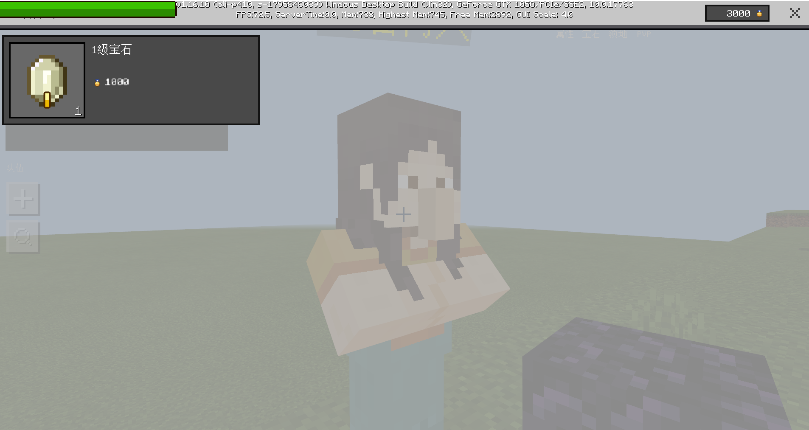
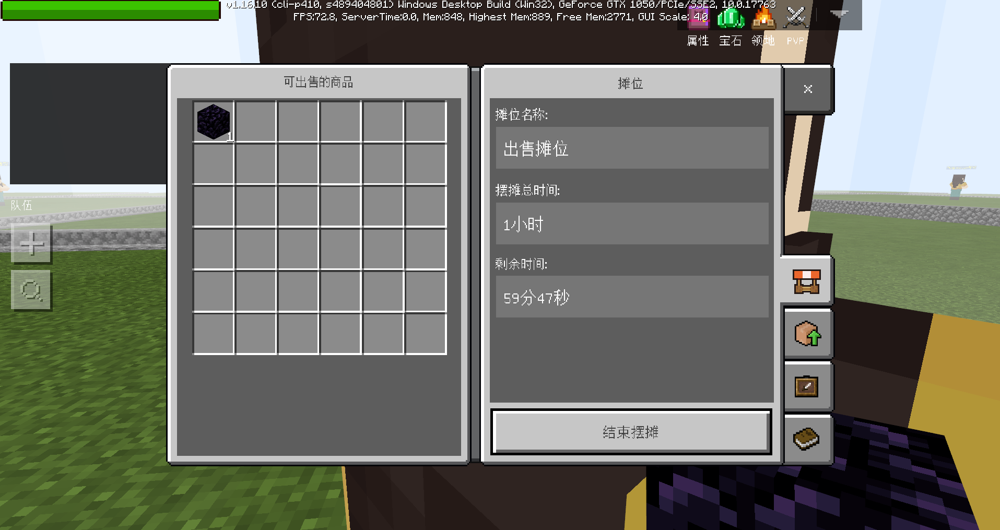
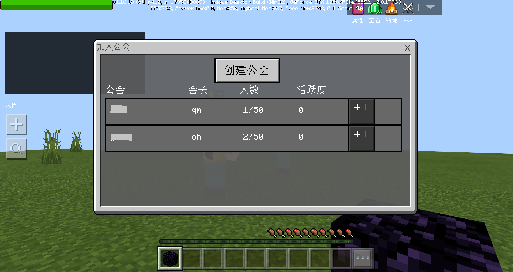
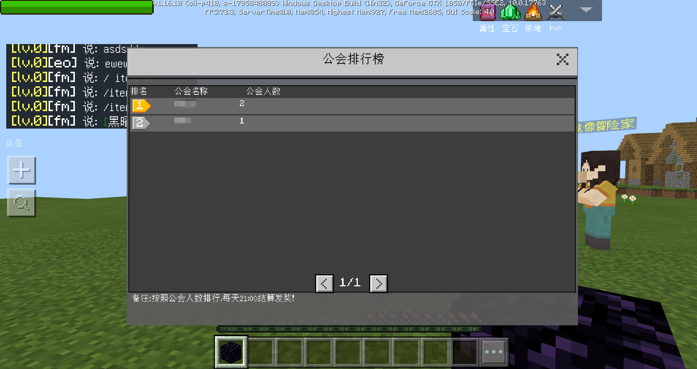
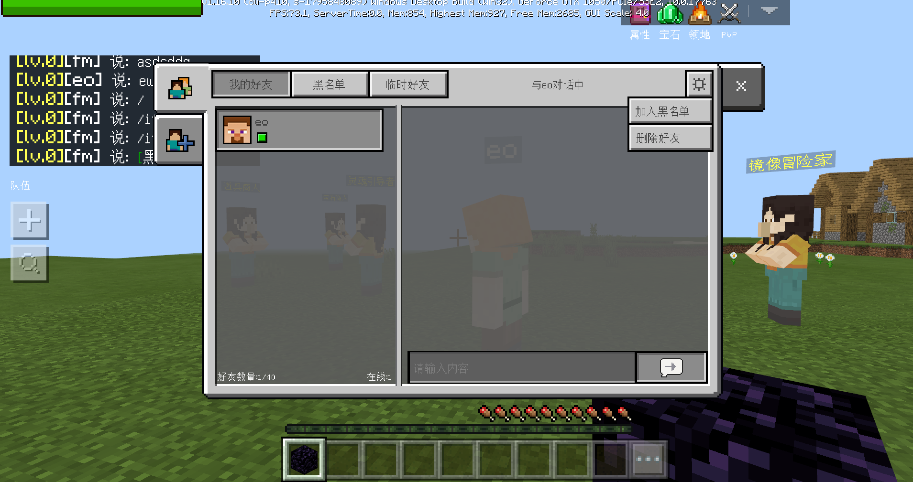

# 生存+RPG服模板简介

## 概述

​		这是常见的带生存元素的RPG网络游戏模板，包含常见的功能，供开发者参考学习。

​		玩家进入游戏后来到大厅，通过npc可跳转到领地、副本、资源世界、珍稀资源世界四个场景。领地可实现地皮认领、传送、权限赋予等功能，副本可挑战不同难度的npc，资源世界相当于原版游戏的主世界，珍稀世界相当于原版游戏的下界。上述场景有可以回到大厅的npc。

​		主菜单中包含属性、宝石、PVP、称号、摆摊、公会、排行榜、签到、聊天、好友等功能。

## 如何运行模板

- 步骤1：MCStudio——新建——基岩版网络服——生存+RPG模板。

- 步骤2：在基岩版服务器找到新建的模板，打开Mod目录，找到neteaseRPGRawer中的mod.sql，在远程开发机上执行mod.sql。

- 步骤3：部署网络服，部署完成后点开发测试，运行生存+RPG服。

## 游戏功能说明

### 1、npc

| 名字          | 位置         | 数量     | 功能             |
| ------------- | ------------ | -------- | ---------------- |
| 管家          | 大厅         | 1        | 前往领地         |
| 旅行者        | 大厅         | 1        | 前往资源世界     |
| 灵魂引导者    | 大厅         | 1        | 前往珍稀资源世界 |
| 镜像冒险家    | 大厅         | 1        | 前往副本         |
| 管家·返       | 领地         | 1        | 返回大厅         |
| 旅行者·返     | 副本         | 1        | 返回大厅         |
| 灵魂引导者·返 | 资源世界     | 1        | 返回大厅         |
| 镜像冒险家·返 | 珍稀资源世界 | 1        | 返回大厅         |
| 武器商人      | 大厅         | 1        | 购买武器升级道具 |
| 宝石商人      | 大厅         | 1        | 购买宝石升级材料 |
| 道具商人      | 大厅         | 1        | 购买回血道具     |
| 呆子村长      | 大厅         | 1        | 无               |
| 领地管家      | 每块地皮中间 | 地皮数量 | 认领地皮         |

### 2、主菜单

- 其中PVP功能只能在珍稀资源世界中打开，摆摊功能只能在大厅、领地中打开。

### 3、自定义内容

- 游戏中有三种货币：银币、探险值、公会勋章。银币暂无投放途径，可用于玩家之间摆摊交易以及购买药水。探险值来源于每日副本，可用于购买装备。公会勋章来源于每日排行榜结算奖励，可用于购买宝石。

### 4、领地

- 与地皮中的npc对话可完成地皮认领。

- 点击主菜单“领地”按钮，完成权限操作、领地传送。

### 5、战斗属性

- 点击主菜单“属性”按钮，可查看总属性。

- 等级提升、装备、宝石以及称号都会带来属性提升。
- 无源伤害需要开启，在资源世界，跌落、窒息和岩浆伤害是原版的3倍。在珍稀资源世界，跌落和岩浆伤害是原版的5倍。

### 6、PVP

- 在珍稀资源世界强制开启PVP功能，其余场景无法开启PVP功能。

- 在珍稀资源世界死亡后，背包中的以下物品将掉落：灵魂沙、萤石、恶魂之泪、烈焰棒、岩浆膏。

### 7、副本

- 需在组队状态下且队伍人数1~3可进入副本。
- 副本有5个难度，不同难度的副本具有进入等级要求。
- 不同难度的副本，怪物属性、击杀数量要求、副本时间、结算奖励不同。

### 8、组队

- 包括创建队伍、队伍操作、搜索队伍等功能。

### 9、称号

- 可用于展示所有称号并管理已获得的称号。

### 10、摆摊

- 可在大厅、领地召唤npc进行摆摊，上架物品。

- 每小时会收取一定的摆摊费用。
- 可以点击其他玩家召唤的摆摊npc购买商品。

### 11、签到活动

- 以一周为周期，每天登陆后可在活动界面领取当天的签到奖励。

### 12、公会

- 包括公会的创建、邀请、退出、搜索等基本操作。

### 13、聊天

- 通过主菜单的“聊天”按钮进入。

- 与原版聊天相比，增加本地、世界两个频道的聊天内容。本地表示当前服务器，世界代表所有服务器。

- 支持物品超链接，可把物品栏中的物品描述发送到聊天栏中。

- 可在聊天栏中选中玩家并加为好友或私聊。

### 14、排行榜

- 全服排行榜，榜中有两列，分别记录公会名称、公会人数，排行榜按公会人数排序。
- 前20名的公会将上榜。
- 每天21:00，排行榜结算。奖励将通过邮件发送到获奖公会的全体成员。

### 15、好友

- 包括好友添加、删除、聊天功能。

### 16、运营日志

- 实际运营中，运营日志必不可少，本模板选取了一部分进行记录，我们建议开发者尽可能详细地记录网络游戏运营日志，以便发现问题。
- 领地进入与认领情况：1）进入领地时记录角色ID。2）认领领地时记录角色ID。
- 副本参与、完成情况：1）进入副本时记录副本难度、组队人数、角色ID。2）完成副本时记录副本难度、组队人数、角色ID。
- 商店购买情况：1）在武器、宝石、道具商店购买商品时，记录购买的物品类型、数量、角色ID。
- 公会参与情况：1）加入公会时记录角色ID、公会ID。2）离开公会时记录角色ID、公会ID。3）每日排行榜结算时，记录排行榜前20的数据。
- 摆摊情况：1）开始摆摊时记录角色ID。2）打开别人摊位时记录浏览者ID、摊主ID。3）购买物品时记录购买者ID、摊主ID、出售物品、数量、单价、总价。
- 死亡记录：1）死亡时记录角色ID、所在维度。
- 升级记录：1）升级的时候记录角色ID、升到的等级。
- 属性记录：1）角色离开游戏时，记录角色ID，各项战斗属性及其数值。

## 配置说明

​		可通过修改、增加配置，丰富模板的游戏体验，说明如下：

### 1、官方Mod配置

- 在每个developer_mods中的mod.json文件，对官方插件的内容进行修改、增加。
- 在neteaseBattle\behavior_packs\neteaseBattleBehavior\neteaseBattleScript\fmt.py文件，对自定义装备、物品的描述进行修改、增加。

### 2、模板内容配置

- 自定义物品、生物放在neteaseRawer\behavior_packs目录下。

- 升级消耗经验及属性放在neteaseRawer\behavior_packs\neteaseRawerBeh\neteaseRawerScript\commonConfig\rawerAttrConfig.py。

- 副本常规设置放在neteaseRawer\behavior_packs\neteaseRawerBeh\neteaseRawerScript\commonConfig\rawerBattleConfig.py。

- 副本怪物属性放在neteaseRawer\behavior_packs\neteaseRawerBeh\neteaseRawerScript\commonConfig\rawerMonsterConfig.py。

- 货币、药水、宝石、装备属性等内容放在neteaseRawer\behavior_packs\neteaseRawerBeh\neteaseRawerScript\commonConfig\rawerItemConfig.py。

- 排行榜奖励放在neteaseRawer\behavior_packs\neteaseRawerBeh\neteaseRawerScript\commonConfig\rawerRankConfig.py。

## 插件代码说明

​		为了实现本模板，我们添加了一些核心代码统筹各个官方插件，另外还对官方插件做了一些调整。如果开发者愿意通过代码对本模板进一步了解，可仔细阅读以下部分。

### 1、公告

- 修改setlayer逻辑，让界面堆叠更合理

### 2、面板描述

- 无修改

### 3、战斗系统

- fmt.py配置了新增装备

- 修改setlayer逻辑

- mod.json不配置物品

- battlePlayer中def GetAllAttribute(self):将称号属性包含

- battleDamageMgrServer中加了设置无源伤害倍率的功能，添加了杀死一个怪物的函数接口

- battleGameObjMgrServer将离线时将属性记录在运营日志中

- battleServerSystem设置怪物属性、装备属性，提供了除了在mod.json中配置之外的另外一种方案

### 4、聊天

- 修改setlayer逻辑，让界面堆叠更合理

### 5、云端玩家信息

- 无修改

### 6、每日登陆

- 修改setlayer逻辑，让界面堆叠更合理

- dailyServerSystem增加每日功能尚未领取判断

### 7、副本

- 修改setlayer逻辑，让界面堆叠更合理

### 8、好友

- 修改setlayer逻辑，让界面堆叠更合理

### 9、公会

- 取消原有入口，入口改到主菜单

- 修改setlayer逻辑，让界面堆叠更合理

- 增加获取所有公会成员接口，用于排行榜发奖

- 运营数据记录：加入公会时记录角色ID、公会ID，离开公会时记录角色ID、公会ID，每日排行榜结算时，记录排行榜前20的数据

### 10、宝石

- 修改setlayer逻辑，让界面堆叠更合理

### 11、称号

- 无修改

### 12、主菜单

- menu初始化界面完成之后，给主逻辑一个事件，然后主逻辑才能设置按钮的是否可按状态，否则会失败

- 原生menu控件的点击按钮响应是直接发送给了按钮控件的服务端mod处理，改写后直接把事件发送给了主逻辑，然后在主逻辑里面处理是直接显示界面

### 13、功能NPC

- 无修改

### 14、pvp

- 增加了锁定pvp功能

### 15、排行榜

- 修改setlayer逻辑，让界面堆叠更合理

- 增加结算逻辑

### 16、领地

- 认领、进入领地时记录玩家ID运营日志

- ResidenceMyUI中，隐藏新建、改建领地入口

- 修改setlayer逻辑，让界面堆叠更合理

- residenceGasMgr中增加地皮构建逻辑：InitRawerResidence，增加了初始地皮无属主的逻辑，增加了认领地皮的逻辑，增加了不允许新建、改建领地的提示

### 17、队伍

- 调整队伍插件UI位置，使其和聊天插件界面不冲突

- OnPosDataToAllMembersReq，队长主导开始进入副本服后，向所有队员发送事件，队员也会一起开始转服进对应的副本

### 18、摆摊

- 在npc商店购买时记录相关运营日志

- 开始摆摊时、打开别人摊位时、在别人摊位购买时记录运营日志

- tradeMgr中维护已连接的服务器ID，在摊位过期的时候，能广播给server，然后server能够去掉对应的摊位NPC

## 核心代码说明

### 1、neteaseRawer——game服通用

- behavior_packs
  1）副本中怪物的行为、属性配置

  2）角色属性配置

  3）各等级副本的通关要求、开放等级配置

  4）各种物品的属性、tips配置

  5）排行榜奖励配置

  6）副本选择、积分、进入、结算界面

  7）主菜单按钮状态、提示

  8）各类自定义物品、合成配方

  9）领地、资源世界、珍稀资源传送平台结构

- develop_mods
  1）游戏各种主要逻辑，包含但不限于：角色、怪物属性设置，升级，加经验，复活，玩家登录、离开服务器，使用物品， 死亡，货币变化。

- resource_packs
  1）各种自定义物品、NPC的外观、贴图资源

- worlds
  1）不包含具体地图

### 2、neteaseRawerOverload——领地game服

- behavior_packs
  1）购买领地

- develop_mods
  1）购买领地

2）设置出生点、游戏模式、难度

- worlds
  1）领地地图

### 3、neteaseRawerMine——资源世界game服

- behavior_packs
  1）通用代码

- develop_mods
  1）设置不同资源世界的伤害系数

  2）设置出生点、游戏模式、难度

- worlds
  1）原版资源世界地图的主世界和下界，无需新增地图

### 4、neteaseRawerGame——副本game服

- behavior_packs
  1）通用代码

- develop_mods
  1）副本各种主要逻辑：玩家进入副本、怪物死亡结算、玩家死亡计算、玩家复活、离开副本

  2）设置出生点、游戏模式、难度

- worlds
  1）副本地图

### 5、neteaseRawerLoby——大厅服

- behavior_packs
  1）通用代码

- develop_mods
  1）大厅各种主要逻辑：开启主城保护，禁止主城刷怪，加载NPC，NPC打开功能界面以及具体跳转功能，召集队员进副本

  2）设置出生点、游戏模式、难度

- worlds
  1）大厅地图

### 6、neteaseRankService——功能服

- behavior_packs
  1）排行榜计算、结算、发奖。

