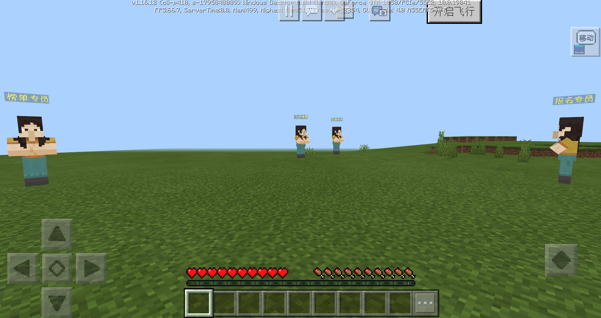
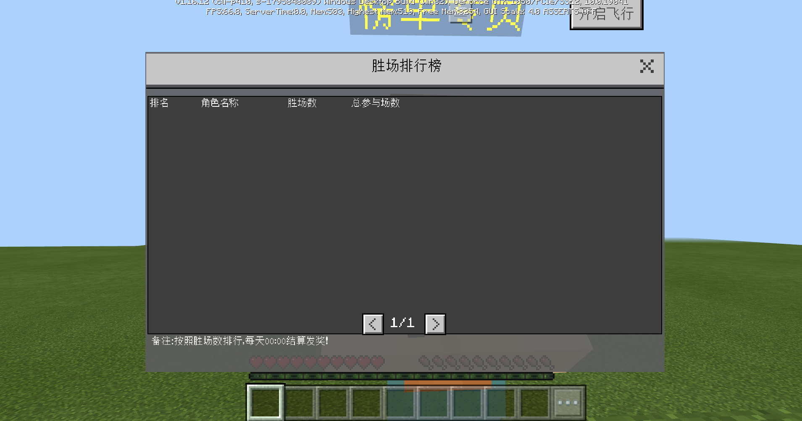

# 小游戏服模板简介

## 概述

​		这是常见的小游戏网络游戏模板，供开发者参考学习。

​		玩家进入游戏后来到大厅，大厅有5个npc。分别用于报名起床战争、购买飞行特权、购买外观商品、查看排行榜单、展示榜首玩家外观。

​		通过npc“报名专员”报名起床战争游戏，报名后进行匹配，匹配成功后进入起床战争，结算后将返回大厅。

​		起床战争结算时，胜场数以及总参与场数将更新到胜场排行榜，通过npc“榜单专员”可查看排行榜信息。每天0：00排行榜将结算，榜单前50的玩家将获得一定数量的积分券。每月1日0：00重置排行榜。

​		榜首玩家的形象将出现在大厅。

​		积分券可用于在“飞行专员”处购买30天飞行体验券或永久飞行券，也可用于在“外观专员”处购买部分外观。

​		游戏经过**商业化审**核后，可在左上角进入商城，通过钻石购买游戏币，游戏币可用于在“外观专员”处购买部分外观。

## 如何运行模板

- 步骤1：MCStudio——新建——基岩版网络服——小游戏模板。

- 步骤2：在基岩版服务器找到新建的模板，打开Mod目录，找到neteaseWars中的mod.sql，在远程开发机上执行mod.sql。

- 步骤3：部署网络服，部署完成后点开发测试，运行小游戏模板。

## 游戏功能说明

### 1、npc

| 名字     | 位置 | 数量 | 功能                                                 |
| -------- | ---- | ---- | ---------------------------------------------------- |
| 报名专员 | 大厅 | 1    | 报名起床战争                                         |
| 榜单专员 | 大厅 | 1    | 查看胜场榜单                                         |
| 飞行专员 | 大厅 | 1    | 购买飞行券                                           |
| 外观专员 | 大厅 | 1    | 购买时装、翅膀、坐骑、光环等外观资源                 |
| 榜首形象 | 大厅 | 1    | 排行榜结算时，显示榜首玩家形象（初始无数据时不显示） |

### 2、报名

- 报名后，弹出等待信息栏。人数满4人后进入起床战争。

### 3、起床战争

- 起床战争复用基岩版组件——起床战争模板，每队人数改成2。

### 4、排行榜

- 按胜场数进行排序，最多显示50人。
- 每日0：00排行榜进行结算，前50的玩家可获得积分券。
- 每月1日0：00重置排行榜。

### 5、榜首形象

- 排行榜每日结算时，榜首玩家的形象将出现在大厅服。

### 6、飞行商店

- 飞行商店购买飞行体验券之后，就可以在大厅使用飞行功能。

### 7、外观衣柜

- 可在外观专员处打开衣柜，购买或更换时装、翅膀、坐骑、光环等资源。

## 配置说明

​		可通过修改、增加配置，丰富模板的游戏体验，说明如下：

- 在每个developer_mods中的mod.json文件，对官方插件的内容进行修改、增加。（例如外观商店、飞行功能、飞行商店、排行榜等内容）

- 自定义物品、货币放在neteaseWars\behavior_packs\netease_items_beh之下。

## 插件代码说明

​		为了实现本模板，我们添加了一些核心代码统筹各个官方插件，另外还对官方插件做了一些调整。如果开发者愿意通过代码对本模板进一步了解，可仔细阅读以下部分。

### 1、飞行插件

- neteaseFly\developer_mods\neteaseFlyDev\neteaseFlyScript\flyServerSystem.py中，OnFlyStateChange增加是否可飞行的判断。

### 2、匹配插件

- neteaseMatch\developer_mods\neteaseMatchDev\neteaseMatchScript\matchServerSystem.py中，OnMatchResult增加申请游戏房间操作。

### 3、排行榜

- neteaseRankService\developer_mods\neteaseRankDev\neteaseRankScript\rankDataManager.py中，realRankAward增加发奖、每月重置功能。

### 4、起床战争

- 新建起床战争模板，再将其转化成网络服mod。

- neteaseBedwar\developer_mods\neteaseBedwar\script_World\worldServerSystem.py以及neteaseBedwar\behavior_packs\neteaseBedwarBehavior\script_World\worldServerSystem.py中，设置游戏规则的接口改成服务器API：SetGameRulesInfoServer。

- neteaseBedwar\developer_mods\neteaseBedwar\script_Team\editorConfig.py以及neteaseBedwar\behavior_packs\neteaseBedwarBehavior\script_Team\editorConfig.py中，设置队伍人数。

- neteaseBedwar\developer_mods\neteaseBedwar\script_EndLogic\editorConfig.py以及neteaseBedwar\behavior_packs\neteaseBedwarBehavior\script_EndLogic\editorConfig.py中，将每局结束清空背包设为True。

- neteaseBedwar\script_Team\modServer\serverSystem\teamServerSystem.py 中，根据匹配的结果来分队，而不是按照进入游戏的先后顺序分队。

- neteaseBedwar\developer_mods\neteaseBedwar\script_StartLogic\startLogicServerSystem.py中，增加开局逻辑，开局逻辑将在核心代码说明中介绍。

- neteaseBedwar\developer_mods\neteaseBedwar\script_EndLogic\endLogicServerSystem.py中，增加游戏中途退出的处理逻辑，增加结算、发奖逻辑，结算逻辑将在核心代码说明中介绍。

- neteaseBedwar\script_Currency\modServer\serverSystem\currencyServerSystem.py中，增加一个集合用于记录当前服务器参与起床战争的玩家，若加入游戏，则进入该集合，若退出游戏，则从该集合中移除。集合中的玩家，定期将背包中的货币更新到界面中。

## 核心代码说明

### 1、neteaseWars

- game服、lobby服通用

- behavior_packs
  1）两种飞行体验券、两种货币配置。

  2）起床战争中增加离开逻辑，增加结算显示逻辑。

  3）从大厅进入起床战争之前，增加二次确认功能。若玩家选择确认，则向服务器发起申请游戏房间请求。

  4）对于新增的两种飞行体验券以及两种货币，双击物品栏，将使用该位置全部堆叠物品。

  5）榜首形象设置。

- develop_mods
  1）控制大厅服npc创建。

  2）进入、离开起床战争的服务器跳转。

- resource_packs
  1）各种自定义物品、界面资源

- worlds
  1）不包含具体地图

### 2、neteaseWarsLobby

- lobby服通用

- worlds

  1）大厅服地图

### 3、neteaseWarsLobbyService

- 功能服通用

- develop_mods

  1）统筹管理各个game服的房间。

