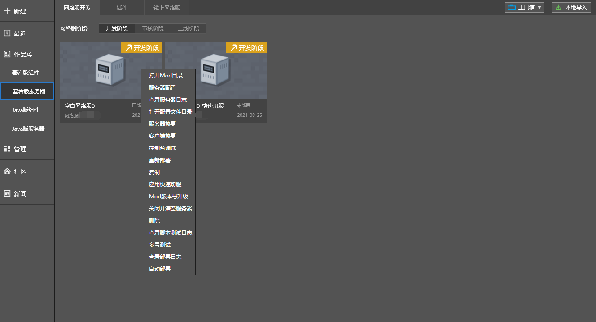
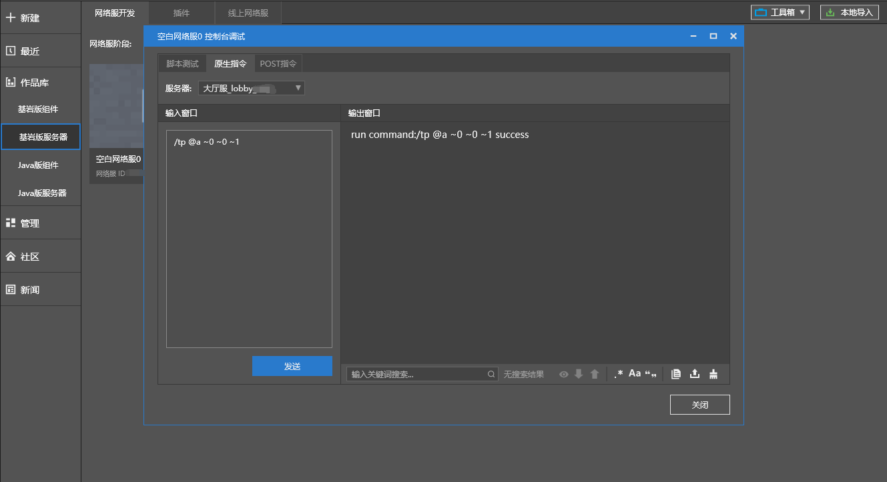
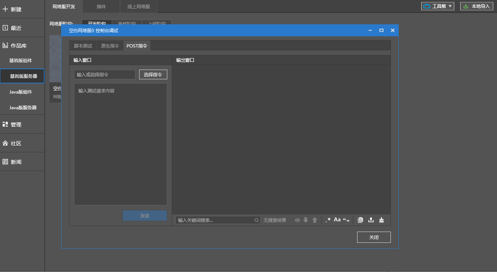
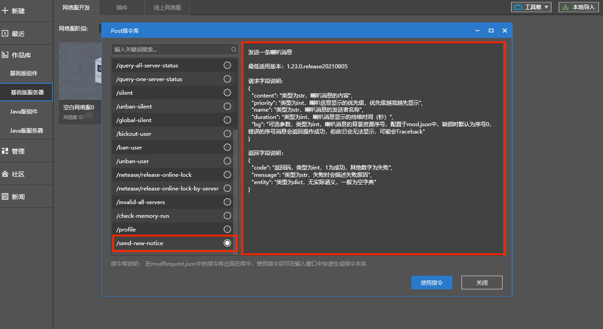
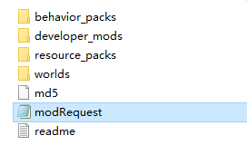

---
front:
hard: 进阶
time: 20分钟
---

# 控制台调试

### 应用场景

​		控制台调试集成了三项功能：脚本测试、原版指令输入、POST指令输入。可在开发阶段使用。

- ​	脚本测试：便于加载mod的时候，额外执行脚本，获取关注的变量或返回值。
- ​	原生指令：可在指定的服务器类型，执行原生指令。
- ​    POST指令：POST指令是Apollo网络服的自定义指令，固定在控制服（Master）执行。

### 控制台调试入口

​		右键点击正在运行的网络服，选择“控制台调试”。

### 脚本测试

​		在脚本测试分页，选定要执行脚本的服务器类型，然后再输入文本框中输入测试脚本，点击“发送”按钮，执行结果在右侧输出区域显示。

​		*举例如下：在控制服输入控制服API：GetGameTypeByServerId()，该API的作用是获取指定ID服务器的类型。*

### 原生指令

​		在原生指令分页，选定要执行脚本的服务器类型，然后再输入文本框中输入测试脚本，点击“发送”按钮，执行结果在右侧输出区域显示。

​		*举例如下：在大厅服输入原生的tp指令*

### POST指令

​		在POST指令分页，选定要执行脚本的服务器类型，然后再输入文本框中输入测试脚本，点击“发送”按钮，执行结果在右侧输出区域显示。

​		鉴于POST指令过于复杂，提供了预设指令的功能。点击“选择指令”按钮，可预览预设指令。

​		其中，插件中的自定义指令可通过在modRequest.json中指定。以官方的喇叭公告插件为例，modRequest.json位于neteaseShout目录之下。文件格式如下：

​

