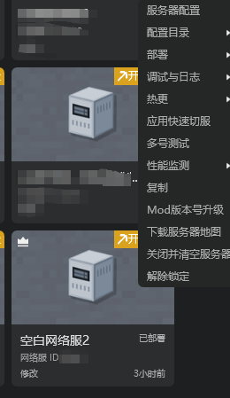

# 子账号部署和控制台调试功能

### 概述

​		团队开发过程中，可能需要协同部署和测试，涉及到一定的权限管理。

### 可实现的效果

- 主账号拥有完全权限
- 子账号被赋予了主账号开发及审核阶段的部署权限：对这些赋予权限的服务器，拥有除删除以外的所有权限
- 子账号被赋予了主账号上线阶段调试权限：对这些赋予权限的服务器，拥有调试和查看日志的权限

### 权限设置

- 在开发者平台进行子账号的管理，可以在这里设置
  - 子账号在开发阶段与审核阶段是否允许配置，部署和热更服务器
  - 子账号在上线阶段是否允许使用控制台调试

### 多个子账号协同

如果多个账号同时对一个服务器进行部署，或者服务器配置等操作，会导致冲突。为了避免此类冲突，我们引入了一套锁定机制。

需要执行这些操作的账号需要先锁定服务器，才能进行，而其他账号不能对锁定中的服务器进行部署，配置等操作。

1. 如果一个服务器没有完成配置，那么你只能进行开发测试等功能。

2. 如果想要进行配置，你必须先点击锁定。完成对服务器的锁定后，其他开发者进行配置或部署将失败。

3. 锁定后，如上图，你可以对这个服务器进行配置。配置结束后，可以对这个服务器进行部署操作。

4. 如果你的服务器处于可部署，但是未锁定的状态，如下图，你也必须先锁定，才能进行部署操作。

5. 当你需要的操作（配置，部署等）都执行完毕的时候，请即时解锁，避免影响其他账号使用。解锁有两种方式，一种是直接点击服务器封面的解锁按钮，见下图1，另一种是右键或者点击服务器封面的更多按钮，在菜单中选择解除锁定。

6. 工作台不会即时同步锁定状态，所以有可能出现当你希望执行某操作的时候，可能出现服务器已经被其他账号锁定的情况，会弹出如下的提示。此时，如果你需要执行操作，需要自主联系对方解锁。

7. 如果你是主账号，你有强制解锁服务器的权限。被强制解锁的子账号在3min中内不能再上锁这个服务器。

### 子账号运营日志权限管理

- 主账号可以在工作台中指定每个运营指令是否允许子账号操作
- 当复制服务器到审核阶段，上线阶段时，运营指令的设置也会被继承

