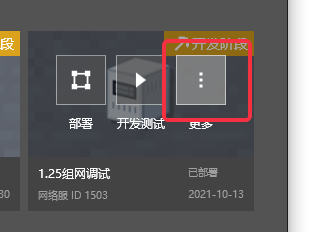
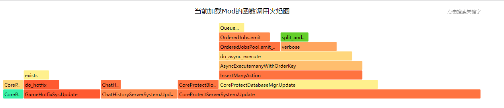
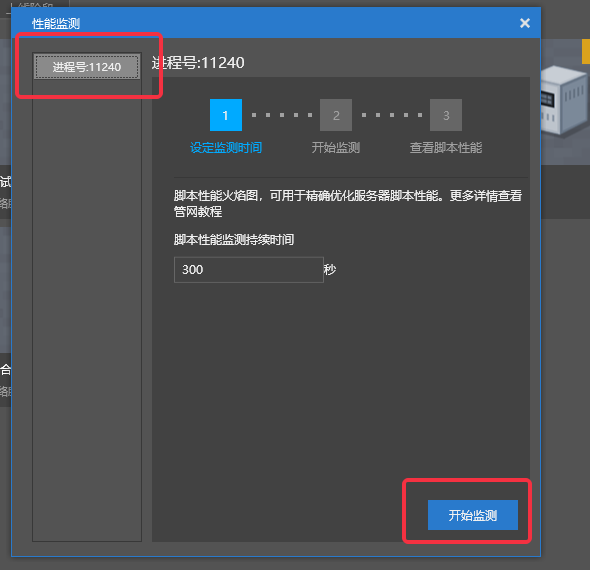

# 性能优化小贴士
## 定位性能瓶颈
### 定位有性能问题的服务器
* 登录到服务器
* 使用**ps命令**可以查看当前服务器进程
```bash
ps -aux | grep mcpe
```
* 输出如下
```txt
fuzhu    12325  8.5  0.2 4177016 280364 ?      Sl   11月17  91:44 /home/admin/netgame/app/1494/lobby/lobby_lobby_4000/mcpe_1494_lobby_lobby_4000 -m 8G
.
.
.
```
* 第一列为启动该进程的用户名，服务器进程一般都用**fuzhu**账号启动
* 第二列为该进程的**PID**，需要进一步查询信息需要用到
* 第三列为该进程使用掉的CPU资源百分比，一般此数字最高的就是性能最有问题的
* 第四列为该进程所占用的物理内存百分比，有时候内存占用过多也可能导致卡顿
* 第五列为该进程使用掉的虚拟内存量 (Kbytes)，一般无需过多关注
* 第六列为该进程占用的固定的内存量 (Kbytes)，第四列很高的时候这一项一般也很高
* 最后一列为该进程的启动路径，从启动路径最后的可执行文件名，可以定位该进程是哪个服务器
* mcpe_1494_lobby_lobby_4000，**mcpe**后的第一个数字1494，对应的就是Studio上的项目名

* mcpe_1494_lobby_lobby_4000，位于**最后的数字**，对应的就是Studio上的此项目的具体的服务器ID

* 然后可以通过配置，看到这个服务器到底使用了哪些插件，加载了哪些Mod


### 通过Studio获取服务端脚本性能直方图

* 部署服务器完毕后，点击【更多】
  
* 在菜单中选中【性能监测】
  
* 再点击【监测服务端脚本】
  
* 左侧服务器列表中选中想要监测脚本性能的服务器（这里选择了大厅服，ID4000）
* 然后填写性能监测的持续时间，并点击【开始监测】按钮
  
* 监测开始后，中间显示了监测的持续时间和总进度，此时就可以登录服务器触发需要监测性能的玩法
* 可以点击下方的【结束监测】按钮随机结束监测（此时依旧能够获取到已执行时间内的监测结果）
  
* 结束监测后，会自动切换到【查看脚本性能】分页，此时点击【查看火焰图】
  
* 首次查看火焰图需要选择打开火焰图的浏览器，这里选择【Google Chrome】即可
  
* 在浏览器上可以查看脚本运行的火焰图，定位性能热点
  

### 通过Studio获取客户端脚本性能直方图
* 部署服务器完毕后，点击开发测试启动PC客户端登录服务器后（也可以启动手机客户端），然后点击【更多】

* 在菜单中选中【性能监测】
  
* 再点击【监测客户端脚本】
  
* 左侧列表中选中想要监测脚本性能的客户端
* 然后填写性能监测的持续时间，并点击【开始监测】按钮
  
* 监测开始后，中间显示了监测的持续时间和总进度，此时就可以在客户端触发需要监测性能的玩法
* 可以点击下方的【结束监测】按钮随机结束监测（此时依旧能够获取到已执行时间内的监测结果）
  
* 结束监测后，会自动切换到【查看脚本性能】分页，此时点击【查看火焰图】
  
* 首次查看火焰图需要选择打开火焰图的浏览器，这里选择【Google Chrome】即可
  
* 在浏览器上可以查看脚本运行的火焰图，定位性能热点
  

- 特别说明：

  ​	（1）客户端脚本火焰图，需要有账号进入游戏才开始监测。

  ​	（2）为保证客户端性能监测的准确性，建议只开启一个客户端账号进行监测。


## 客户端常见性能问题
### ScrollView中的元素过多
* 客户端的UI界面的性能表现，与UI界面上原始控件（button、label、image、panel等）的总数成正比，一般超过1000个就会有明显可感知的卡顿感
* 隐藏（使用API【SetVisible】）不需要的控件可以提升整体性能，但是不隐藏，仅仅是不可见的控件依旧会影响UI界面的性能
* 最常遇到问题的就是ScrollVIew中因为滚动出可见窗口而不可见的部分（因为一般ScrollView中，不可见的控件一般远多于可见的），所以需要尽量控制ScrollView中Clone的单元，最好不要超过50个
### 限制贴图尺寸
* 客户端有很大的一部分内存和CPU都消耗在了解压、加载、同步贴图资源上，而贴图的尺寸则是影响性能的关键，无论是在UI还是在模型特效领域都是如此
* 贴图尺寸是指贴图的分辨率，一张1024x1024的贴图，比512x512的贴图多占用4倍的资源，哪怕都只是纯色的贴图。

## 数据库与存档
### 根据需求设计合适的存储方案
* 在绝大多数的情景中，合适的设计方案都比编码层面的优化更有效，在需要持久化存储，涉及数据库操作的层面更是如此。
* 假设有这么一个需求：需要记录每个玩家每日的杀怪数量，并根据杀怪数量给予阶梯性奖励。
* 使用key-value的形式，存储杀怪的数量，不同的设计如下所示
* 方法1：
```Python
def GetKillMob(uid):
	key = "killMob:{}".format(uid)
	value = dbGet(key)
	if not value:
		value = 0
	return value

def OnKillMob(uid, number):
	key = "killMob:{}".format(uid)
	value = dbIncrby(key, number)
	# 根据玩家杀怪进度给予奖励
	CheckBonus(uid, value)
	# 记录uid杀过怪，Set形式的存储重复的uid，在add时会被无视
	globalKey = "killMob:allUser"
	dbSetAdd(globalKey, uid)

# 每天的日期变更点，需要情况当日的杀怪记录
def OnMidNight():
	globalKey = "killMob:allUser"
	allUsers = dbSetGetall(globalKey)
	if not allUsers:
		return
	for uid in allUsers:
		key = "killMob:{}".format(uid)
		dbSet(key, 0)
```
* 方法2
```Python
import time
def GetKillMob(uid):
	local = time.localtime()
	key = "killMob:{}:{}-{}-{}".format(uid, local.tm_year, local.tm_mon, local.tm_mday)
	value = dbGet(key)
	if not value:
		value = 0
	return value

def OnKillMob(uid, number):
	local = time.localtime()
	key = "killMob:{}:{}-{}-{}".format(uid, local.tm_year, local.tm_mon, local.tm_mday)
	value = dbIncrby(key, number)
	# 设置过期时间为1天
	dbExpire(key, 86400)
	# 根据玩家杀怪进度给予奖励
	CheckBonus(uid, value)
```
* 很明显的，方法1中的【OnMidNight】函数就是性能的瓶颈，执行需要的时间和当日登陆过杀过怪物的玩家数量成正比，而方法2中，因为存储的key中就包含了日期，就不需要日期变更点时清理杀怪数量，只需要设置key过期时间为一天就行了（假如是mysql，也可以根据updateTime清理过期的key），直接规避了最大的性能瓶颈。

### 使用定时+离线存档替代实时存档
* 根据实际更新的频率与数据重要程度，分离存档数据也是提升整体性能的妙招。
* 假设玩家有一个需要存档的数值为金币数，每次杀怪都会掉落几堆金钱，然后每分钟玩家都可能杀死十几只甚至几十只怪物（玩法参考传奇、Diablo），那么适合处理这个金币数的方式，就是只在内存中更新，并且每隔几分钟存档一次，然后玩家离线时额外存档一次。否则多高性能的数据库也顶不住大量玩家在线时实时更新金币数的操作。
* 假设玩家有个物品栏，每次关卡结束才有可能获取物品，在NPC商店中才能买卖物品，那么物品的变化就比较合适每次都同步到数据库，因为丢失物品存档对玩家来说是非常严重且无法接受的（上面的金币数没对上可能玩家都不会发觉），而且物品的更新频率可能要好几分钟才一次。

## 已知的性能深坑
### 地图物品过多引发的性能问题
* 地图（minecraft:filled_map）是一种用于观看已探索地形的物品，由于目前地图物品中的信息存储在服务端地图文件中，并且向客户端同步信息的方式存在一定的问题，每一个新的地图物品都会增加服务器进行的负载，当一个服务器使用过（在保存地图信息的情况下，重启服务器依旧不会情况计数）的地图物品过多时（几百几千张地图），会导致服务器卡顿
* 解决方法：暂时只能通过禁用地图物品来避免此问题；假如已经遇到了此问题，那么可以通过API【ChangePerformanceSwitch】关闭地图信息记录同步来解决。


### 复活点与末地传送门距离过近
* 复活逻辑中，存在一些固有的限制，比如说，人物复活的地点不能离末地传送门太近
* 当前的复活逻辑中，定位复活点的方式是，在预设的复活点附近小范围内随机一个点，然后判定这个点是否符合复活的条件，假如不符合，那么就重新再随机一次，直到找到一个可用的复活点为止。但是如果附近就有末地传送门，按照人物不能复活在末地传送门附近的限制，所有可随机的点都无法复活，逻辑就会陷入死循环
* 解决方法：暂时只能限制地图中，复活点附近不能有末地传送门

### 不恰当使用API 【RegisterEntityAOIEvent】
* API【 RegisterEntityAOIEvent】在设置的区域过大时，会因为扫描的范围过大导致每帧判定实体进出AOI范围时消耗很多CPU，导致卡顿

* 解决方法：慎用

### 不恰当使用API【SetAddArea】
* 引擎逻辑消耗的CPU基本与加载进内存的实体数量成正比，而加载进内存的实体数量，又和加载进内存的区块数量成正比，一般来说加载进内存的区块，等同于所有在线玩家的视野范围的并集，但是API【SetAddArea】可以设置一些区块为常驻内存，额外带来更多的运算量。

* 解决方法：慎用

## 一些特定应用环境下的特殊优化方法
### 使用__slots__优化类
* 使用**__slots__**能够节省大规模节省内存占用，并且提升类属性的访问效率
#### __slots__用法举例
```Python
class A(object):
	__slots__ = ['name', 'attr']
	def __init__(self, name, attr):
		self.name = name
		self.attr = attr
```
* 定义了一个类A，它有两个属性name和attr，这样，在A的实例中我们就可以使用name和attr这两个属性了，但是使用一个没有包含在__slots__中的属性就会出错（类似其他一些语言中，预定义类的属性）
#### 优化效果
* 使用**__slots__**的类，内存占用大概只有不使用的**三分之一**到**四分之一**
* 使用**__slots__**的类，属性访问的速度比不适用的快**10%**左右
* 使用**__slots__**的类，可以禁止外部调用胡乱给实例赋值定义之外的属性
#### 使用注意事项
* 要使用**__slots__**，类必须继承自object，而且为了不生成**__dict__**，子类必须定义**__slots__**
* 使用**__slots__**的类不适合多继承
#### 合适的应用场景
* 需求层面上，类的属性较多但固定，并且实例众多


## 高效Python编码建议
### 缓存属性访问值
* Python的**.**和**[]**取值效率较低，在复杂循环中，适当地使用临时变量缓存属性；或者在类中，适当使用成员变量缓存属性有助于提升性能：
```Python
# -*- coding: utf-8 -*-
import timeit

buff_data = dict({'CommonEffectArgs': 'EffectCom/buff_shutup_jh:biped Head:-1:110000:p0,-0.1,-0.5:s1.2,1.1,1.1', 'Desc': '沉默，无法释放部分技能。', 'Effect': 2, 'Icon': 'UI_bufficon_cm.png', 'Name': '沉默', 'NegType': 1, 'SubType': 1, 'Type': 2, 'iNoSkill': 2})

class Buff(object):
    def __init__(self):
        self._data = buff_data
        self.dataGetter = buff_data.get

    @property
    def data(self):
        return self._data

a = Buff()
b = a.dataGetter
n = 10000000

print timeit.Timer("a.data.get('CommonEffectArgs', None)", 'from __main__ import a').timeit(n)
print timeit.Timer("a._data.get('CommonEffectArgs', None)", 'from __main__ import a').timeit(n)
print timeit.Timer("a.dataGetter('CommonEffectArgs', None)", 'from __main__ import a').timeit(n)
print timeit.Timer("b('CommonEffectArgs', None)", 'from __main__ import b').timeit(n)

# 3.05556253623
# 1.56452551984 提升49%
# 1.12835684232 提升63%
# 0.834673416222 提升73%
```
### 减少函数调用层次
* Python的**函数调用开销**比较大，适当减少一些**粒度较小**的函数有助于提升性能
```Python
import timeit

def func():
    1 + 1

n = 10000000
print timeit.Timer('func()', 'from __main__ import func').timeit(n)
print timeit.Timer('1 + 1', 'from __main__ import func').timeit(n)
# 0.942378586137
# 0.160280201029
```
### xrange比range更快
```Python
import timeit

print timeit.Timer('for i in range(100000000): pass', '').timeit(1)
print timeit.Timer('for i in xrange(100000000): pass', '').timeit(1)
print '*' * 50

print timeit.Timer('for i in range(10): pass', '').timeit(10000000)
print timeit.Timer('for i in xrange(10): pass', '').timeit(10000000)
print '*' * 50

print timeit.Timer("""
for i in range(1000000):
  if i == 1000:
    break""", '').timeit(1)
print timeit.Timer("""
for i in xrange(1000000):
  if i == 1000:
    break""", '').timeit(1)

# 2.50074970539
# 1.42963639366 提升43%
# **************************************************
# 4.08494359559
# 3.33126372555 提升19%
# **************************************************
# 1.0912625188 提升99.9999%
# 2.64364066034e-05
```
### 分支逻辑改成dict lookup进行分发
```Python
# 使用分支逻辑，性能较低
def GetDataFunc(eType):
	if eType == 1:
		return Func1
	elif eType == 2:
		return Func2
	elif eType == 3:
		return Func3
	elif eType == 4:
		return Func4
	else:
		return Func5
# 使用字典分发，分支越多，调用次数越多，性能差距越大
_FuncMap = {
	1: Func1,
	2: Func2,
	3: Func3,
	4: Func4,
}
def GetDataFunc(eType):
	return _FuncMap.get(eType, Func5)
```
### 分支逻辑把命中概率的判断放在前面
* 不得已使用分支结构时，应该把命中概率高的判断放在前面，这样可以截断进入其他分支判断，提升效率
```Python
import random
# 写法1，四个分支，长期多次运行后概率分别为10%，15%，25%和50%，效率最低
number = random.randint(1, 100)
if number > 90:
	DoThing1()
elif number > 75:
	DoThing2()
elif number > 50:
	DoThing3()
else:
	DoThing4()
# 写法2，四个分支，长期多次运行后概率分别为50%，25%，15%和10%，效率最高
number = random.randint(1, 100)
if number <= 50:
	DoThing4()
elif number <= 75:
	DoThing3()
elif number <= 90:
	DoThing2()
else:
	DoThing1()
```
### 使用in而不是has_key
```Python
import timeit

n = 10000000

L = {'name': 'coco'}
print timeit.Timer('L.has_key("name")', 'from __main__ import L').timeit(n)
print timeit.Timer('"name" in L', 'from __main__ import L').timeit(n)

# 0.759608778504
# 0.362127141699 提升52%
```
### 尽量不用getattr和__getattr__
```Python
import timeit

class A(object):
    def __init__(self):
        self.name = 'coco'

n = 10000000
a = A()
print timeit.Timer('getattr(a, "name")', 'from __main__ import a').timeit(n)
print timeit.Timer('a.name', 'from __main__ import a').timeit(n)
# 1.11034120692
# 0.449406160554 # 提升60%
```
### 性能敏感的不用map、zip、filter
```Python
import timeit

def func(x):
    pass

n = 10000000
lst1 = [1, 2, 3]
print timeit.Timer('map(func, lst1)', 'from __main__ import func, lst1').timeit(n)
print timeit.Timer("""
for x in lst1:
	func(x)""", 'from __main__ import lst1, func').timeit(n)

# 6.45036315847
# 3.2444904196 提升50%
```
### 尽量避免/减少函数默认参数和拓展参数
```Python
import timeit

def func1(x, y, z):
   pass

def func2(x=True, y=True, z=True):
   pass

def func3(*args):
   pass

def func4(**kwargs):
   pass

n = 10000000
print timeit.Timer('func1(True, True, True)', 'from __main__ import func1').timeit(n)
print timeit.Timer('func2(True, True, True)', 'from __main__ import func2').timeit(n)
print timeit.Timer('func3(True, True, True)', 'from __main__ import func3').timeit(n)
print timeit.Timer('func4(x=True, y=True, z=True)', 'from __main__ import func4').timeit(n)

# 1.3778375206  提升46%
# 1.47306705548 提升42%
# 1.77330221509 提升30%
# 2.54251300749
```

