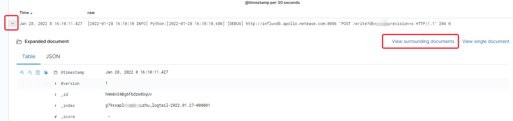

---
front:
hard: 进阶
time: 10分钟
---

# 使用ELK查询服务器日志
## 申请指南
`ELK`是用于对服务器日志进行快速检索的网站，正式上线的网络游戏项目才可以申请。

### 申请前提
1. 申请项目已通过正式上线审核，并获取到正式服务器资源。
2. 已经使用正式机器，部署服务器，并成功进入游戏。

### 申请方法
1. 联系官方运营人员，申请开通ELK，提交项目代号以及本地的外网IP。
2. 等官方通知ELK权限开通后，会发放登录ELK的账号密码。

## 如何使用
ELK 网站地址: http://kibana.x.netease.com/g79xxapl-4038/s/----/app/discover#/

### 登录
输入官方通知的ELK账号密码。

### 查询
如果进入首页，请点 `Discover` 页面进行查询。

查询页面包含几个主要区域：
* 绿色区域用于输入查询语句，支持基础的布尔运算组合，如且(and)、并(or)、非(not)以及括号。
* 黄色区域用于筛选时间区间，可以选择相对时间(比如 15min前-2min前)、也可以选择绝对时间(比如 2022/01/28 15:00:32 - 2022/01/28 16:00:32)。
* 紫色区域是日志数量柱状图，可以通过单击一个柱形快速选取那个柱形的时间区间放大来看，也可以通过拖动一段距离选择指定的时间区间放大查看。
* 蓝色区域显示日志主体内容，里面包含了大量基础信息字段，服主可以忽略不看，只关注 `raw` 字段，是日志内容。
* 红色区域可以选择重点关注哪些字段，添加 `raw` 字段为选中字段，则蓝色区域内容只显示选中的 `raw` 字段。

对于每条日志，点击左边箭头可以查看详情，在右侧点查看附近日志，可以查看其上下文。

在上下文界面，因为日志是按照时间顺序的上下文，所以可能多个机器、多个进程的集中在一起，这时候可以通过加 `filter` 的方式来筛选。
* `path` 表示日志路径
* `hostname` 表示上传日志的机器

如下为关键字搜索例子：

**提示：灵活使用布尔运算组合，特殊符号如 ( [ 等会被忽略。**
