# 平台发布

​		开发完成后，若其他玩家想体验游戏，需要进行平台发布。平台发布包括审核和上线两个阶段，**首次上线**或者**日常更新**都需要经过这两个阶段。只有审核通过才能进行上线，完成发布。

## 审核阶段

### 获取游戏ID

- 为了将提审的网络服和申请的项目进行绑定，需要配置游戏ID。

- 项目在最初申请完成之后，会自动生成游戏ID。

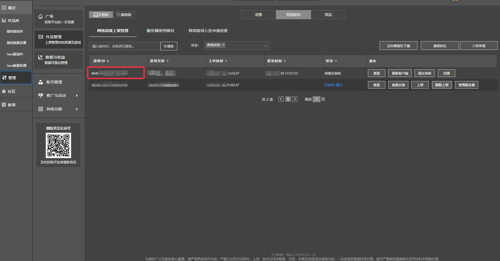

### 配置游戏ID

- 创建审核阶段网络服:

  选择左侧功能栏-基岩版-服务器=》网络服开发=》开发阶段,右键选择复制功能,选择审核阶段复制

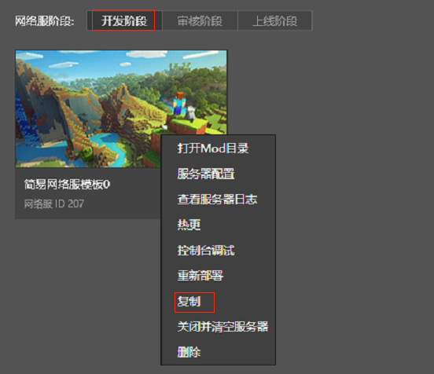

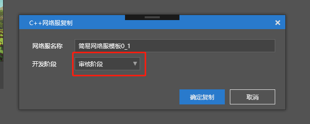

- 选择审核阶段的网络服务器,打开配置=>更多，将上述游戏ID填入，关闭配置页面后可以**部署网络服**

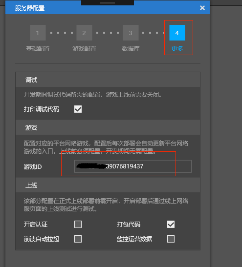

### 部署审核服

- 选择一个配置好游戏ID的网络服进行部署操作，部署过程将上传对应的MOD组件资源到服务器

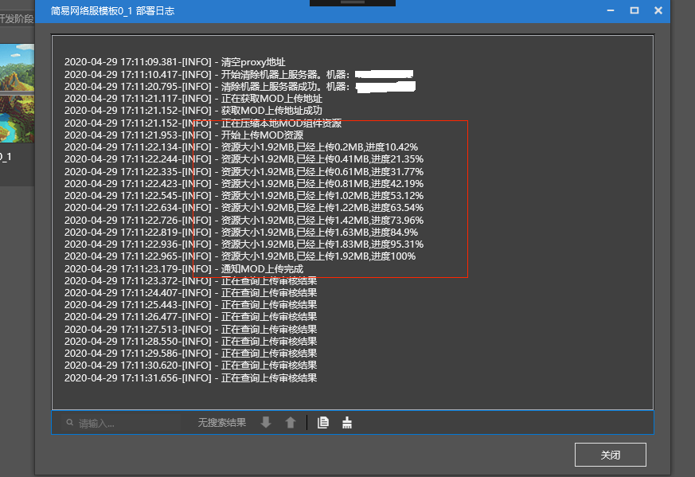

- 部署成功，可关闭此部署日志界面，选择对应的网络服进行测试。

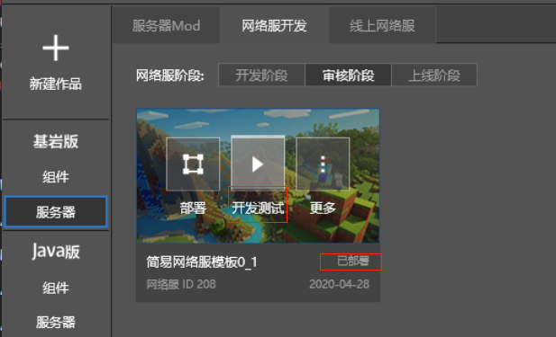

### 提交审核

- 审核服测试完成后，点击“查看”按钮，进入配置页面。再点击右上角“编辑”按钮，进行具体配置。

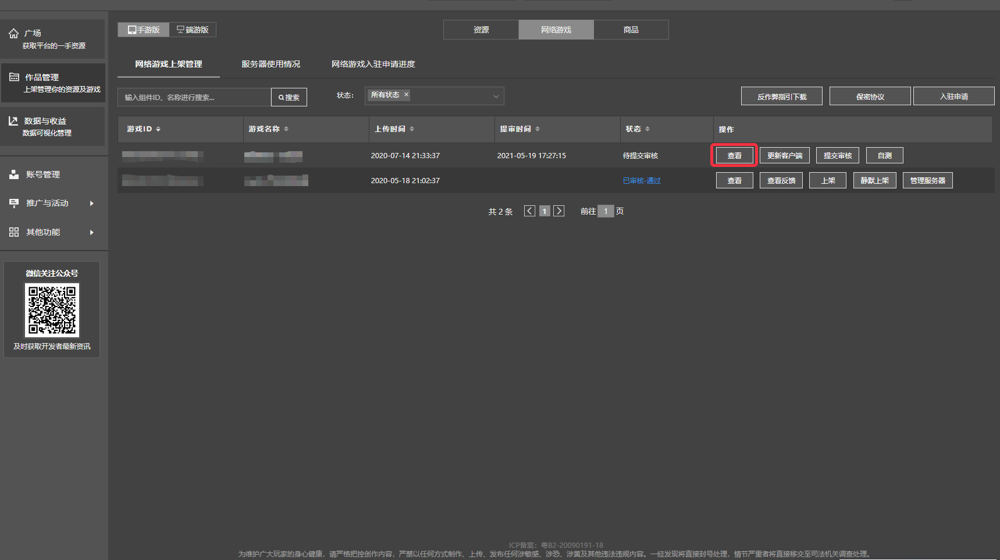

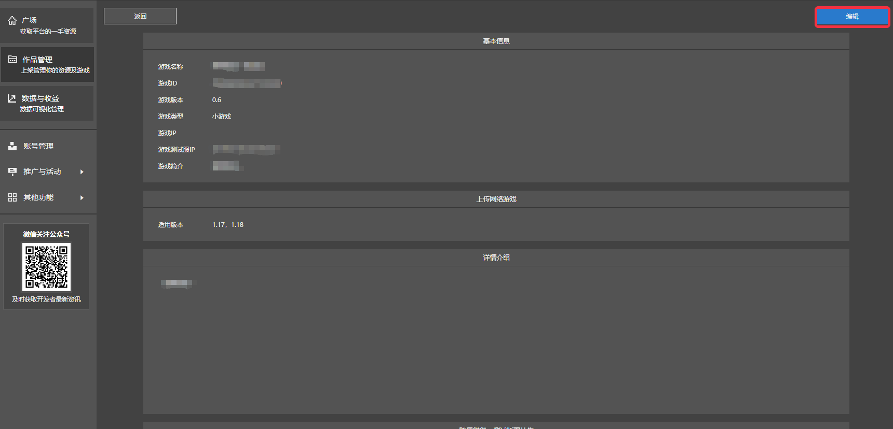

- 测试服ip或域名将根据部署情况，自动填入。
- 如果已拿到正式服务器，游戏Ip或域名也将根据部署情况，自动填入。
- 适用版本按照Apollo Mod的引擎版本进行选择。

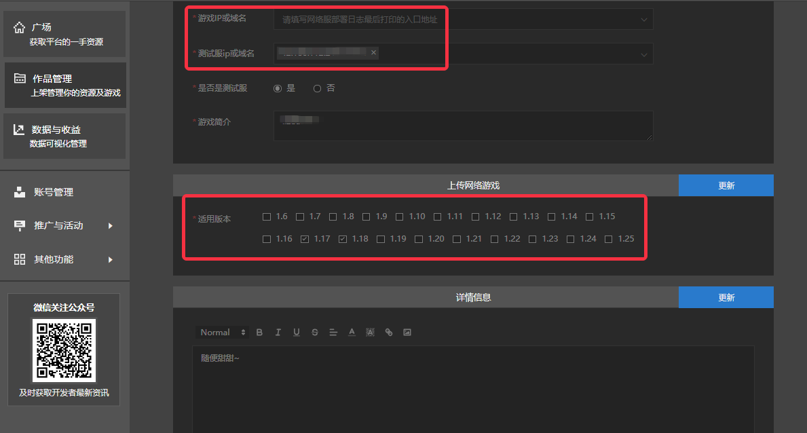

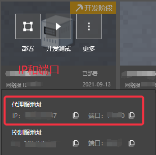

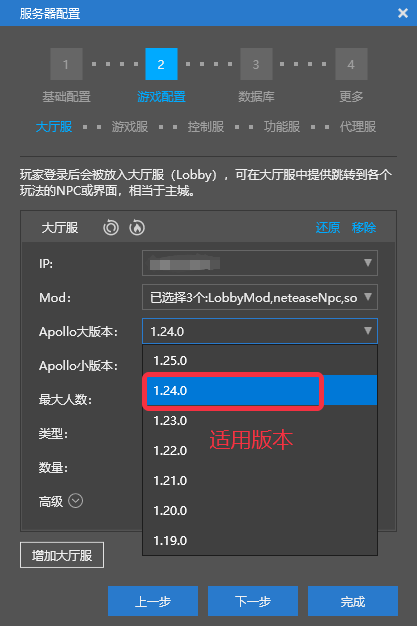

### 审核结果

- 提交审核后10个工作日左右，将会收到反馈结果。

- 若审核不通过，开发者可按照反馈意见重新修改并提审。

- 若审核通过，可进入上线阶段。

  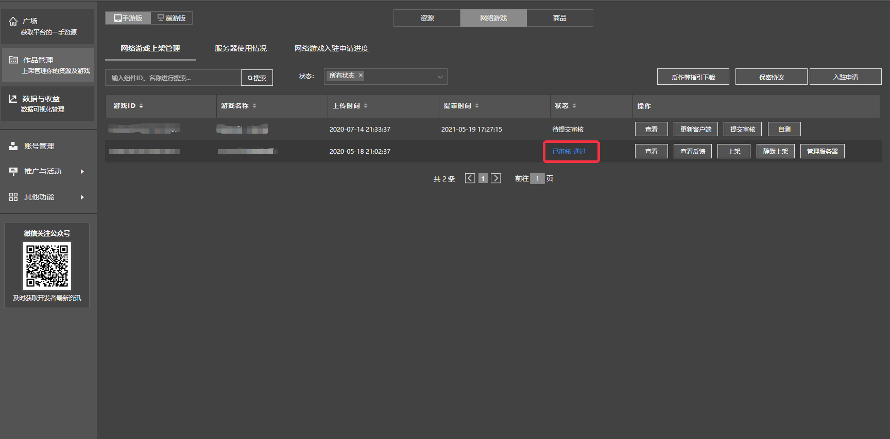

## 上线阶段

### 上线部署

- 审核通过且拿到正式机器的网络游戏，可以上线。
- 右键点击审核阶段中已通过审核的网络服，选择”复制"，把网络服复制到上线阶段。

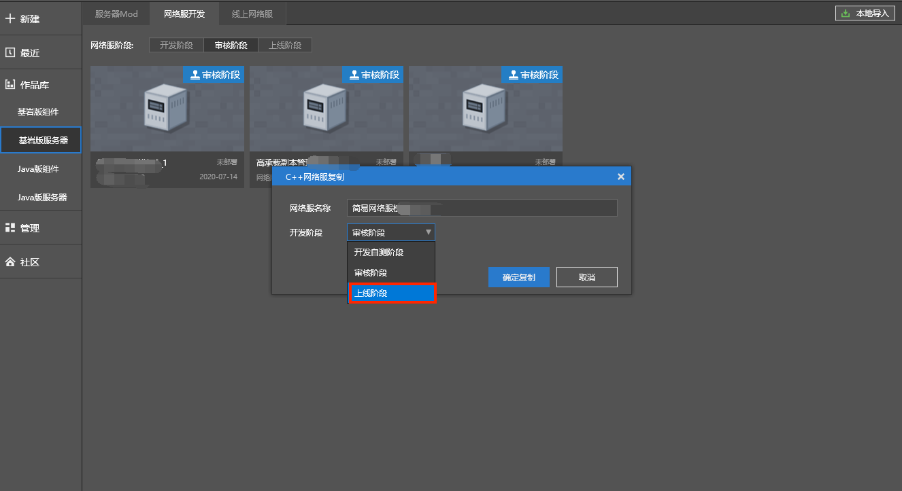

- 正配置上线阶段的机器信息，该阶段需要填写**正式机器**地址。

  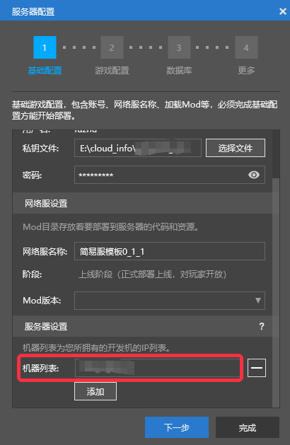

- 正确配置上线阶段的数据库信息，该阶段需要使用正式数据库，不要填写开发阶段的测试数据。（此处以mysql为例，mongo的配置也类似）

  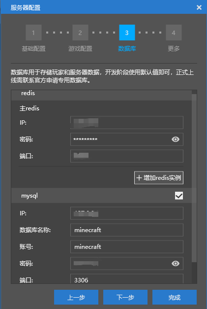

  ​	1）数据库名称、账号统一为minecraft。

  ​	2）其余信息查看开发者平台的项目信息。

  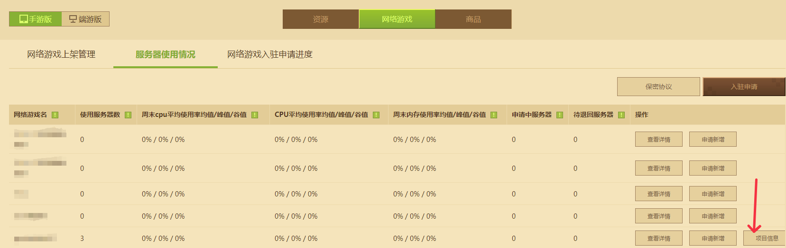

  

- 选择上线阶段的网络服务器,打开配置=>更多，勾选上“开启认证”、“打包代码”、“崩溃自动拉起”、“监控运营数据”几项。

  若网络服是PCPE互通，则勾选“允许PC用户进入”。

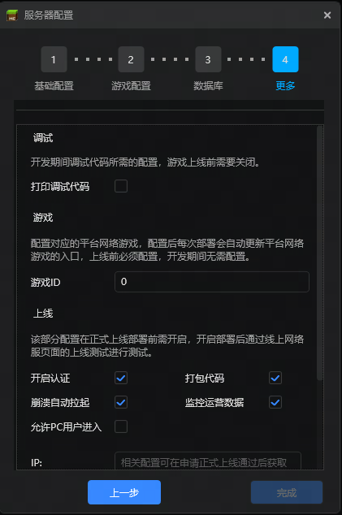

​	其中监控运营数据之下的IP、数据库名称、账号、密码、端口等内容，填写方式如下：

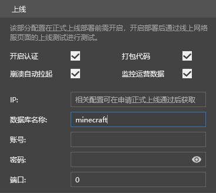

​	1）数据库名称统一为minecraft。

​	2）IP、账号、密码、端口等内容查看开发者平台的项目信息。

- 关闭配置页面后，**部署网络服**。

### 上架操作

- 上述所有步骤完成后，可在McStudio的管理页面执行**上架**。至此，完成平台发布的整个流程。

