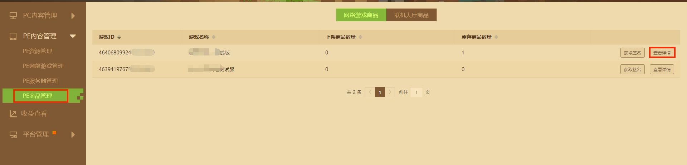
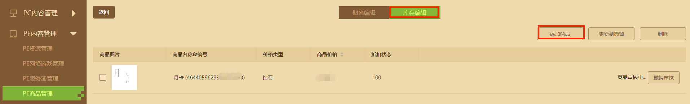
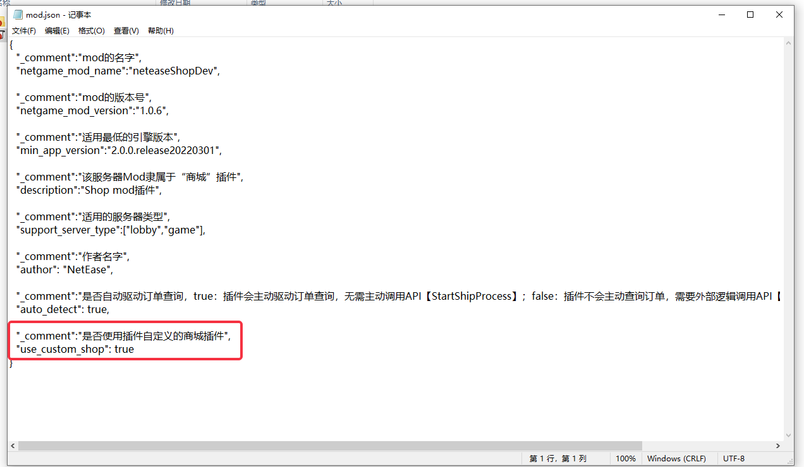
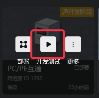

# 商业化流程

​		网络服中要用钻石、绿宝石购买的商品的话，需要走商品审核流程，提审通过才能将商品正式上架。另外商品需要在游戏中生效，需配合官方的“商城”插件（neteaseShop）。


### 商品提审

- 在开发者平台中的“PE商品管理”添加商品。

  

  

- 正确填写商品的各项基本信息，填写完成后点击“保存”

  

  其中，”实现指令“填写的是开发者自己设定的指令，每次购买将执行该指令1次。

  

  “首充内容“控制的是玩家首次购买该商品时的发货奖励，如有需要，请将”是否有首充内容“勾选为”是“。

  ”首充实现指令“填写的是开发者自己设定的指令，玩家首次购买时将执行该指令1次。

  


- 在“PE商品管理——查看详情——库存编辑”分页处提交审核

  

- **审核通过**的商品将出现在“PE商品管理——查看详情——橱窗编辑”分页，点击“上架”可让货品在客户端中显示（未通过审核的商品无法在橱窗编辑分页展示）。

  


### 关联商城插件

> 使用Spigot开服时，商城插件的内容请参考[Spigot商城插件详解](../课程10：使用Spigot开服/30-Spigot服Demo详解/3-商城Demo详解.md)

- 强烈推荐使用官方商城插件辅助实现发货逻辑。
#### 打开道具商店
- 假如游戏仅支持PE端登录，那么可以选择使用引擎自带的道具商店（mod.json中配置use_custom_shop为false），或者插件自定义的道具商店（mod.json中配置use_custom_shop为true）。
- 假如游戏需要支持PC端的登陆，由于PC端引擎没有自带的道具商店，必须使用插件自定义的道具商店（mod.json中配置use_custom_shop为true）

#### 实现发货逻辑
- 假如游戏没有特殊的自定义发货逻辑（比如说到特定NPC那边对话），那么建议选择自动发货（mod.json中配置auto_detect为true），然后按照商城插件readme.txt中的指引，监听【ServerShipItemsEvent】事件，处理发货逻辑

- 假如游戏有自定义的特殊发货逻辑，那么可以选择不自动发货（mod.json中配置auto_detect为false），然后按照商城插件readme.txt中的指引，使用API【StartShipProcess】触发查询订单的逻辑


- 发货逻辑的实现，可以参考示例代码，位于商城插件服务端mod的【neteaseTestServerSystem.py】中
```Python
class TestServerSystem(ServerSystem):
	def __init__(self, namespace, systemName):
		self.ListenForEvent("neteaseShop", "neteaseShopDev", "ServerShipItemsEvent", self, self.OnServerShipItems)

	def OnServerShipItems(self, args):
		'''
		收到订单信息，执行发货逻辑
		'''
		uid = args["uid"]
		entities = args["entities"]
		#根据 entities 执行发货逻辑,entities参数如下
		# entities = [{
		# 	"item_id": 90027446413343740, #商品id，仅记录用
		# 	"uuid": "8a0886b5-eeb5-41f0-b517-f65691a2ce3b",# 玩家的唯一编号
		# 	"item_num":1,#玩家购买的道具数量
		# 	"orderid":"1234", #订单id
		# 	"cmd":"test",#实现指令
		# 	"buy_time":1230782400,#购买时间戳
		# 	"group" : 1#道具分类
		# },
		# {
		# 	"item_id": 90027446413343740,
		# 	"uuid": "8a0886b5-eeb5-41f0-b517-f65691a2ce3b",
		# 	"item_num":1,
		# 	"orderid":"1235",
		# 	"cmd":"test",
		# 	"buy_time":1230782400,
		# 	"group" : 1
		# }
		# ]
		for entity in entities:
			itemNum = entity['item_num']
			cmd = entity['cmd']
			#todo:开发者在需要根据cmd给玩家发货
		#发货之后，需要通知Apollo发货成功了。
		self.ShipSuccess(args)

	def ShipSuccess(self,args):
		'''
		通知Apollo发货成功了
		'''
		neteaseShopServerSystem = serverApi.GetSystem("neteaseShop", "neteaseShopDev")
		neteaseShopServerSystem.ShipOrderSuccess(args)
```
#### 部署商城插件

### 测试

#### 申请测试货币

上述步骤成功后，可在McStudio或者移动端测试商品购买，在测试环境中，需要先申请测试货币。

- 测试货币申请：在McStudio——管理分页——PC组件管理处申请测试货币，可按需申请测试用的货币，货币只在测试环境中生效。


#### 移动端测试
- 在[测试版登录器](./第2节：PE测试.html)中登录游戏。
- 假如配置了不使用商城插件的自定义道具商店（mod.json中配置use_custom_shop为false），点击左上角商店入口，可以打开引擎的道具商店，用测试货币购买对应成功上架的商品。

- 假如配置了使用商城插件的自定义道具商店（mod.json中配置use_custom_shop为true），点击左上角的【打开商店】按钮，可以打开插件自定义道具商店，用测试货币购买对应成功上架的商品。


#### PC端测试
- 在McStudio——基岩版服务器——网络服开发，选中需要测试的游戏，点击"开发测试"可以打开测试客户端

- PC端引擎没有道具商店，必须配置使用商城插件的自定义道具商店（mod.json中配置use_custom_shop为true），进入测试客户端后，点击左上角的【打开商店】按钮，可以打开插件自定义道具商店，用测试货币购买对应成功上架的商品。

#### McStudio测试
- 在McStudio——基岩版服务器——线上服务器，选中需要测试的游戏，点击“更多”——“商店”，可打开测试商店界面。

  

  

  