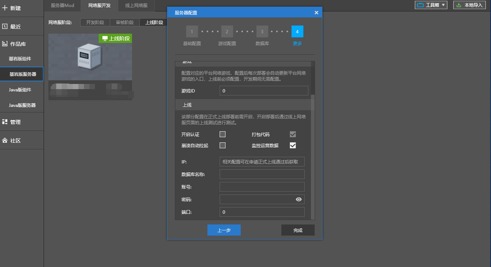

---
front:
hard: 入门
time: 10分钟
---

# 在线人数显示

## 在线人数显示规则

| 网络服类型                        | 在线人数显示规则                                             |
| --------------------------------- | ------------------------------------------------------------ |
| 非互通服                          | 仅显示所在客户端人数                                         |
| 互通服（Apollo 1.0)               | 显示双端合并总人数                                           |
| 互通服（除Apollo 1.0外的其他架构) | 在主要玩法互通的情况下，经官方运营审核跑测确认和备案后，显示双端人数，否则只能显示各自所在客户端的人数。 |

> 1. 互通的定义：电脑端和手机端的用户能通过进同一区服、在互通队列匹配等方式一起游玩同一场游戏。
> 2. 对于对抗性较强的网络游戏，双端操作模式存在较大差距，我们强烈建议服主允许玩家自由选择是否互通游玩，以免带来较差的用户体验。

## 如何显示在线人数

​	网络服登录页面中，包含了实时的在线人数。该人数能有效反应游戏当前的参与情况，对玩家选择游戏以及开发者监控服务器情况至关重要。

​		

​		完成下列步骤后，可在网络服登录页面中显示在线人数：

### 步骤1：申请项目代号

​		项目完成第一次上线提审通过之后，需进行**项目代号**申请。项目代号一般命名规则是mcXXXX，其中“XXXX”是项目名称拼音首字母。

​		项目代号可在入驻群中联系工作人员进行申请。

### 步骤2：监控工具grafana接入

​		详见[**第4节：Monitor监控报警系统**](./第4节：Monitor监控报警系统.html)、[**第5节：Grafana监控进阶功能**](./第5节：Grafana监控进阶功能.html)。

### 步骤3：在审核阶段、上线阶段部署“运营数据”插件

### 步骤4：在上线阶段正确填写监控运营数据

​		在上线阶段服务器配置中，勾选“监控运营数据”，并正确填写IP、数据库等相关信息。

​		相关信息将在正式机器发放的时候一并提供，若有疑问，请在入驻的群中联系工作人员进行确认。

