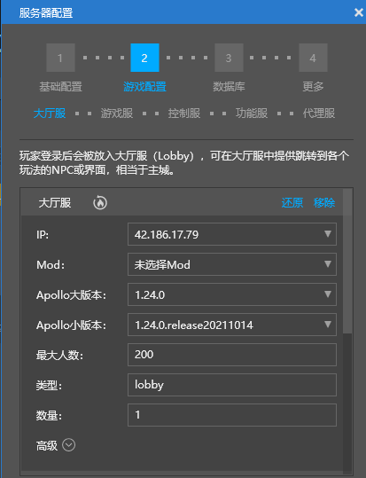
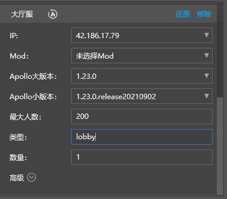
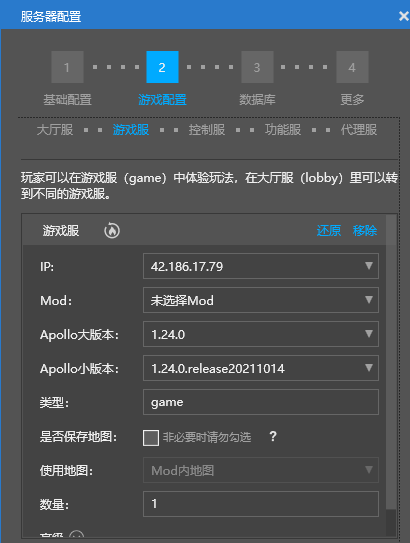
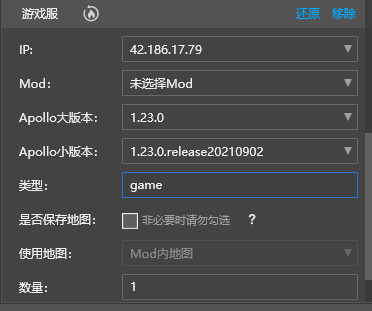
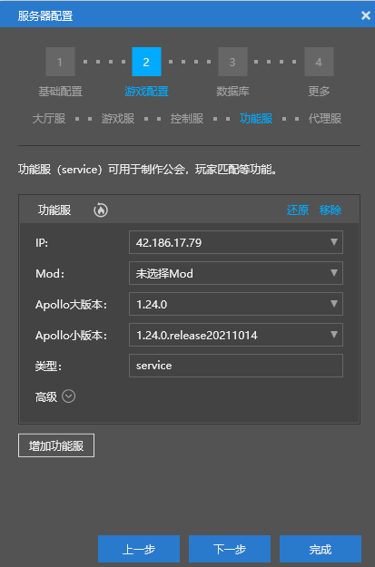
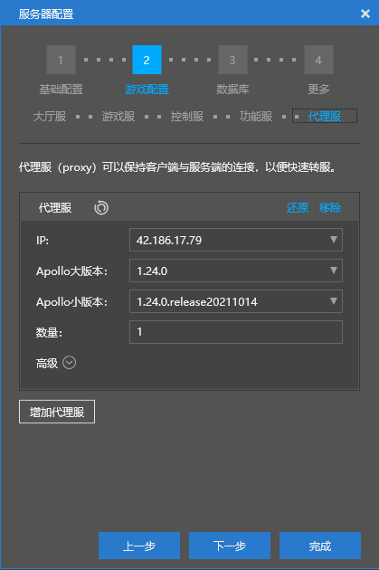

---
front:
hard: 进阶
time: 20分钟
---

# 多版本客户端引擎支持

### 应用场景

​		整包升级期间，网络服支持多个版本客户端同时进入，解决升级后低版本客户端无法进入问题。下面以同时支持1.23版本和1.24版本客户端为例，介绍多版本客户端引擎支持方案

## 解决方案

​		apollo中proxy、master和service是兼容不同版本的，只需解决lobby/game兼容问题，方法是将玩家分配到适配版本lobby/game中，也即1.23版本的玩家进入1.23版本的lobby/game中，1.24版本玩家进入1.24版本lobby/game中。下面详细介绍实现细节

### 网络服配置

​		大厅服需要同时部署多个版本，这里同时部署1.23和1.24两个版本的lobby





​	游戏服需要同时部署多个版本，并且每种类型的游戏服都要部署多个版本，这里同时部署1.23和1.24两个版本的game






控制服配置为多个版本中最高版本，这里配置为1.24版本


功能服配置为多个版本中最高版本，这里配置为1.24版本



代理服配置为多个版本中最高版本，这里配置为1.24版本




## 代码支持

​		将玩家分配到适配lobby/game中，需要考虑登陆和切服两种情况

### 登陆

​		apollo支持将玩家分配到适配的lobby，无需开发者做额外开发，但是若开发者设置玩家登陆策略（参见`SetLoginStratege`接口），则需要考虑多版本兼容问题，实现步骤是：

- 获取可用服务器和协议版本号
- 根据协议版本号将玩家分配到适配版本服务器中

下面示例实现自定义登陆逻辑，将登陆玩家分配到适配版本"gameA"类型游戏服中

```python
#master mod
class testMaster(MasterSystem):
        def __init__(self,namespace,systemName):
				import master.netgameApi as netMasterApi
                MasterSystem.__init__(self, namespace, systemName)
                self.mVersion2TargetServerIds = {} #protocolVersion--> serverIds
                def loginStratege(uid, callback):
                    	# 获取玩家协议版本号
						protocolVersion = netMasterApi.GetProtocolVersionByUID(uid)
						targetIds = self.mVersion2TargetServerIds.get(protocolVersion, [])
                        targetId = random.choice(targetIds) #选择目标服务器
                        #检查目标服务器是否有效。因为滚动更新过程中，服务器会慢慢下线，处于无效状态
                        if not serverManager.IsValidServer(targetId):
                                #若发现有无效服务器，则过滤掉所有无效服务器，然后重新选择目标服务器
                                targetIds = [server for server in targetIds if serverManager.IsValidServer(server)]
								self.mVersion2TargetServerIds[protocolVersion] = targetIds
                                targetId = random.choice(targetIds)
                        callback(targetId) #必须执行，执行登陆后续操作
                netMasterApi.SetLoginStratege(loginStratege)
                self.ListenForEvent('gameANameaspace', 'gameASystem', 'NewLoginServerEvent', self, self.OnNewLoginServer)

        def OnNewLoginServer(self, args):
                # 将有效目标服务器记录下来
				protocolVersion = args['protocolVersion']
				serverId = args['serverId]
				serverIds = self.mVersion2TargetServerIds.get(protocolVersion, [])
                if serverId not in serverIds:
                        serverIds.append((serverId, ))
						self.mVersion2TargetServerIds[protocolVersion] = serverIds
#gameA mod
class gameServer(ServerSystem):
        def __init__(self, namespace, systemName):
                ServerSystem.__init__(self, namespace, systemName)
                self.ListenForEvent(serverApi.GetEngineNamespace(), serverApi.GetEngineSystemName(), 'MasterConnectStatusEvent',
                	self,self.OnMasterConnectStatus)
        def OnMasterConnectStatus(self, args):
                # 同master建立连接后，马上向master注册为有效服务器
                if args['isConnect']:
                        data = {
                            'serverId' : lobbyGameApi.GetServerId(),
                             'protocolVersion' : lobbyGameApi.GetServerProtocolVersion()#获取服务器协议版本号
                        }
                        self.NotifyToMaster('NewLoginServerEvent', data)
```


### 切服

​		切服需要将玩家分配到适配版本的服务器中，实现步骤：

- lobby/game从master获取目标服务器，master需要通过协议号找到适配服务器列表，然后根据某种算法获取目标服务器
- lobby/game根据目标服务器进行切服

下面示例实现多版本支持的切服逻辑，将登陆玩家分配到适配版本"gameA"类型游戏服中

```python
#master mod
class testMaster(MasterSystem):
        def __init__(self,namespace,systemName):
				import master.netgameApi as netMasterApi
                MasterSystem.__init__(self, namespace, systemName)
                self.mVersion2TargetServerIds = {} #protocolVersion--> serverIds
				self.InitServerInfo()
				self.ListenForEvent(extraMasterApi.GetEngineNamespace(), extraMasterApi.GetEngineSystemName(),
                	'NetGameCommonConfChangeEvent',self, self.OnNetGameCommonConfChange)
                self.ListenForEvent('gameNameaspace', 'gameSystem', 'ChooseTargeGameServerRequestEvent',
                     self, self.ChooseTargeGameAServer)

		def OnNetGameCommonConfChange(self, args)
            '''
            每次配置发生变化，需要重新获取目标服务器
            '''
			self.InitServerInfo()

		def InitServerInfo(self):
			'''
			获取gameA服务器和它的协议版本号
			'''
			import master.serverManager as serverManager
			commonConf = netMasterApi.GetCommonConfig()
			self.mVersion2TargetServerIds = {}
			serverlist = commonConf['serverlist']
			for conf in serverlist:
				if conf['type'] == 'gameA':
					serverId = conf['serverid']
					protocolVersion = serverManager.GetServerProtocolVersion(serverId)
					ids = self.mVersion2TargetServerIds.get(protocolVersion, [])
					ids.append(serverId)
					self.mVersion2TargetServerIds[protocolVersion] = ids

        def ChooseTargeGameAServer(self, args):
            '''
            随机选择一个目标服务器
            '''
			serverId = args['protocolVersion']
			protocolVersion = args['protocolVersion']
			targetIds = self.mVersion2TargetServerIds.get(protocolVersion, [])
            targetId = random.choice(targetIds) #选择目标服务器
            #检查目标服务器是否有效。因为滚动更新过程中，服务器会慢慢下线，处于无效状态
            if not serverManager.IsValidServer(targetId):
                #若发现有无效服务器，则过滤掉所有无效服务器，然后重新选择目标服务器
                targetIds = [server for server in targetIds if serverManager.IsValidServer(server)]
				self.mVersion2TargetServerIds[protocolVersion] = targetIds
                targetId = random.choice(targetIds)
			data = {'uid' : uid, 'targetId' : targetId}
			self.NotifyToServerNode(serverId, "ChooseTargeGameResponseServerEvent", data)

#game mod
class gameServer(ServerSystem):
        def __init__(self, namespace, systemName):
                ServerSystem.__init__(self, namespace, systemName)
                self.ListenForEvent('masterNameaspace', 'masterSystem', 'ChooseTargeGameResponseServerEvent',
                	self,self.ChooseTargeGameResponseServer)

        def DoTransferPlayer(self, uid):
            '''
            玩家切服，会从master请求获取适配服务器
            '''
			data = {
				'uid' : uid,
				'protocolVersion' : lobbyGameApi.GetServerProtocolVersion(),
				'serverId' : lobbyGameApi.GetServerId()
			}
            self.NotifyToMaster('ChooseTargeGameServerRequestEvent', data)

		def ChooseTargeGameResponseServer(self, args):
            '''
            从master获取适配服务器后执行切服操作
            '''
			playerId = lobbyGameApi.GetPlayerIdByUid(args['uid'])
			self.TransferToOtherServerById(playerId, args['uid'], args['targetId'])
```


