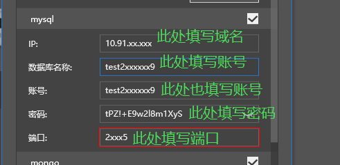

# 正式机器信息说明
## 发放机器信息的时机
* 在开发者平台**提交新增服务器申请**，**申请通过**之后，会收到正式机器的信息
* 正式机器的信息以**开发者平台站内邮件**的方式发送
* 邮件的标题为**PE网络游戏服务器发放通知**

## 正式机器包含信息与正式服配置填写
### MySQL数据库
* 下面是发放的MySQL数据库的配置信息截图

* 标题为**数据库SaaS资源**；类型为**mysql**
* 对应的数据库配置，需要填写到**服务器配置**的**数据库**分页，如下截图所示，注意需要勾选**mysql**，才会显示下方的配置框

* 数据库的具体配置信息填写，如下截图所示：

*  **IP**项填写发放信息中的**域名**（示例中为10.91.xx.xxx）
*  **数据库名称**项填写发放信息中的**账号**（示例中为test2xxxxxx9）
*  **账号**项填写发放信息中的**账号**（示例中为test2xxxxxx9）
*  **密码**项填写发放信息中的**密码**（示例中为tPZ!+E9w2l8m1XyS）
*  **端口**项填写发放信息中的**端口**（示例中为2xxx5）
* 注意事项1：只有确实申请了MySQL数据库，才会发放对应的数据库资源，此时才需要勾选并填写配置信息
* 注意事项2：设计上**数据库名称**和**账号**保持一致，所以发放信息中只有**账号**信息
* 注意事项3：Mongo数据库与Mysql数据库，一般只会根据申请提供其中一个

### Mongo数据库
* 下面是发放的Mongo数据库的配置信息截图
  
* 标题为**数据库SaaS资源**；类型为**mongo**
* 对应的数据库配置，需要填写到**服务器配置**的**数据库**分页，如下截图所示，注意需要勾选**mongo**，才会显示下方的配置框
  
* 数据库的具体配置信息填写，如下截图所示：
  
* **IP**项填写发放信息中的**域名**（示例中为10.91.xx.xxx）
* **数据库名称**项填写发放信息中的**账号**（示例中为test2xxxxxx9）
* **账号**项填写发放信息中的**账号**（示例中为test2xxxxxx9）
* **密码**项填写发放信息中的**密码**（示例中为mv0S@7HlU9)K.M+s）
* **端口**项填写发放信息中的**端口**（示例中为2xxx5）
* 注意事项1：只有确实申请了Mongo数据库，才会发放对应的数据库资源，此时才需要勾选并填写配置信息
* 注意事项2：设计上**数据库名称**和**账号**保持一致，所以发放信息中只有**账号**信息
* 注意事项3：Mongo数据库与Mysql数据库，一般只会根据申请提供其中一个

### Redis数据库
* 下面是发放的Redis数据库的配置信息截图
 
* 标题为**Redis SaaS资源**
* 对应的数据库配置，需要填写到**服务器配置**的**数据库**分页下的**主redis**项，如下截图所示
 
* 数据库的具体配置信息填写，如下截图所示：
 
* **IP**项填写发放信息中的**域名**（示例中为10.91.xx.xxx）
* **密码**项填写发放信息中的**密码**（示例中为c03af643758142c0be3686fccaff92f6）
* **端口**项填写发放信息中的**端口**（示例中为6xx9）
* 注意事项1：主redis配置**必须填写**

### influxdb数据库
* 下面是发放的influxdb数据库的配置信息截图

* 标题为**influxdb**
* 对应的数据库配置，需要填写到**服务器配置**的**更多**分页，如下截图所示，需要勾选**监控运营数据**，才会显示下方的配置框

* 数据库的具体配置信息填写，如下截图所示：

* **IP**项填写发放信息中的**域名**（示例中为10.214.xx.xxx）
* **数据库名称**项填写发放信息中的**账号**（示例中为test2xxxxxx9）
* **账号**项填写发放信息中的**账号**（示例中为test2xxxxxx9）
* **密码**项填写发放信息中的**密码**（示例中为.Rmp&W#?1d4%P@F}）
* **端口**项填写发放信息中的**端口**（示例中为8xx6）

### Grafana网站
* 下面是发放的Grafana网站的账号信息截图
 
* Grafana网站可以通过浏览器访问（强烈建议使用Google Chrome浏览器）
* Grafana网站的登录信息填写方式如下截图所示
 
* 注意事项1：登录Grafana网站，需要先访问白名单URL，地址为【http://temp-white-list.mc.netease.com:9999/?type=grafana】，和登录服务器需要访问的白名单URL参数不同。

### 正式服务器信息
* 下面是发放的正式服务器的信息截图

* 对应的数据库配置，需要填写到**服务器配置**的**基础配置**分页中的**机器列表**里面，如下截图所示

* 此外，在**游戏配置**分页中，具体服务器的**IP**项中，也是填写发放的**服务器IP**

* 注意事项1：登录服务器，需要先访问白名单URL，地址为【http://temp-white-list.mc.netease.com:9999/?machine=42.186.xx.xxx】（machine的值为发放的服务器的地址），和登录Grafana网站需要访问的白名单URL参数不同。