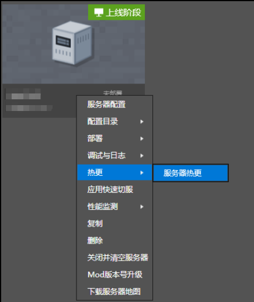
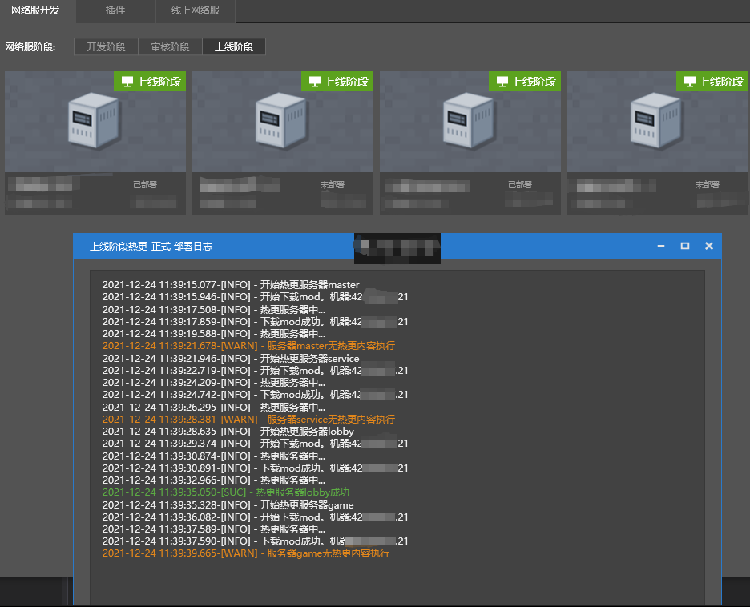

---
front:
hard: 进阶
time: 10分钟
---

# 上线阶段热更

### 热更简介

- 热更操作就是在不停服的情况下，将代码更新到服务器。详见[部署——热更](.././课程2：Apollo基础知识/第4节：部署.html#热更)。

- 上线阶段热更适用于服务器代码修改，在只修改了developer_mods文件代码且只修改函数内实现的情况下，可不停服将代码内容更新到上线阶段的服务器。既不用线上玩家掉线，又实现了游戏内容的调整。

- 为提升玩家的游戏体验，对于符合上述条件的调整，我们建议服主采用上线阶段热更功能。热更前后，可将更新内容通过游戏公告等形式告知线上玩家。

### 热更步骤

- 步骤1改代码：按实际需要，只修改developer_mods文件代码且只修改函数内实现。

- 步骤2提审：提审自测通过后，在开发者平台进行提审，详见教程“平台发布”的审核阶段部分[平台发布——审核阶段](./第1节：平台发布.html#审核阶段)。

- 步骤3过审：符合上线阶段热更的修改，必然能通过平台的**有条件免审**，游戏的审核状态变成“已审核——通过”后，可执行热更。

- 步骤4选择热更：右键点击上线阶段游戏，选择服务器热更。

  

- 步骤5热更完成：最近一个通过**有条件免审**的版本，将热更到上线阶段的服务器，热更详情可从部署日志中查看。

  