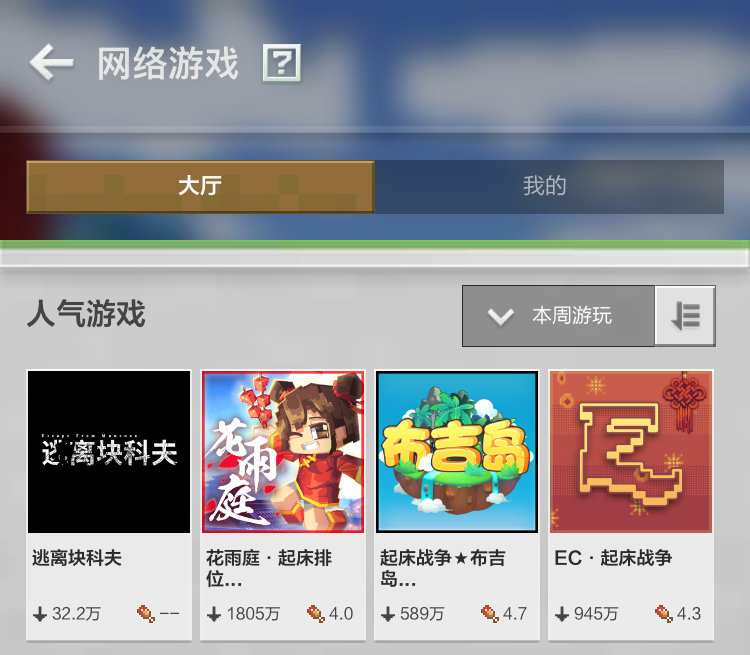

# 基岩版网络游戏概述与工具指引

## 基岩版网络游戏概述

基岩版网络游戏是指开发者通过 **官方提供** 的服务器资源进行玩法搭建的多人游戏服务。在《我的世界》手机版主页右下方有显目的入口位置，用户可以通过入口找到处于 **上线阶段** 的在线多人服务器。 **网络游戏解除了本地联机的多种限制，让玩家与玩家间可以不受时间和地区因素干扰，遇到更多兴趣相投的玩家好友。** 

## 基岩版网络游戏工具指引

**《我的世界》基岩版网络游戏大厅** 当前 **仅支持** 接入 **网络游戏开服工具（Apollo）** 架设的网络游戏。框架内置于 **《我的世界》开发工作台** ，集成负载均衡、集群管理、运营指令、多号协作的功能，同时支持**完整的原版内容**与**附加包自定义功能** ，为制作我的世界服务器创意玩法带来更多可能。在根据下方流程入驻成功后，开发者将会获得一台用于上线开发的 **测试开发机（小小云）** 。拥有属于自己的第一台小小云仅仅是是开始，官方也为方便更多人了解工具框架提供了诸多支持：

### 一站式教学与活动

为了方便更多人了解工具框架，官方邀请明星导师为广大开发者提供[一站式图文教学](../课程1：成为Apollo服主及相关准备/第1节：Apollo介绍.html)，并常态化举办《我的世界》线上短期·手游网络服插件开发实战班与《我的世界》手游网络服插件征集活动，以激发社区活力，促进生态健康。

### 官方与社区插件共建

《我的世界》开发工作台上内置了 **长期维护** 的 **官方插件库** 和 **稳定可靠** 的 **第三方插件库（由插件开发者提供）**。官方会定期线上调研时下基岩版网络游戏开发者需求榜单。**同样官方也诚挚邀请有志愿的插件开发者与我们共建手游版网络游戏的插件生态**。官方将为协助制作网络游戏开服工具插件的开发者提供**资金支持**、**免费的测试开发机**以及**专业团队的开发辅导**，让服主拥有一个更加灵活、便捷的开服条件！

