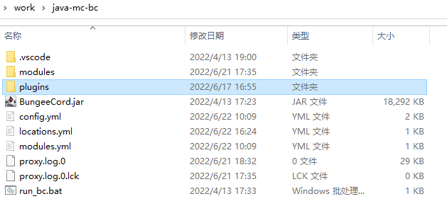
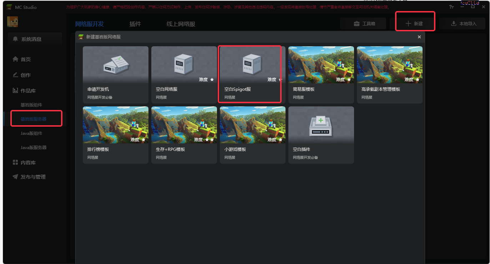
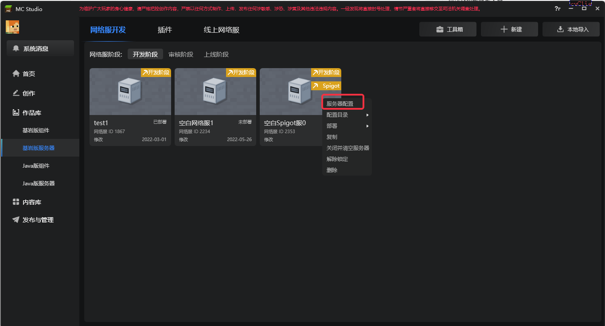
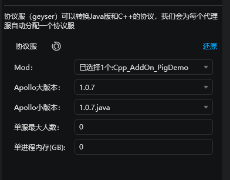
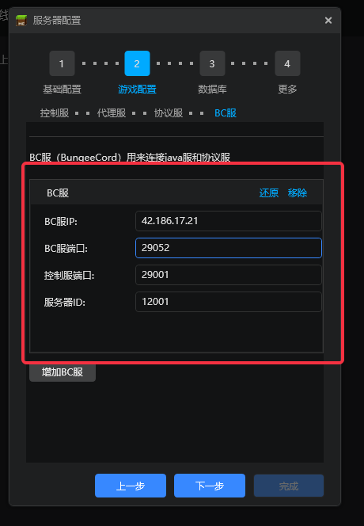
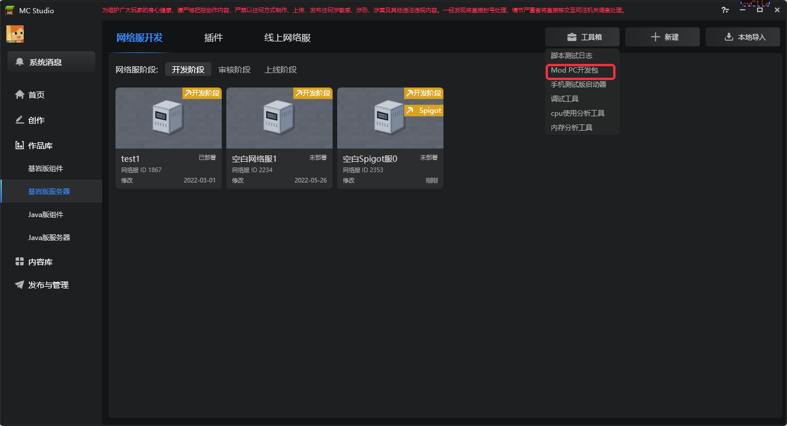

# 部署服务器

## 准备阶段

在进行Java版网络游戏搭建和部署流程前，首先需要注册成为我的世界开发者，并完成入驻申请，申请开发阶段服务器。具体步骤，请详细阅读如下文档：

1. [开发准备阶段概述](../课程1：成为Apollo服主及相关准备/第2节：开发准备阶段概述.md)
   
2. [入驻申请](../课程1：成为Apollo服主及相关准备/第3节：入驻申请.md)
   
3. [申请开发阶段服务器](../课程1：成为Apollo服主及相关准备/第4节：申请开发阶段服务器.md)
   
4. [使用数据库前端连接数据库](../课程1：成为Apollo服主及相关准备/第5节（拓展）：使用数据库前端连接数据库.md)
   
5. [连接开发机](../课程1：成为Apollo服主及相关准备/第5节：连接开发机.md)

## 特别提示

1. 拿到机器后，要先访问添加白名单，之后才可以正常登入
2. spigot机器的java环境对应的操作命令，分别是**java8**和**java18**，其中运行Spigot请使用java8(具体原因详见[常见问题合集](./90-常见问题合集.md))

## JAVA服部署流程
- 在准备好开发机后，连接上开发机

- 通过服主各自的Java服框架，部署各自的Java服(必须存在BC服)

- 经过初步的调研，确定目前使用的Spigot版本为1.12.2，因此为了兼容基岩版1.18客户端，需要在**Spigot服**使用**ViaVersion**插件

- 下载[**ViaVersion插件**](https://www.spigotmc.org/resources/viaversion.19254/)，并放置于 **Spigot服目录/plugins/** 目录下。
    **注：由于Viaversion转换1.20.5版本头颅（模型）会过滤掉非法昵称的信息，导致自定义方块和中文昵称的头颅（模型）出错，因此无法直接使用官网版本。可选择MCS内容库中的“ViaVersion-4.10.2”资源或自行修改。**

- 下载[**SpigotMaster插件**](./99-下载内容.md#SpigotMaster插件)，并放置于 **Spigot服目录/plugins/** 目录下。

- 下载[**BungeeMaster插件**](./99-下载内容.md#bungeemaster插件)，并放置于 **BC服目录/plugins/** 目录下。

- 在 **BC服目录/plugins/** 下，新建文件夹 **BungeeMaster**，并在 **BungeeMaster** 文件夹下新建文件 **config.yml**（此为BungeeMaster插件配置）

    

    

    

- 然后填入如下内容,其中
    - server_id 取值区间在[12000, 14000)内，并且保持单次部署唯一即可

    - master_port端口范围要求[29000,31000)
      - **master_port**是指BC服监听Master服连接所用端口，请注意与下述用于原生游戏的**query_port**区分，以免造成端口冲突

    - 填写完毕后，请记下相关参数，后面需要在studio中填写

    

- 打开**BC服目录/config.yml**文件(此为bc服配置)，配置bc服监听的端口，端口范围要求[29000,31000)
  
    - 记下端口参数，后面需要在studio中填写
- 注意，此处的**query_port**和**host中冒号后面的端口值**，请保持一致
    - 该处的端口，均为**BC服**用于监听来自**Geyser**服相关连接的端口
    
    

## 负载/协议转换部分部署流程

- 打开MCStudio，选择基岩版服务器，并选择右上角新建选项，打开后，选择空白Spigot服
  
    

- 选择更多后，点击服务器配置，开始配置

    

- 其中，控制服的配置不再赘述，和基岩版网络服务器相似

- 代理服和协议服实际上是同一个进程，所以配置合在一起说明：

    - 每个proxy内部会启动一个geyser，因此只需要调整proxy的数量，不需要配置geyser的数量。
    - proxy单进程内存：暂时未被使用
    - geyser单服最大人数：建议为200~300人，正式上线后根据proxy与geyser进程的负载情况再进行调整。0表示无上限，但正式服强烈建议设置最大人数，避免整服卡死。
    - geyser单进程内存：指geyser的java部分的最大可用堆内存。0表示使用默认值，开发与审核阶段默认为1G，正式阶段默认为6G。一般来说6G内存至少可以承载500人。

    

- BC服的配置则根据Java服部署中，BC服的数量和配置来决定。如，根据上个步骤截图数据，则最终配置为：

    
    - 如图所示，BC服端口即为**query_port**
    - 控制服端口即为**master_port**

- 配置完成后，点击部署

- 查看日志，若部署成功，则可以通过工具箱打开ModPC开发包，进入游戏开始测试

    
    
## 部署多个代理服与BC

- 在代理服的配置界面填写数量即可部署多个代理服（协议服与代理服为一对一的关系，所以这个数量也是协议服的数量），点击增加代理服则可以在不同机器上部署代理服。

- 如果需要部署多个BC：

	1. 在机器上部署好多个BC（可以分布在不同机器上），按上面的指引分别配置好server_id，master_port，query_port。注意这三个字段，不同bc之间不能有重复。
	2. 在studio的BC服配置界面，点击增加BC服，然后填写每个BC的ip，server_id，master_port，query_port。
	3. 重新部署，即可与多个BC组网，master会平均分配玩家到各个BC。

## Proxy与Geyser服的性能参数

一个proxy可以支撑300个玩家的跑图及连续登录，并且维持流畅运行，此时geyser建议分配4G的内存上限，整个进程最多会占用5G内存，以及5个核心的cpu。

## 常见部署问题合集

[常见部署问题合集](./90-常见问题合集.md)

