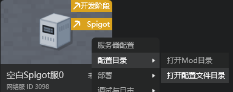

# 其他部署时可配置字段

## deploy.json

对studio的服务器点更多->配置目录->打开配置文件目录，在目录下找到deploy.json。我们可以在该json的“common”字段中 **自行** 添加一些额外的配置字段。

### command_suggestions

bool类型。

设置是否在客户端开启命令补全，若开启，那么在命令很多时，客户端在聊天栏输入斜杠后会卡顿。默认为true。

### geyser_survival_place_dist

int类型。

由于基岩版与java版的可放置距离不同，geyser会在玩家放置方块时对距离进行校验，距离大于该值会放置失败。该值为生存模式玩家的校验距离，默认为6。

PE基岩版生存模式的放置距离为7，所以将该字段配置为7时，可以满足基岩版的最远放置距离。但是配置时需要同步修改spigot，对于1.12.2版本，需要修改`PlayerConnection.java`下的`SURVIVAL_PLACE_DISTANCE_SQUARED`

### geyser_creative_place_dist

int类型。

与geyser_survival_place_dist类似，但该配置对应创造模式下的放置距离，默认为7。

PE基岩版创造模式的放置距离为12，配置时需要同步修改spigot，对于1.12.2版本，需要修改`PlayerConnection.java`下的`CREATIVE_PLACE_DISTANCE_SQUARED`

### geyser_max_place_dist

float类型。

生存模式与创造模式的放置距离都会受此限制，默认为8.0。

如果只需兼容生存模式，则不需要改动。如果还需兼容创造模式，则需要设置为12.0或以上。

配置时需要同步修改spigot，对于1.12.2版本，需要修改`PlayerConnection.java`下方法`a(PacketPlayInUseItem packetplayinuseitem)`中的`64.0D`，将其修改为配置的距离的平方。

### geyser_max_destroy_dist

float类型。

由于基岩版与java版的可破坏距离不同，geyser会在玩家破坏方块时对距离进行校验，距离大于该值会破坏失败。生存模式及创造模式的玩家都受此距离限制，默认为6.0。

PE基岩版生存模式的放置距离为7（创造模式下为12），所以将该字段配置为7.0时，可以满足生存模式的最远放置距离。但是配置时需要同步修改spigot，对于1.12.2版本，需要修改`PlayerConnection.java`下方法`a(PacketPlayInBlockDig packetplayinblockdig)`，`case START_DESTROY_BLOCK`分支下的`36.0D`，将其修改为配置的距离的平方。

**如果只是想兼容pe基岩版生存模式的交互距离，则把geyser_survival_place_dist设为7，把geyser_max_destroy_dist设为7.0即可。**

