#  自定义实体Demo详解

## 概要
[示例Demo](../99-下载内容.html#示例demo)中的CustomEntityDemo包含客户端Mod及Java插件，其中：

- 客户端Mod新增了三种生物
  - netease:squirrel
    - 自定义松鼠，spigot实体根据命令，可对应不同生物
  - netease:robot
    - json配置碰撞盒大小为3x3
    - 自定义机器人，spigot实体固定对应狼
  - netease:spider
    - json配置碰撞盒大小为2*3
    - 客户端继承马

- Java插件新增了一个指令/addEntity，简单展示了三种新增实体的方式
  - 仅客户端换皮
    - 命令
      - /addEntity WOLF(spigot生物identifier) netease:squirrel(客户端生物identifier)
    - 效果
      - 生成一只客户端表现为松鼠，实际行为为狼的换皮生物

  - 使用mythicmob插件进行生物换皮
    - 命令
      - /addEntity AngrySludge
      - /addEntity StaticallyChargedSheep
      - /addEntity SkeletalMinion
      - /addEntity SkeletonKing
    - 效果
      - 生成客户端为机器人，实际为MythicMob史莱姆
      - 生成客户端为机器人，实际为MythicMob闪电羊
      - 生成客户端为松鼠，实际为MythicMob骷髅兵
      - 生成客户端为机器人，实际为MythicMob骷髅王,骷髅王被攻击后会发送信息，并且有概率会召唤骷髅兵

  - 继承原生生物类进行换皮
    - 命令 
      - /addEntity 
    - 效果
      - 生成一只客户端表现为机器人，实际行为为狼的生物，修改攻击力为20，同时覆写了攻击函数，实现攻击时产生随机特效
      - 生成一只客户端表现为蜘蛛，实际行为为马的生物，同时覆写骑乘函数，实现骑乘两人

## 客户端开发流程
- 自定义松鼠
    1. 参照[自定义生物](../../../20-玩法开发/15-自定义游戏内容/3-自定义生物/01-自定义基础生物.md)，如实体定义、动画controller、动画、客户端实体定义、骨骼模型、贴图等
        
    
    2. 需要注意的是animation_controllers中使用molong语法，获取mod.is_moving变量，当收到rpc调用时，修改相关值，让松鼠在被攻击时播放移动动作
        

    3. 客户端注册molong值增加rpc调用监听，当收到事件时，修改松鼠的molong值
        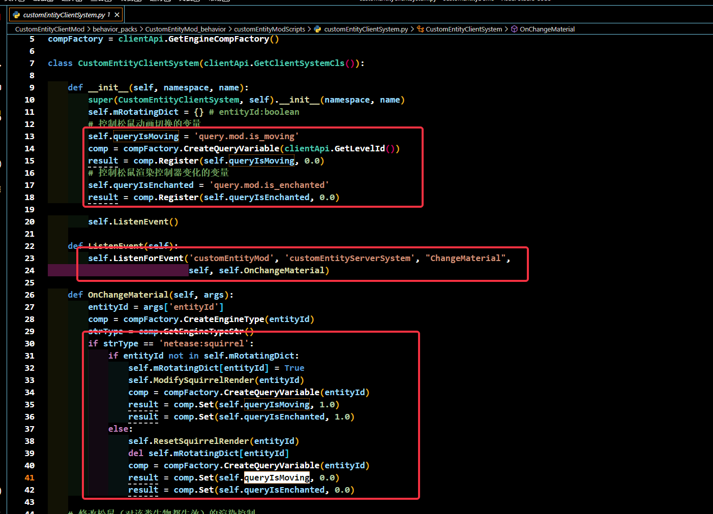

- 自定义机器人
    1. 类似松鼠，增加各项文件，其中特别设置碰撞盒大小
        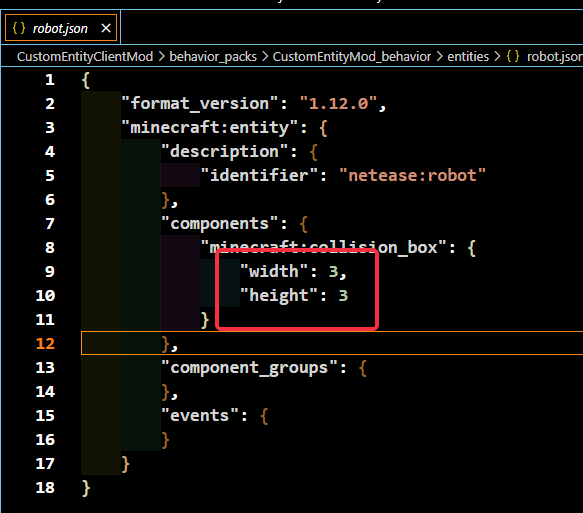
    2. 机器人的animation_controllers使用微软原生molang变量，只要机器人浮空，即可触发浮空的动作
        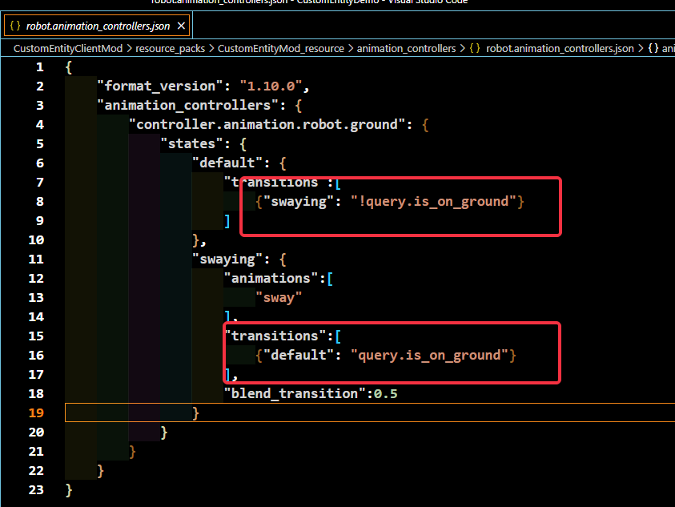
    3. 机器人的 animation_controllers使用Mod自定义molang变量，只要plugin发送rpc包，即可触发机器人放技能动作
        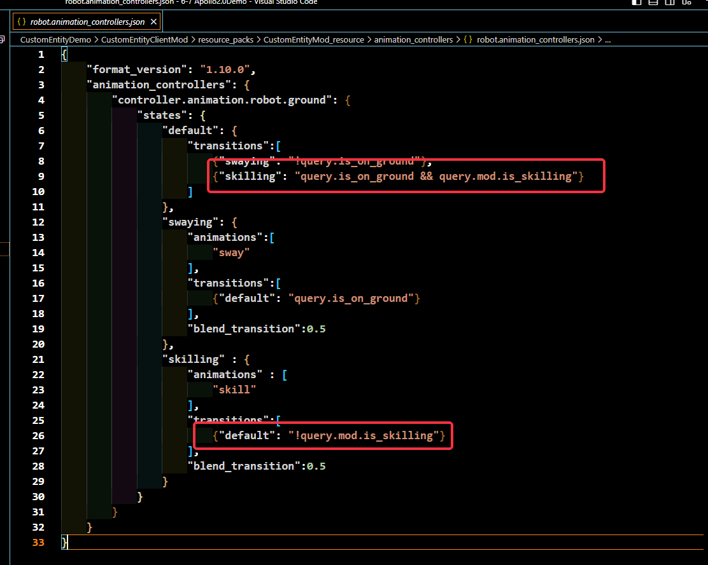
    
    强烈建议阅读:
    - 关于机器人的模型来源、动画制作、molong语法详细解读
      
        [机器人Demo](https://learn.microsoft.com/zh-cn/minecraft/creator/documents/entitymodelingandanimation)

- 自定义蜘蛛
  1. 类似松鼠，增加各项文件，同时增加 **minecraft:rideable** 组件、**minecraft:can_power_jump** 组件，支持骑乘和蓄力跳跃、客户端继承马实体 **"runtime_identifier" : "minecraft:horse"**
        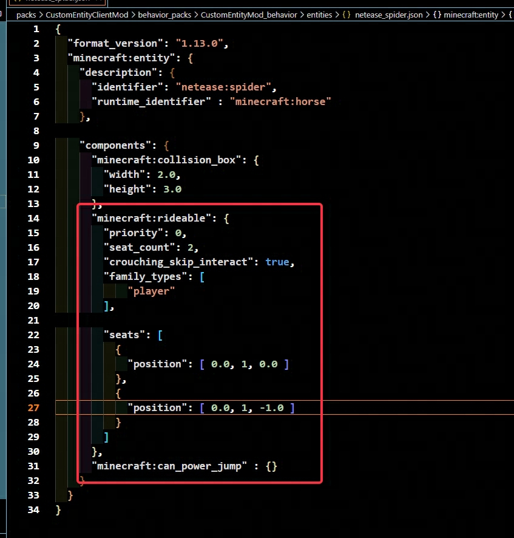

  至此客户端Mod开发结束

## Java插件开发流程

Demo中的Java插件演示了三种换皮方式，其具体的适用范围、实际效果我们一一讲述。

### 仅客户端换皮

- 应用场景：
  
  - 只支持修改生物的模型、动画、碰撞盒大小

  - 不支持修改生物的行为逻辑，如攻击、生命、敌对行为等等

- 命令格式为：
  ```
  /addEntity WOLF netease:robot
  ```

- 具体代码示例如下：
  ```
  spigotIdentifier = "WOLF";
  clientIdentifier = "netease:robot";
  EntityType spigotType = EntityType.valueOf(spigotIdentifier);
  Entity mob = spigotMaster.spawnEntity(player, player.getLocation(), spigotType, clientIdentifier);
  ```
  
- 上述代码的最终效果如下，生成一个本质上为狼，但是模型是机器人的实体
  

### 使用mythicmob插件进行生物换皮

Demo中使用的MythicMob插件为**4.13.0**版本

- 应用场景：
  
  - MythicMob插件提供了强大的自定义生物功能，包括生物的技能、血量、体积等等

  - 不同版本的MythicMob需要根据各自版本的事件、API自行适配

- 插件开启时，监听MythicMob插件的生物生成事件

  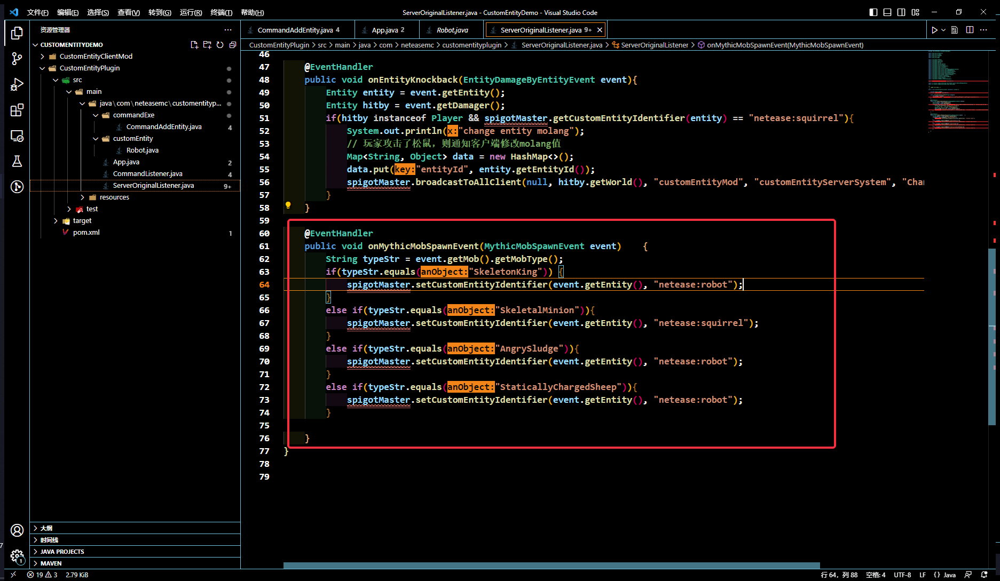

- 同时新增Mechanic，通过配置，达到玩家触发技能时，发送rpc包
  
  下图演示的是新增的yml配置
  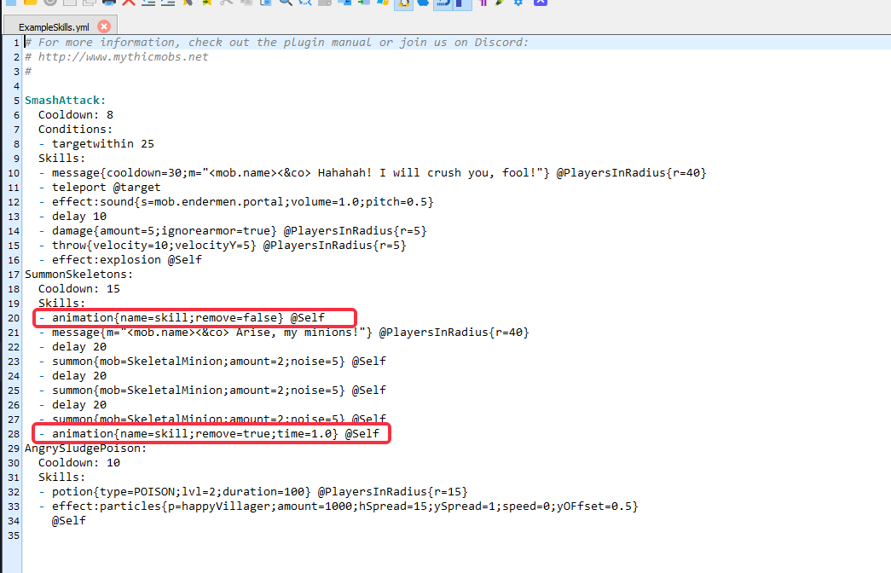
  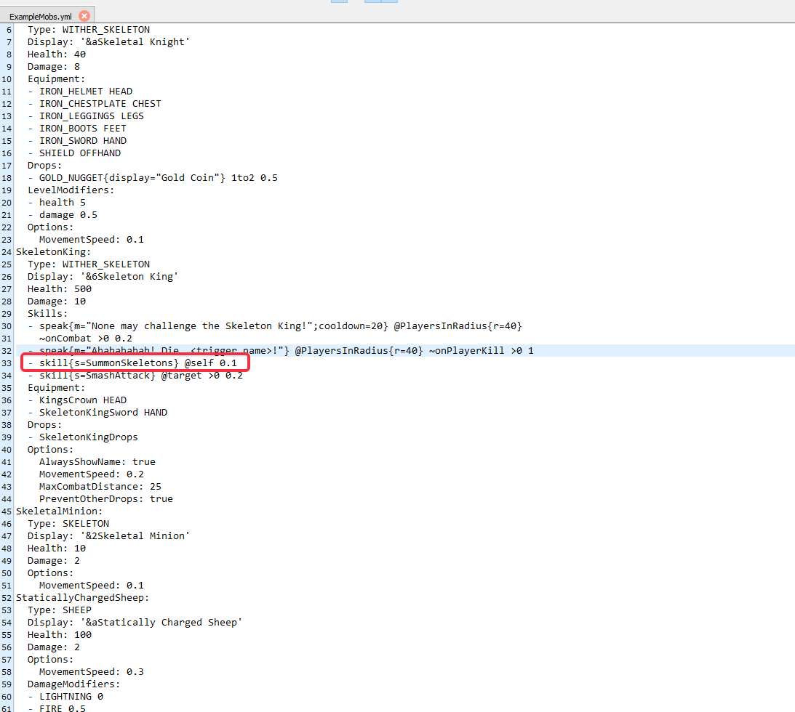

  下图演示的是代码逻辑实现
  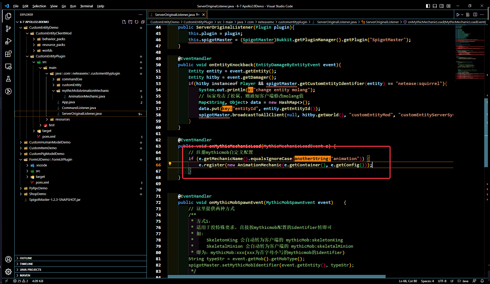
  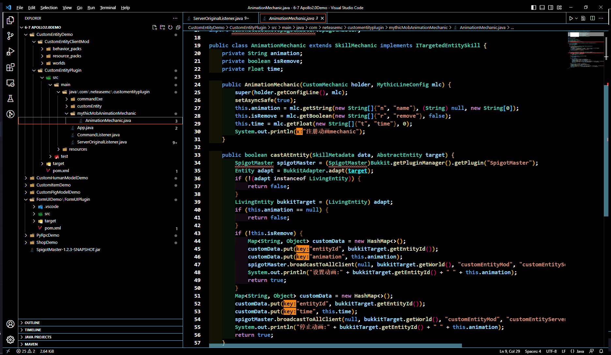

- 命令格式为：
  ```
  /addEntity SkeletonKing
  ```

- 生成对应生物时，设置生物对应的客户端identifier，这里提供两种设置方案
  - 第一种适用于固定identifier，Mob自动对应到固定的identifier，如：简单讲就是 **mythicMob:mobType**（固定前缀 + MobType首字母缩写）
    - SkeletonKing -> mythicMob:skeletonKing
    - SkeletalMinion -> mythicMob:skeletalMinion
    ```
    String typeStr = event.getMob().getMobType();
    spigotMaster.setMythicMobIdentifier(event.getEntity(), typeStr);
    ```
  
  - 第二种适用于想自定义对应identifier，相同Mob可对应不同identifier，如下代码
    ```
    // 把MythicMob插件的骷髅王样例映射为客户端的机器人
    if(typeStr.equals("SkeletonKing"))	{
      spigotMaster.setCustomEntityIdentifier(event.getEntity(), "netease:robot");
    }
    // 把MythicMob插件的骷髅小兵样例映射为客户端的松鼠
    else if(typeStr.equals("SkeletalMinion")){
      spigotMaster.setCustomEntityIdentifier(event.getEntity(), "netease:squirrel");
    }
    ```

- 最终效果如下, MythicMob插件官方给的骷髅王例子的具体效果有
    - 被攻击后，发送消息
    - 被攻击有一定概率会召唤骷髅小兵，召唤技能的动作为右手平挥
  

### 继承原生生物类进行换皮

- 应用场景：
  
  - 要求十分了解生物属性、逻辑，能阅读混淆后逻辑，并自行继承改造相应逻辑

  - 可改造范围十分广泛，行为逻辑定制灵活性很高

- 命令格式为：
  
  1、目前demo样例中，展示了如何继承并修改原生狼的攻击函数，在客户端以机器人的模型表现出来
  
  2、展示了客户端模型为蜘蛛的马

  ```
  /addEntity
  ```

- 插件开启时，反射修改Spigot核心的实体定义，并把狼的实体映射为自定义的Robot类

   **这里需要注意的是，目前1.12.2版本需要Viaversion，因此注册时，需要采用已用的EntityId，如图中的EntityType.valueOf("WOLF").getTypeId()**

   **如果只是单纯地取最大值递增，最终Viaversion会拦截下相关实体创建，导致实体生成失败**
    

- Robot类中，修改狼的攻击里为20, 并重载狼地攻击函数，随机产生攻击效果

  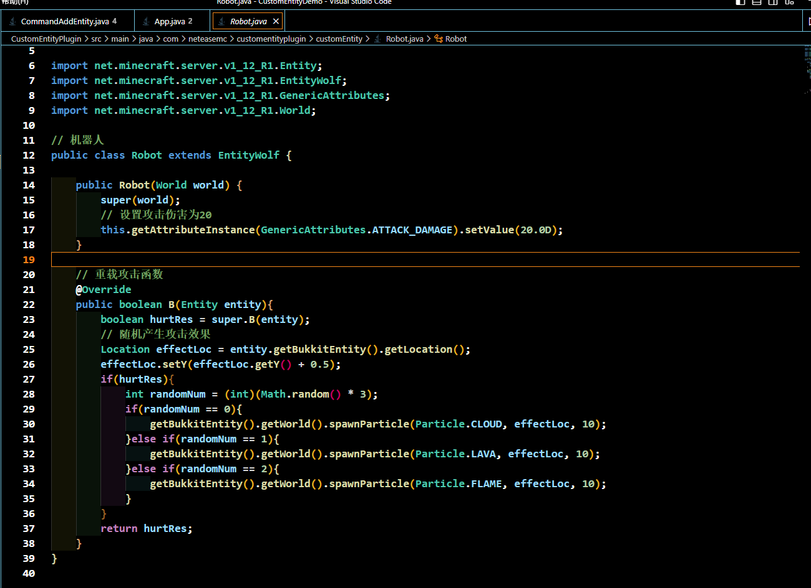

- MySpider类中，修改马的骑乘判断函数、骑乘函数
  
  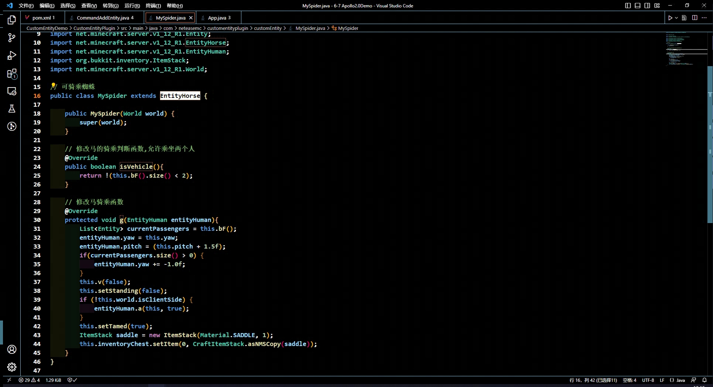


- 最终效果如下：
  

  
