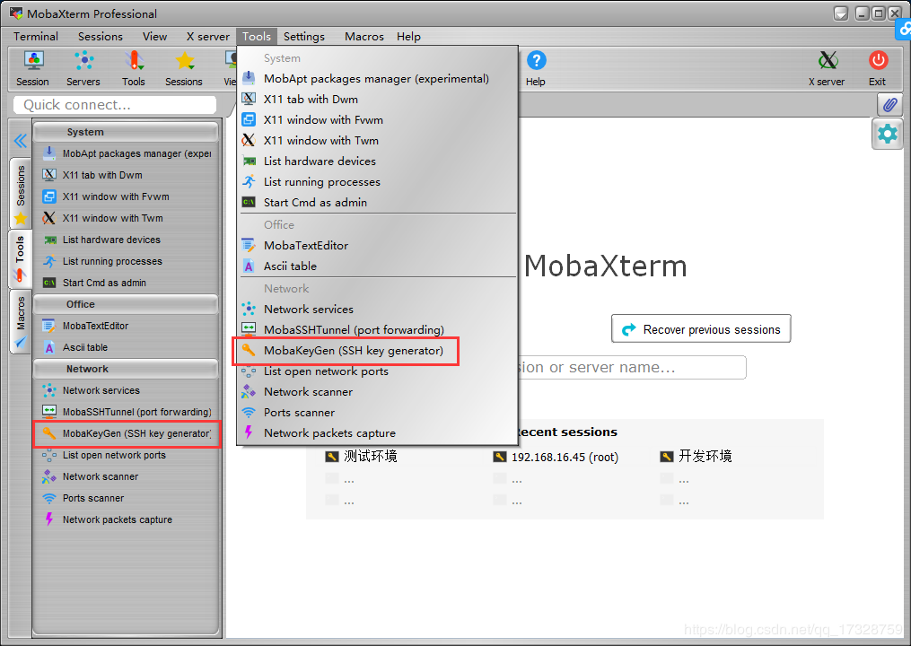
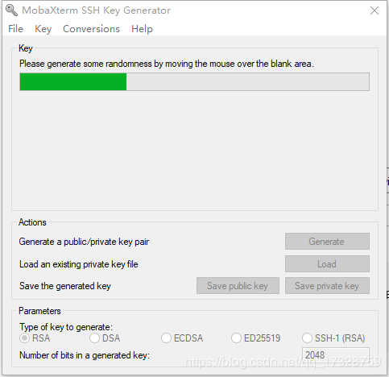
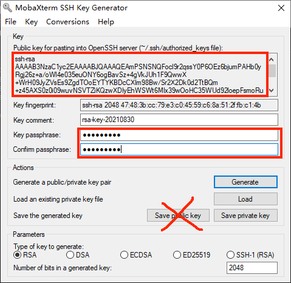
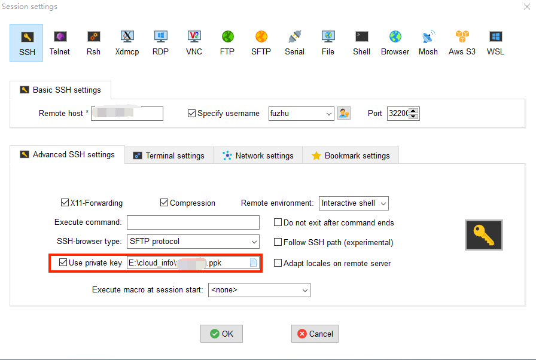

# 申请开发阶段服务器

审核通过后，官方人员将根据审核信息中预留的QQ号联系开发者，开发者需要在审核信息中提供**登录服务器的公钥**。资料确认无误之后，官方人员将发放开发阶段服务器（简称：开发机）。

## 登录服务器的公钥

- 推荐使用MobaXterm。打开MobaXterm界面，Tools->MobaKeyGen

- 密钥类型选择RSA，密钥长度选择2048位

- 很快生成公钥对，单击下一步（需要在空白框中，持续移动鼠标，加快公钥、私钥生成速度）。

- 密钥名称自定义，输入密钥加密的密码（可以留空，但是建议输密码）；
- 全选public key文本框中的内容，复制到记事本，另存为fuzhu_public.pub。（温馨提示：不要直接通过Save public key按钮获取公钥，否则将导致机器远程连接无法进行）

- 需要保存两种格式的私钥，分别用于SSH连接以及McStudio连接：

  1）点击Save private key保存私钥，文件名建议包含private，比如fuzhu_private.ppk。

  

  ​	此私钥用于SSH连接，举例如下：

  

  2）生成MC Studio使用的RSA私钥文件：

  

- 其中，**公钥**用来存放于服务器中与私钥校验，需要在[入驻](../../35-上架与入驻/课程12.1-基岩版网络游戏入驻指南.md)时上传，**私钥**文件自己保管好，用于服务器的**连接**与开发。

## 添加白名单IP

- 只有在白名单的IP，才能访问并部署Apollo测试机器、正式机器。
- 在机器发放后，可以在服务器使用情况处，添加白名单。
  
- 进行白名单添加或删除操作。
  

