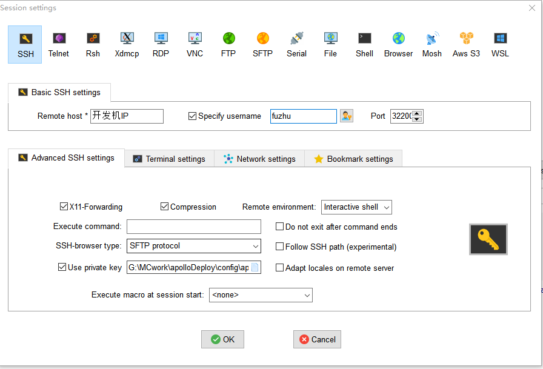
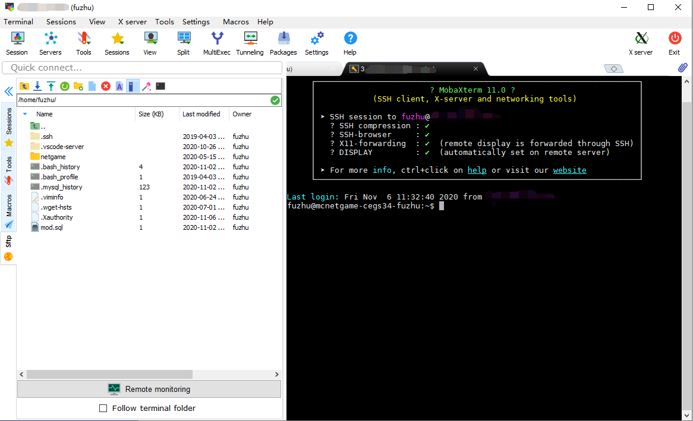

# 连接开发机

​		第4节我们介绍了如何进行开发机申请，当申请通过后，官方工作人员会与您取得联系并发放开发测试机。本节将介绍如何连接开发测试机，以及开发机的目录。

### 远程连接

以MobaXterm为例，远程连接到开发机的步骤如下：

- 账号为fuzhu
- 机器填开发机的IP
- 端口为32200

****

- 勾选use private key,内容是本地保存的私钥的路径。若对私钥路径有疑问，建议回看第4节内容。

### 开发机目录

- 链接成功后，可看到开发机的目录结构

- 以下目录均为使用MCStudio**完成搭建第一个网络服**后方会生成
- 网络游戏部署相关文件统一存放在/home/fuzhu/netgame/
- 不要在netgame目录存放未经备份的重要信息，**以免被误删**

**网络服名称以sample为例**，若使用其他网络服名称则替换sample为对应名称即可

​		其中，应用目录位置如下：

- 应用部署根目录：/home/fuzhu/netgame/app/sample
- 本机部署服务配置：/home/fuzhu/netgame/app/sample/config
- 本机部署master：/home/fuzhu/netgame/app/sample/master
- 本机部署game：/home/fuzhu/netgame/app/sample/game
- 本机部署lobby：/home/fuzhu/netgame/app/sample/lobby
- 本机部署proxy：/home/fuzhu/netgame/app/sample/proxy
- 本机部署service：/home/fuzhu/netgame/app/sample/service
- 上传mods目录：/home/fuzhu/netgame/mods/sample

​		其中，log目录位置如下：

- logs的真实存放路径：/home/fuzhu/netgame/logs/sample
- 每个app服目录内也有一个logs软链接

