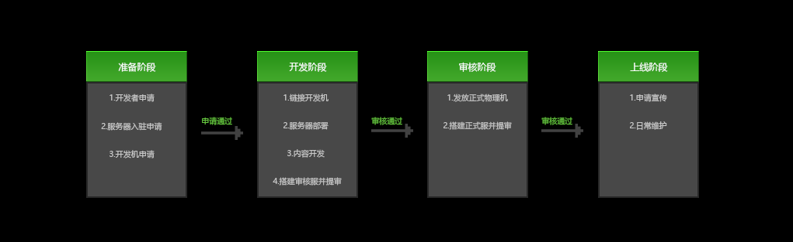

# 开发流程说明

​		从入驻到上线可分为四个阶段，详见下图：

 

### 准备阶段

​		此阶段主要是一些必要的准备，首先需要成为一名开发者，开发者需要申请网络服入驻，通过后可提供固定IP和公钥获取开发机。拥有开发机之后，可进入开发阶段。

### 开发阶段

​		此阶段依赖**开发机**，进行服务器部署、游戏内容开发等操作。开发完毕，可搭建审核服。同时在开发者平台-PE内容管理-PE网络游戏管理中选择发布游戏，填写对应信息提交审核，官方人员会在**10个工作日**内予以审核并给到审核结果。提审通过后，将进入审核阶段。

### 审核阶段

​		游戏内容经官方人员审核通过后，会依据网络游戏情况发放**正式物理机**，用于正式环境的网络游戏搭建。开发者搭建完成后，同样在开发者平台-PE内容管理-PE网络游戏管理中选择发布游戏即可，提交审核并通过后，游戏即可上线。

### 上线阶段

​		此阶段需使用正式物理机，以保证服务器性能。除了日常维护，服主也可申请上新、日常推荐，增加游戏曝光度。

