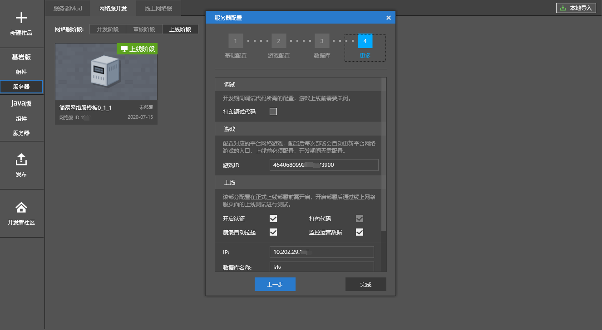

# 部署

​		任何针对服务器配置的修改或者服务器mod的修改，仅保存在本地。若需要在服务器中生效，需要进行部署操作。开发、审核、上线阶段，都需要部署操作。

​		MCStudio部署网络服有多种方式，包含智能部署，重新部署，热更三种。另外开发阶段的部署跟审核、上线阶段的部署又有设置上的区别。

​		简单起见，这里先介绍最常用的一种情况：开发阶段执行智能部署。

​		在开发阶段，任何服务器配置或者服务器mod的修改之后，可直接点击部署按钮，将修改同步到开发机中。

​		

以下内容涉及较多进阶知识，建议在入门阶段暂时跳过。

------

## 智能部署

网络服开发页面的部署按钮默认采取智能部署方式，总是尝试采取最快最低成本的更新方式，使修改的代码生效。

通常在开发阶段，总是使用智能部署就可以了。

常用的配置包括：修改服务器数量，修改Apollo大小版本，新增一种类型的大厅服/游戏服等。

Apollo网络服中的各种配置可以一次性修改，部署会自动根据配置的变化选择最优的部署方式。

如果网络服配置修改了**全局设置**，如控制服、功能服、数据库或更多配置，**智能部署**会触发**重新部署**，重新部署前会关闭当前的所有服务器并清空该网络服的文件，再进行部署。

通常情况下，只修改大厅服/游戏服/代理服，则不会触发重新部署，而是采取**滚动更新**方式应用到服务器上。

**滚动更新**：使用最新Mod代码启动一批新服来接管需要更新的旧服务器，旧服务器将采取**优雅停机**的方式退出

**滚动更新注意事项**：假如配置中选择了【保存地图】，那么需要两次滚动更新才能安全更新对应服务器上的Mod：第一次更新选择删除服务器，让目标服务器正常关闭并上传地图文件；第二次更新新建服务器，使用相同的配置参数并且选择使用【服务器最新地图】。

**优雅停机**：正在服务器游玩的玩家不受影响，但不会再分配新玩家进入，当所有玩家退出后，旧服自然停机

**样例**：修改Mod目录内的游戏服gameA的代码并保存，点击网络服开发的部署按钮，则MCStudio会滚动更新所有gameA游戏服，并移除本地电脑中的gameA的客户端脚本缓存

**注意**：如果开发者正在gameA游戏服中，则开发者必须退出后重新登陆gameA游戏服放可验证新的代码

## 重新部署

在网络服开发分页，选中网络服的更多 => 重新部署可以显式指定MCStudio使用重新部署来应用修改。

重新部署会关闭当前的所有服务器并清空该网络服的文件，包括日志，再重新上传Mod进行部署。

## 热更

热更是指不停服更新服务器部分的代码，它的执行有以下前提：

- 修改的Mod内容**只包含运行在服务端部分**的代码，即**developer_mods**里的代码修改
- **只修改了函数内实现**

如果满足上述条件，则可以选中网络服的更多 => 热更来应用新的服务器代码

热更可以避免客户端被踢出，更新应用的速度也比滚动更新和重新部署更快速，在开发期提升调试的效率，在正式运营时也可以作为问题的修复手段

**样例**：开发者在gameA游戏服验证Mod功能时发现异常，通过修改游戏服gameA的developer_mods里的代码进行修复，或增加日志用于排查问题，保存后点击更多 => 热更，则MCStudio会上传更新的代码到gameA游戏服并执行服务端代码热更操作，开发者无需退出gameA即可继续验证内容

## 开发阶段部署设置

- 开发阶段部署需要关闭验证、关闭崩溃自动拉起、关闭运营数据。
- 开发阶段部署需要开启打包代码、开启打印调试代码。

## 审核阶段部署设置

- 完成开发后可进行提审，以便申请正式物理机。您需要在发布界面的开发者平台上新建一个正式网络服项目。
- 新建好正式网络服项目，并设置对应的游戏ID
- 审核阶段部署需要关闭验证、关闭崩溃自动拉起、关闭运营数据。
- 审核阶段部署需要开启打包代码、开启打印调试代码。

## 上线阶段部署设置

- 通过网络服的demo提审后会发放正式物理机，您需要在发布界面的开发者平台上新建一个正式网络服项目。
- 新建好正式网络服项目，并设置对应的游戏ID
- 上线部署需要关闭打印调试代码
- 上线部署都需要开启打包代码
- 上线部署需要开启认证和崩溃自动拉起，同时也需要开启监控运营数据

