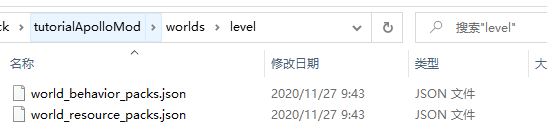
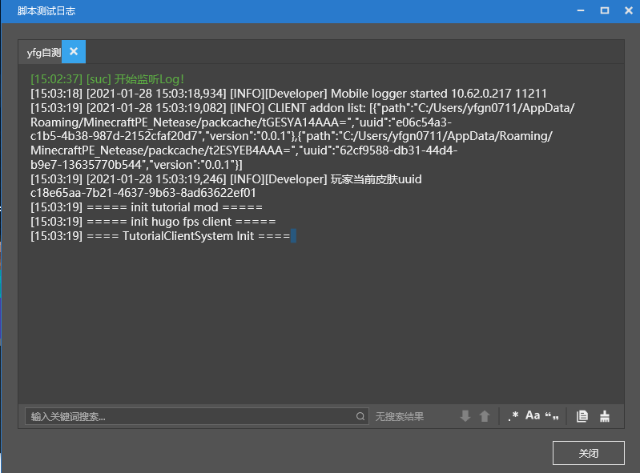
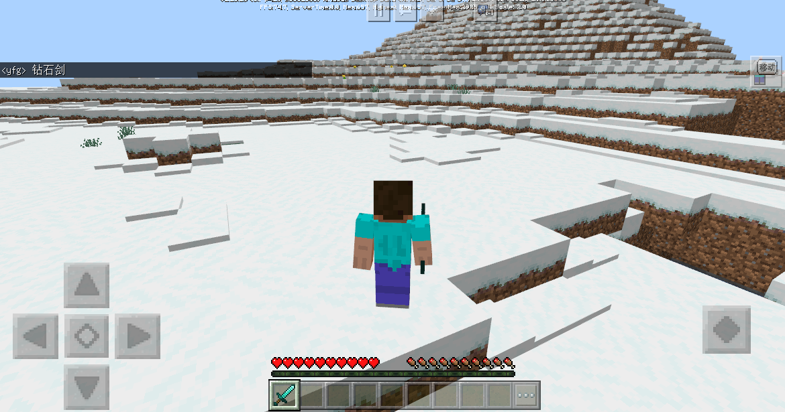

# Mod到网络游戏Mod入门

​		这篇教材将带领有Mod基础的开发者进入网络游戏Mod开发，教材讲述如何将“脚本开发入门”中介绍的脚本Mod转化成网络游戏Mod，引导开发者入门网络游戏Mod。本教材要求开发者已经申请到了开发机（按照“网络游戏入驻”流程申请），且会使用部署工具（参考“使用部署工具”），已经阅读“脚本开发入门”

​		网络游戏Mod主要由服务端Mod和客户端Mod组成。客户端Mod包含行为包和资源包，它运行在玩家手机上，可以处理界面交互、特效、entity 行为等逻辑，只能使用Mod SDK客户端组件和事件。服务端Mod运行在linux机器上，它可以从数据库存取玩家数据，实现玩家之间交互，可以使用Apollo SDK所有功能、Mod SDK服务端组件和事件。下面介绍如何将Mod转化为网络游戏Mod


## Mod转化成网络游戏Mod

1、创建tutorialApolloMod文件夹作为网络游戏Mod的根目录，然后创建behavior_packs、resource_packs、worlds、developer_mods四个文件夹。


2、打开“入门脚本模板”的目录，可以找到“tutorialBehaviorPack_xxx”文件夹和“tutorialResourcePack_xxx”文件夹


3、把“tutorialBehaviorPack_xxx”文件夹拷贝到behavior_packs目录下，重命名为tutoriaBehavior


​	把“tutorialResourcePack_xxx”文件夹拷贝到resource_packs目录下，重命名为tutorialResource


4、developer_mods新建tutorialDev文件夹，然后把“tutorialBehaviorPack_xxx”文件夹里面的tutorialScripts复制到tutorialDev目录下


5、在worlds目录下创建level文件夹，里面创建world_behavior_packs.json文件和world_resource_packs.json文件



打开“tutorialBehaviorPack_xxx”文件夹里面的manifest.json文件，把header层级下的uuid、version字段对应值配置到world_behavior_packs.json文件中


打开“tutorialResourcePack_xxx”文件夹里面的manifest.json文件，把header层级下的uuid、version字段对应值配置到world_resource_packs.json文件中


## 一个游戏服Mod的目录结构

我们以tutorialApolloMod为示例介绍一个游戏服Mod目录结构：

	tutorialApolloMod
		behavior_packs
			tutorialBehavior
		developer_mods
			tutorialDev
				tutorialScripts
		resource_packs
			tutorialResource
		worlds
			level
				world_behavior_packs.json
				world_resource_packs.json
| 文件/文件夹               | 解释                                                         |
| ------------------------- | ------------------------------------------------------------ |
| tutorialApolloMod         | 游戏服Mod根目录                                              |
| behavior_packs            | 存放客户端行为包，可以包含多个行为包                         |
| tutorialBehavior          | 行为包                                                       |
| developer_mods            | 存放服务端Mod，这些Mod只会运行在服务器，不会传送给客户端     |
| tutorialDev               | 服务端Mod                                                    |
| tutorialScripts           | python脚本的根目录，该目录的脚本会被加到python运行环境下，可以从该路径开始import脚本文件，例如from tutorilaScripts import modMain |
| resource_packs            | 存放客户端资源，可以包含多个资源包                           |
| tutorialResource          | 资源包                                                       |
| worlds                    | 存放地图，还包含world_behavior_packs.json和world_resource_packs.json |
| world_behavior_packs.json | 配置客户端需要下载的行为包                                   |
| world_resource_packs.json | 配置客户端需要下载的资源包                                   |

### 命名建议

建议behavior_packs、developer_mods、resource_packs目录下所有Mod都遵守"脚本开发入门"中"命名建议"，Mod脚本根目录名建议采用`[团队名称][Mod名称][Scripts]`格式，例如SDKTeamTestScripts。

### 服务器与客户端

游戏服Mod中客户端脚本和服务端脚本是分开两个目录存储的，客户端脚本放到behavior_packs文件夹，服务端脚本放到developer_mods文件夹，两者是独立的不能相互import。客户端脚本只能使用”ModAPI“系列文档中客户端事件和客户端组件，服务端脚本不仅能使用”ModAPI“系列文档中服务端端事件和服务端组件，还能使用”Apollo网络服开发“文档中SDK。

游戏服Mod强烈建议客户端脚本只包含客户端逻辑，服务端脚本只包含服务端逻辑，一方面方便管理和开发代码，另一方面还可以避免万一客户端脚本被破解而导致包含的服务端代码泄露。下面介绍如何让Mod只包含客户端或服务端代码：

tutorialBehavior中脚本去掉服务端代码，首先屏蔽ModMain.py中服务端代码，注释掉TutorialServerInit和TutorialServerDestroy函数：

```python
@Mod.Binding(name = "TutorialMod", version = "0.0.1")
class TutorialMod(object):

    # 类的初始化函数
    def __init__(self):
        print "===== init tutorial mod ====="

    # InitServer绑定的函数作为服务端脚本初始化的入口函数，通常是用来注册服务端系统system和组件component
    # @Mod.InitServer()
    # def TutorialServerInit(self):
    #     print "===== init tutorial server ====="
    #     # 函数可以将System注册到服务端引擎中，实例的创建和销毁交给引擎处理。第一个参数是MOD名称，第二个是System名称，第三个是自定义MOD System类的路径
    #     # 取名名称尽量个性化，不能与其他人的MOD冲突，可以使用英文、拼音、下划线这三种。
    #     serverApi.RegisterSystem("TutorialMod", "TutorialServerSystem", "tutorialScripts.tutorialServerSystem.TutorialServerSystem")
    #
    # # DestroyServer绑定的函数作为服务端脚本退出的时候执行的析构函数，通常用来反注册一些内容,可为空
    # @Mod.DestroyServer()
    # def TutorialServerDestroy(self):
    #     print "===== destroy tutorial server ====="
    
    # InitClient绑定的函数作为客户端脚本初始化的入口函数，通常用来注册客户端系统system和组件component
    @Mod.InitClient()
    def TutorialClientInit(self):
        print "===== init hugo fps client ====="
        # 函数可以将System注册到客户端引擎中，实例的创建和销毁交给引擎处理。第一个参数是MOD名称，第二个是System名称，第三个是自定义MOD System类的路径
        # 取名名称尽量个性化，不能与其他人的MOD冲突，可以使用英文、拼音、下划线这三种。
        clientApi.RegisterSystem("TutorialMod", "TutorialClientSystem", "tutorialScripts.tutorialClientSystem.TutorialClientSystem")
    
    # DestroyClient绑定的函数作为客户端脚本退出的时候执行的析构函数，通常用来反注册一些内容,可为空
    @Mod.DestroyClient()
    def TutorialClientDestroy(self):
        print "===== destroy hugo fps client ====="
```

接着删除tutorialBehaviorPack目录下tutorialServerSystem.py文件。同样，对于服务端，只需屏蔽tutorialDev目录下ModMain.py文件中服务端代码，也即注释掉TutorialClientInit和TutorialClientDestroy函数，然后删除tutorialDev目录下tutorialClientSystem.py文件。

## 如何调试

网络游戏Mod代码目前只能通过在不同的地方打Log来调试代码。打Log可以使用 print 也可以使用 mod_log模块。客户端日志显示在”脚本测试日志“窗口中




通常调试日志用print，其他日志建议用mod_log模块，例如：

```python
from mod_log import logger
logger.info("print log: %s", "OK")
```

在MCStudio中找到网络游戏，然后点击"更多"，接着点击“查看服务端日志”，会弹出“服务器日志”窗口


点击“大厅服”中“大厅服4000”可以查看服务器日志。网络游戏包含大厅服、游戏服、控制服、功能服、代理服，目前服务器Mod是运行在大厅服，大厅服日志包含了"===== init tutorial server ====="字符串，它是执行服务端modMain.py文件中TutorialServerInit函数打印出来的


最后，我们验证游戏服Mod功能，使用客户端进入游戏服后，聊天框中输入“钻石剑”，玩家背包中多了一把钻石剑



## 使用MCStudio将Mod转化成网络游戏Mod

MCStudio可以直接将Mod转换成网络游戏Mod，我们以“入门脚本模板”为示例介绍转换方法

MCStudio中，点击新建→基岩版组件→入门脚本模板，点击新建，会自动创建一个“入门脚本模板“的AddOn。


MCStudio中，点击基岩版组件，找到新建的入门脚本模板，点击更多→转换为服务端Mod


输入Mod名字为tutorialApolloModV2，点击转换，我们就得到一个网络游戏Mod了


打开网络游戏Mod，可以看看转换后Mod的目录，这是MCStudio替我们执行了上面“Mod转化成网络游戏Mod”过程，但是转换后Mod的客户端和服务端逻辑还没有分离，需要按照“服务器与客户端”进行调整。


## 开始行动吧

首先阅读“ModSDK模组开发”，然后从modMain.py入手，阅读tutorialApolloMod的代码与注释。

完全理解后，在服务端事件以及服务端组件中找几个自己感兴趣的，尝试添加到网络游戏Mod里，看能不能生效吧！

掌握事件与组件的用法后，可以阅读Apollo中“SDK”文档，学习更多Apollo的用法，然后阅读“网络服开发进阶”，全面学习网络游戏Mod开发技巧。阅读完成后，可添加一些Apollo SDK，尝试运行并查看是否生效。

掌握Apollo “SDK”后，可以阅读“官方插件介绍”，然后开发自己的小游戏了。

遇到自身没法解决的问题时，及时和官方沟通反馈。

