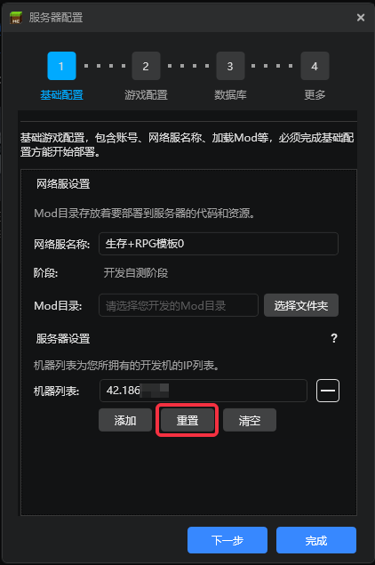

# 网络服基础配置

本节内容可查阅[视频教程](https://cc.163.com/act/m/daily/iframeplayer/?id=5faa58dc5655da63cc2d8a5d)的**网络服基础配置**小节

## 基础配置

- 在创建好的简易网络服上，点击更多=>服务器配置，即可以进入服务器的配置页面。
- 基础配置是**必须完成**的配置
- 将分配到手的**测试机IP**填入红框中

> 点击重置会自动将所有您拥有的机器填入机器列表，您可以先重置，然后再删除不需要的机器。

点击下一步，如果所有填入数据准确无误的话，完成按钮就会点亮。

以下为一些常见的错误：

### 请求超时

连接Apollo开发机需要加入IP白名单，请使用申请时提供的**白名单机器**登陆MCStudio操作，[**点击此处**](http://temp-white-list.mc.netease.com:9999/?machine=)可把当前机器加入白名单。

### 无效的Mod目录

请选择有效的本地文件夹，并且路径内**不要包含中文或特殊字符**

### 机器IP不合法

请填入官方提供的开发机IP

### 网络服名称不合法

请输入合法的网络服名称，**只允许使用字母、数字、下划线**

## 部署网络服

- 当服务器配置的完成按钮点亮后，即可点击完成服务器配置，其余配置会在后面的教程里介绍。

- 完成配置后，网络服就可以开始部署了

- 点击部署，会弹出部署日志窗口

- 部署成功后，在部署日志的最后，会显示入口地址。

