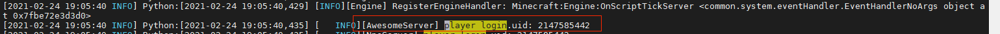
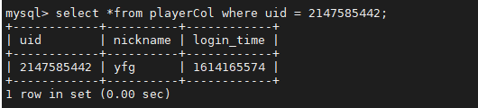
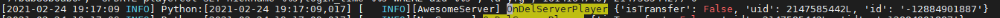

# 进入和退出游戏

主要包含登录、定时存档、登出、切服等功能。

## 登录

Apollo引擎在登录过程中会处理顶号问题，开发者开发过程不用考虑顶号。登录过程主要涉及下面事件：

- client 相关事件：
  - OnUIInitFinished：此时可以创建UI了，但是玩家每次切维度都会触发这个事件
  - OnLocalPlayerStopLoading：出生点地形加载完成时触发，切维度不会触发本事件

- master相关事件：
  - PlayerLoginServerEvent：登录master事件，可以区分登录和切服
- lobby/game相关事件：
  - AddServerPlayerEvent：登录到lobby/game 事件，可以区分登录和切服

### 服务端登录开发

下面开发LobbyMod服务端登录功能。首先处理登录逻辑，监听AddServerPlayerEvent事件，初始化玩家信息，核心代码如下：

```python
class AwesomeServer(ServerSystem):   
	def __init__(self, namespace, systemName):      
		ServerSystem.__init__(self, namespace, systemName)      
        #注册事件
		self.ListenForEvent(
					serverApi.GetEngineNamespace(), 
					serverApi.GetEngineSystemName(),
					modConfig.AddServerPlayerEvent,
					self, self.OnAddServerPlayer
					)   
		...     
            
	def OnAddServerPlayer(self, args):      
		'''      
	 	添加玩家的监听函数      
		'''      
	 	playerId = args.get('id','-1')      
		uid = netgameApi.GetPlayerUid(playerId)     
		self.mPlayerid2uid[playerId] = uid 
	
```
### 读写数据库

玩家游戏数据通常存储到mysql。apollo应该尽量异步读写mysql，避免阻塞游戏逻辑，导致全服玩家卡顿。apollo提供“mysql连接池”，提供各种异步读写mysql接口。

我们以LobbyMod为例介绍“mysql连接池”使用方法。首先我们创建表playerCol，用于存储玩家数据，创表语句如下：

```sql
CREATE TABLE IF NOT EXISTS `playerCol` (
  `uid` bigint unsigned NOT NULL,
  `nickname` varchar(50) NOT NULL,
  `login_time` bigint unsigned NOT NULL DEFAULT 0,
  PRIMARY KEY (`uid`)
) ENGINE=InnoDB DEFAULT CHARSET=utf8mb4;
```

接着，我们读写表playerCol，玩家登录时从mysql读取玩家数据，若没查到数据，则向mysql插入玩家信息，记录新玩家信息。核心代码如下：

```python
class AwesomeServer(ServerSystem):
	def __init__(self, namespace, systemName):
        ...
		self.mysqlMgr = MysqlOperation()
        
	def OnAddServerPlayer(self, args):      
		'''      
	 	添加玩家的监听函数      
		'''      
        ...
		self.mysqlMgr.QueryPlayerData(playerId,uid,lambda data: self.QuerySinglePlayerCallback(playerId, uid, data))
        
	def QuerySinglePlayerCallback(self, player_id, uid, data):
		'''
		回调函数。若玩家存在，则注册玩家；否则记录玩家信息
		'''
		# 数据库请求返回时，玩家已经主动退出了
		if not self.playerid2uid.has_key(player_id):
			return
		if not data:# 找不到玩家数据，注册一个新玩家
			nickname = netgameApi.GetPlayerNickname(player_id)
			data = playerData.PlayerData.getNewPlayerInfo(uid, nickname)
			self.InsertPlayerData(player_id, uid)
		#记录玩家数据
		player = playerData.PlayerData()
		if isinstance(data,tuple):
			data = player.changeMysqlTupleToPlayerDict(data)
		player.initPlayer(player_id, data)
		#刷新玩家登录时间
		player.refreshLoginTime()
		self.player_map[uid] = player
	
```

### 同步玩家数据
玩家登录后，需要从服务端获取玩家信息。我们以LobbyMod为例，客户端登录后，从服务端获取玩家登录时间和昵称。

#### 客户端登录开发

监听OnOnLocalPlayerStopLoading事件，请求获取玩家数据，接着监听服务端发过来的LoginResponseEvent事件，然后记录玩家数据。客户端监听UiInitFinished事件，开始初始化UI。代码如下：
```python
class AwesomeClient(ClientSystem):
	def __init__(self,namespace,systemName):
		ClientSystem.__init__(self,namespace,systemName)
        ...
		# 注册事件
		self.ListenForEvent(
			modConfig.Minecraft, 
			modConfig.LobbyServerSystemName, 
			modConfig.LoginResponseEvent, 
			self, self.OnLoginResponse
		)
        self.ListenForEvent(
            clientApi.GetEngineNamespace(), 
            clientApi.GetEngineSystemName(),
            ‘OnLocalPlayerStopLoading’, 
            self, self.OnOnLocalPlayerStopLoading
        )
		self.ListenForEvent(
            clientApi.GetEngineNamespace(), 
            clientApi.GetEngineSystemName(),     
            'UiInitFinished', 
            self, self.OnUiInitFinished)
		self.mMyPlayerData = None
        
	def OnUiInitFinished(self, args):
		'''
		初始化UI
		'''
		print 'OnUiInitFinished', args
		self.InitUi()
        
	def OnOnLocalPlayerStopLoading(self,args):
		'''
		请求登录到服务端，获取玩家数据
		'''
		logger.info("OnOnLocalPlayerStopLoading : %s", args)
		playerId = clientApi.GetLocalPlayerId()
		loginData = {}
		loginData['id'] = playerId
		self.NotifyToServer(modConfig.LoginRequestEvent, loginData)

	def OnLoginResponse(self, args):
		'''
		初始化玩家数据，然后开始客户端逻辑
		'''
		logger.info("OnLoginResponse : %s", args)
		player_info = args
		self.mMyPlayerData = playerData.PlayerData()
		self.mMyPlayerData.initPlayer(player_info['player_id'], player_info)
		self.InitUi()
```
#### 服务端登录开发
监听客户端自定义LoginRequestEvent事件，设置玩家出生点和维度，将玩家数据返回给客户端。服务端从mysql中读取玩家数据是个异步过程，收到LoginRequestEvent事件后可能还没初始化玩家信息，因此需要延迟推送。核心代码如下：

```python
class AwesomeServer(ServerSystem):
	def __init__(self, namespace, systemName):
        ...
        self.ListenForEvent(modConfig.Minecraft, modConfig.LobbyClientSystemName, 
                            modConfig.LoginRequestEvent, self, self.OnLoginRequest)
       
	def OnLoginRequest(self, data):
		'''
		玩家登录逻辑
		'''
		player_id = data['id']
		uid = netgameApi.GetPlayerUid(player_id)
		# 设置玩家位置和维度
		comp = serverApi.GetEngineCompFactory().CreateDimension(player_id)
		comp.ChangePlayerDimension(4, (1395.664, 5.2, 51.441))
		CoroutineMgr.StartCoroutine(self._DoSendLoginResponseData(player_id, uid))
        
	def _DoSendLoginResponseData(self, player_id, uid):
		'''
		将玩家数据推送给客户端。若还没从db获取玩家数据，则延迟5帧再试
		'''
		if uid in self.player_map:
			player = self.player_map[uid]
			event_data = player.toSaveDict()
			event_data['player_id'] = player_id
			self.NotifyToClient(player_id, modConfig.LoginResponseEvent, event_data)
			return
		yield -5
```


### 验证功能

用MCStudio进入游戏，查看相关信息：

- 登录到linux开发机，切到lobby的logs目录，可以看到OnAddServerPlayer方法打印的登录日志：
  

- 进入mysql，可以查看到玩家数据：
  
  
- MCStudio中查看玩家登录日志，也即OnLoginResponse方法打印的日志：
  
  
  


## 定时存档

通过SetUseDatabaseSave函数打开定时存档功能，引擎会定时触发savePlayerDataEvent/savePlayerDataOnShutDownEvent事件。mod监听这两个事件，然后执行存档逻辑。定时存档把存档从游戏逻辑中解耦出来，让开发者集中于游戏逻辑的开发。

### 服务端mod开发

设置定时存档，然后监听savePlayerDataEvent/savePlayerDataOnShutDownEvent事件。核心代码如下：

```python
class AwesomeServer(ServerSystem):
	def __init__(self, namespace, systemName):
		... 
		netgameApi.SetUseDatabaseSave(True, "awesome", 120)#定时存档，时间间隔是120s
		netgameApi.SetNonePlayerSaveMode(True)

		self.ListenForEvent(
			serverApi.GetEngineNamespace(), 
			serverApi.GetEngineSystemName(), 
			'savePlayerDataEvent',
			self, self.OnSavePlayerData
		)
		self.ListenForEvent(
			serverApi.GetEngineNamespace(), 
			serverApi.GetEngineSystemName(), 
			'savePlayerDataOnShutDownEvent',
			self, self.OnSavePlayerData
		)
	...
	def OnSavePlayerData(self, args):
		'''
		把玩家数据存档。这个函数一定要调用save_player_data_result函数，把存档状态告知引擎。
		'''
		uid = int(args["playerKey"])
		cpp_callback_idx = int(args["idx"])
		player_data = self.mPlayerMap.get(uid, None)
		if not player_data:
			#告知引擎，存档状态。注意传入回调函数id
			netgameApi.SavePlayerDataResult(cpp_callback_idx, True)
		def _SavePlayerCb(args):
			uid, ret = args
			if ret:
				netgameApi.SavePlayerDataResult(cpp_callback_idx, True)
			else:
				netgameApi.SavePlayerDataResult(cpp_callback_idx, False)
		self.SavePlayerByUid(uid, _SavePlayerCb)

	def SavePlayerByUid(self, uid, cb = None):
		'''
		保存玩家数据
		'''
		player = self.mPlayerMap.get(uid, None)
		if not player:
			return
		player_dict = player.toSaveDict()
		if self.mDBType == DbType.Mongo:
			self.mMongoMgr.SavePlayerByUid(uid,player_dict,cb)
		elif self.mDBType == DbType.Mysql:
			self.mMysqlMgr.SavePlayerByUid(uid,player_dict,cb)
```

###  验证功能

- 用MCStudio进入游戏，在游戏停留2min，然后在db中查看玩家数据，发现login_time发生了变化。

- 开发者也可以在OnSavePlayerData函数中添加额外日志，接着用MCStudio进入游戏不退出，然后查看 lobby服日志，可以发现lobby会定时打印对应日志。

### 总结

- 通过SetUseDatabaseSave函数开启定时存档。

- 监听savePlayerDataEvent/savePlayerDataOnShutDownEvent事件，处理存档逻辑。

## 登出

### 登出过程介绍

登录过程主要涉及下面事件：

- master相关事件：
  - PlayerLogoutServerEvent：玩家退出或切服
- lobby/game 相关事件：
  - DelServerPlayerEvent：玩家退出或切服，可以处理玩家登出逻辑

下面介绍LobbyMod登出逻辑的开发。

### 服务端登出逻辑。

监听DelServerPlayerEvent事件，把玩家数据存档，并清除玩家数据。代码如下：

```python
class AwesomeServer(ServerSystem):
	def __init__(self, namespace, systemName):
		...
		self.ListenForEvent(
				serverApi.GetEngineNamespace(), 
				serverApi.GetEngineSystemName(), 
				'DelServerPlayerEvent', 
				self, self.OnDelServerPlayer
			)

	def OnDelServerPlayer(self, args):
		'''
		清除玩家内存数据。
		'''
		player_id = args.get('id','-1')
		logout.info("OnDelServerPlayer player id=%s"% player_id)
		uid = self.mPlayerid2uid.get(player_id, None)
		if not uid:
			return
        self.SavePlayerByUid(uid)
		del self.mPlayerid2uid[player_id]
		if uid in self.mPlayerMap:
			del self.mPlayerMap[uid]
		if uid in self.mUid2dimension:
			del self.mUid2dimension[uid]
```
### 功能验证

用MCStudio进入游戏后立马退出。打开lobby日志，可以查看到登出日志：



### 总结

- 监听OnDelServerPlayer事件将玩家数据存档，并清除脚本层中玩家内存数据。

## 切服

玩家切服是从一个服务器退出，然后再登录到指定服务器过程，实质是退出游戏然后再进入游戏过程。目前，登入事件（AddServerPlayerEvent）是可以区分登录和切服，登出事件（DelServerPlayerEvent）也可以区分切服过程中登出还是退出游戏。

## 服务器关服

服务器关服前会触发ServerWillShutDownEvent事件，开发者可以在该事件中处理存档和清理现场的逻辑。

AwesomeGame服务端在退出时，需要保存所有在线玩家数据。核心代码如下：

```python
class AwesomeServer(ServerSystem):
	def __init__(self, namespace, systemName):
		...
		self.ListenForEvent(
			serverApi.GetEngineNamespace(), 
			serverApi.GetEngineSystemName(), 
			'ServerWillShutDownEvent',
			self, self.OnServerWillShutDown
		)
		...
	
	def OnServerWillShutDown(self, args):
		# 即将关机，先给所有还在线玩家挂一个存档任务
		for uid, player in self.mPlayerMap.iteritems():
			self.SavePlayerByUid(uid)
		# 同步完成所有还挂着的异步数据库操作
		if self.mDBType == DbType.Mongo:
			self.mMongoMgr.Destroy()
		elif self.mDBType == DbType.Mysql:
			self.mMysqlMgr.Destroy()
```
总结：

- 监听OnServerWillShutDown事件，清理服务端现场。


