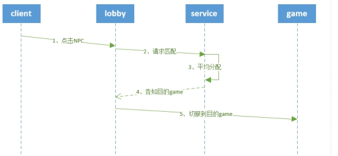

# 游戏玩法

​		这里介绍简易网络服模板的玩法实现，包括NPC以及匹配两块内容。

​		简易网络服模板的大厅服中有三个NPC，玩家点击NPC可以实现切服功能。点击NPC-A显示GameA在线人数，可以跳转到包含AwesomeGameMod的GameA，GameA实现的是常规的生存服。点击NPC-B可以显示GameB在线人数，可以跳转到包含TutorialGameMod的GameB，在GameB的聊天栏中输入“钻石剑”，可在背包中获得钻石剑*1。点击NPC-C可以实现简单匹配，当匹配中玩家≥2人时，将这些玩家传入gameC服。在每个Game服中，都有一个返回大厅NPC。


## NPC

### NPC实现

​		npc由npc插件实现，只需要配置插件里的mod.json，即可生成对应npc。具体配置如下:
```python
{
  "_comment":"mod的名字",
  "netgame_mod_name":"neteaseNpcDev",

  "_comment":"mod的版本号",
  "netgame_mod_version":"1.0.4",

  "_comment":"适用最低的引擎版本",
  "min_app_version":"1.15.0.release20191226",

  "_comment":"该服务器Mod隶属于“功能NPC”插件",
  "description":"Npc mod插件",

  "_comment":"适用的服务器类型",
  "support_server_type":["lobby","game"],

  "_comment":"作者名字",
  "author": "NetEase",

  "_comment":"NPC类型参数配置",
  "NPCS_TYPE": {
    "_comment":"typeId，和NPCS_DISTRIBUTE中的typeId对应",
    "1001":{
      "name": "NPC-A",
      "identifier": "minecraft:npc",
      "simpleStyle": false,
      "modName": "Minecraft",
      "systemName": "AwesomeLobby",
      "funcName": "OnNpcTouched",
      "funcArgs": ["gameA"]
    },
    "1002":{
      "name": "NPC-B",
      "identifier": "minecraft:npc",
      "simpleStyle": false,
      "modName": "Minecraft",
      "systemName": "AwesomeLobby",
      "funcName": "OnNpcTouched",
      "funcArgs": ["gameB"]
    },
    "1003":{
      "name": "NPC-C",
      "identifier": "minecraft:npc",
      "simpleStyle": false,
      "modName": "Minecraft",
      "systemName": "AwesomeLobby",
      "funcName": "OnNpcTouched",
      "funcArgs": ["gameC"]
    },
    "1004":{
      "name": "返回大厅NPC",
      "identifier": "minecraft:npc",
      "simpleStyle": false,
      "modName": "AwesomeGame",
      "systemName": "FpsServerSystem",
      "funcName": "OnNpcTouched",
      "funcArgs": ["lobby"]
    },
    "1005":{
      "name": "返回大厅NPC",
      "identifier": "minecraft:npc",
      "simpleStyle": false,
      "modName": "Minecraft",
      "systemName": "TutorialGame",
      "funcName": "OnNpcTouched",
      "funcArgs": ["lobby"]
    },
    "1006":{
      "name": "返回大厅NPC",
      "identifier": "minecraft:npc",
      "simpleStyle": false,
      "modName": "Minecraft",
      "systemName": "gameMod",
      "funcName": "OnNpcTouched",
      "funcArgs": ["lobby"]
    }
  },
  "_comment":"NPC分布列表",
  "NPCS_DISTRIBUTE": [
    {
      "typeId" : "1001",
      "server" : "lobby",
      "pos" : [1396, 4, 57],
      "orientations" : [0, 180],
      "dimensionId" : 4
    },
    {
      "typeId" : "1002",
      "server" : "lobby",
      "pos" : [1403, 4, 57],
      "orientations" : [0, 180],
      "dimensionId" : 4
    },
    {
      "typeId" : "1003",
      "server" : "lobby",
      "pos" : [1410, 4, 57],
      "orientations" : [0, 180],
      "dimensionId" : 4
    },
    {
      "typeId" : "1004",
      "server" : "gameA",
      "pos" : [5, 4, 5],
      "orientations" : [0, 180],
      "dimensionId" : 0
    },
    {
      "typeId" : "1005",
      "server" : "gameB",
      "pos" : [5, 4, 5],
      "orientations" : [0, 180],
      "dimensionId" : 0
    },
    {
      "typeId" : "1006",
      "server" : "gameC",
      "pos" : [5, 4, 5],
      "orientations" : [0, 180],
      "dimensionId" : 0
    }
  ]
}


```
###  功能验证

用MCStudio进入游戏，可以看到玩家前方有三个NPC：


### NPC插件总结：

- 创建NPC前，用CheckChunkState函数检查chunk状态。
- 推荐用定时器创建NPC。


## 匹配

### 匹配的设计

​		点击NPC-C后，把多个玩家匹配分配到GameC。匹配是把多个玩家分配到另外一个单独服务器的过程，它是全服单点逻辑，建议在service实现匹配功能。

通常匹配功能设计思路如下：

*   lobby向service请求匹配。
*   service包含一个待匹配玩家队列。玩家中途退出时，需要将该玩家从队列中剔除。
*   service每帧遍历所有待匹配玩家，根据一定算法，将多个玩家分配到指定game服务器。
*   service告知game，玩家即将进入，并告知玩家信息。
*   service告知所有玩家切服到指定game。
*   玩家进入game，完成匹配过程。


### 简易网络服模板匹配功能开发

匹配过程如下所示：


*   lobby服务端开发

服务端监听EntityBeKnockEvent事件，处理点击NPC行为，根据NPC的种类，处理不同的请求。点击NCP-A和NPC-B需要向master查询GameA和GameB的在线人数，点击NPC-C需要处理匹配逻辑。核心代码如下：

```python
class AwesomeServer(ServerSystem):
	...
	
	def OnNpcTouched(self, npc_entity_id, player_entity_id, gameType):
		'''
		点击npc回调函数。
		'''
		uid = self.playerid2uid[player_entity_id]
		if gameType == 'gameA':
			logger.info("%s touch NPC gameA",player_entity_id)
			#请求gameA玩家人数
			request_data = {'game': 'gameA', 'player_id': player_entity_id,'uid': uid,'client_id':netgameApi.GetServerId()}
			self.NotifyToMaster(modConfig.GetPlayerNumOfGameEvent,request_data)
		elif gameType == 'gameB':
			logger.info("%s touch NPC gameB",player_entity_id)
			#请求gameB玩家人数
			request_data = {'game': 'gameB', 'player_id': player_entity_id, 'uid': uid,
							'client_id': netgameApi.GetServerId()}
			self.NotifyToMaster(modConfig.GetPlayerNumOfGameEvent, request_data)
		elif gameType == 'gameC':
			logger.info("%s touch NPC gameC",player_entity_id)
			# 请求gameC匹配队列人数
			request_data = {'uid': uid, 'player_id': player_entity_id, 'game': 'gameC'}
			self.RequestToService(modConfig.awesome_match, modConfig.RequestMatchNum, request_data)

	def OnSureGame(self,args):
		'''
		切服逻辑，如果是gameA和gameB则直接传去对应服，如果是gameC则加入匹配队列
		'''
		logger.info("OnSureGame {}".format(args))
		if args['game'] == "gameA":
			netgameApi.TransferToOtherServer(args['playerId'], "gameA")
		elif args['game'] == "gameB":
			netgameApi.TransferToOtherServer(args['playerId'], "gameB")
		elif args['game'] == "gameC":
			playerId = args['playerId']
			uid = self.mPlayerid2uid[playerId]
			levelcomp = self.CreateComponent(playerId, modConfig.Minecraft, "lv")
			playerLevel = levelcomp.GetPlayerLevel()
			if playerLevel >= 0:#大于0级才能匹配
				request_data = {'uid': uid, 'player_id': playerId,'game':args["game"]}
				self.RequestToService(
					modConfig.awesome_match, 
					modConfig.RequestMatch, 
					request_data
				)
				tipData = {'tipType' : TipType.matching} #1匹配中
				self.NotifyToClient(playerId, modConfig.MatchResultTip, tipData)
			else:
				tipData = {'tipType': TipType.levelNotEnough} #0等级不够
				self.NotifyToClient(playerId, modConfig.MatchResultTip, tipData)
	def OnMatchResultEvent(self, args):
		'''
		处理匹配结果。切到指定服务器。
		'''
		logger.info("OnMatchResultEvent {}".format(args))
		playerId = args['player_id']
		desc_game = args['desc_game']
		if args['game'] == 'gameC':
			#如果是gameC则延时1S传送
			tipData = {'tipType': TipType.toTransfer}  # 2 即将传送
			self.NotifyToClient(playerId, modConfig.MatchResultTip, tipData)
			self.mTransferPlayerQueue.append(playerId)
			CoroutineMgr.StartCoroutine(self.Transfer2Server(playerId, desc_game))
	def Transfer2Server(self,playerId,descGame):
		'''
		把玩家传送至对应的服
		'''
		yield -30
		#判断玩家是否在待传送队列里，若玩家中途下线，则不作处理
		if playerId in self.mTransferPlayerQueue:
			netgameApi.TransferToOtherServerById(playerId, descGame)
			self.mTransferPlayerQueue.remove(playerId)
```
- service开发

service监听UpdateServerStatusEvent事件，可以获取所有game的状态，这些可用game构成了可用资源池。当有玩家请求匹配时，则从可用资源池中分配资源（也就是匹配算法），然后告知玩家。核心代码如下：	

```python
class AwesomeService(ServiceSystem):
	def __init__(self, namespace, systemName):
		ServiceSystem.__init__(self, namespace, systemName)
		self.mFrameCnt = 0
		self.mPlayerServer = {}
		self.mGameCMatchingPlayer = []#gameC的匹配玩家
		self.mActiveGameServerIds = [] #可用game列表
		self.mGameStatus = {}#serverid => server status.server status:
        #注册service接口
		self.RegisterRpcMethod(modConfig.awesome_match, modConfig.RequestMatch, self.OnRequestMatch)
		self.RegisterRpcMethod(modConfig.awesome_match, modConfig.RequestMatchCancel, self.OnRequestMatchCancel)
		self.RegisterRpcMethod(modConfig.awesome_match, modConfig.RequestMatchNum, self.OnRequestMatchNum)

	def OnRequestMatchCancel(self,server_id, callback_id,args):
			logger.info("OnRequestMatchCancel {}".format(args))
			player_id = args["player_id"]
			if player_id in self.mGameCMatchingPlayer:
				self.mGameCMatchingPlayer.remove(player_id)

	def OnRequestMatchNum(self,server_id, callback_id, args):
		'''
		返回匹配队列人数
		:return:
		'''
		logger.info("OnRequestMatchNum {}".format(args))
		result_data = {
			'uid':args["uid"],'player_id':args["player_id"],
			'playernum':len(self.mGameCMatchingPlayer),
			"game": args["game"]
		}
		self.NotifyToServerNode(server_id, modConfig.MatchNumEvent, result_data)

	def OnRequestMatch(self, server_id, callback_id, args):
		'''
		请求匹配进入gameC的游戏
		'''
		logger.info("OnRequestMatch {}".format(args))
		player_id = args['player_id']
		self.mPlayerServer[player_id] = server_id
		#如果已经在匹配队列，则不加入匹配队列
		if player_id in self.mGameCMatchingPlayer:
			return
		else:
			logger.info("%s matching",player_id)
			self.mGameCMatchingPlayer.append(player_id)

	def GameCMatch(self):
		'''
		检查匹配队列，匹配成功，清空匹配队列
		:return:
		'''
		if not self.mGameCMatchingPlayer:
			return
		desc_game = -1
		if len(self.mGameCMatchingPlayer) >=2:
			desc_game = self.MatchAlgorithm()
		if desc_game == -1:
			return
		for i in range(len(self.mGameCMatchingPlayer)):
			playerId = self.mGameCMatchingPlayer[i]
			self.NotifyToServerNode(self.mPlayerServer[playerId], modConfig.MatchResultEvent, {'player_id': playerId,'desc_game':desc_game,'game':'gameC'})
		self.mGameCMatchingPlayer = []#清空匹配队列
		
	def Update(self):
		self.mFrameCnt += 1
		if self.mFrameCnt % 10 == 0:#10帧匹配一次
			self.GameCMatch()

	def MatchAlgorithm(self):
		'''
		匹配算法
		'''
		serverid = -1
		serverlistConf = serviceConf.netgameConf['serverlist']
		for serverConf in serverlistConf:
			if serverConf['type'] == "gameC":
				serverid = serverConf['serverid']
				break
		return serverid

	def OnUpdateServerStatusEvent(self, args):
		'''
		记录服务器状态
		'''
		logger.info("OnUpdateServerStatusEvent {}".format(args))
		self.mGameStatus = {}
		self.mActiveGameServerIds = []
		for server_id, status in args.iteritems():
			id = int(server_id)
			int_status = int(status)
			self.mGameStatus[id] = int_status
			if int_status == EServerStatus.OK:
				self.mActiveGameServerIds.append(id)
```
- Master开发

Master查询对应游戏玩家人数用。核心代码如下：	
```python
class AwesomeMaster(MasterSystem):
	... ...
	def GetPlayerNumOfGame(self,args):
		serverlistConf = masterConf.netgameConf['serverlist']
		print "OnGetPlayerNumOfGameResponse",args
		checkServeridList = []
		for serverConf in serverlistConf:
			if serverConf['type'] == args["game"]:
				serverid = serverConf['serverid']
				checkServeridList.append(serverid)
		playernum = 0
		for serverid in checkServeridList:
			playernum += serverManager.GetOnlineNumByServerId(serverid)
		request_data = {
			'game': args["game"], 
			'playernum': playernum,
			'player_id':args["player_id"]
		}
		self.NotifyToServerNode(
			args["client_id"], 
			modConfig.GetPlayerNumOfGameRequestEvent, 
			request_data)
```
用MCStudio进入游戏，点击不同的NPC发现切服到对应game。

备注：新建一个mod.json于ServiceMod/developer_mods/AwsomeService下面，mod.json的内容是
{
  	"netgame_mod_name": null,
 	 "netgame_mod_version": "1.0.0",
  	"min_app_version": null,
  	"author": null,
 	 "module_names": ["awsome_match"],
 	 "support_server_type": null
 	 "unsupport_app_version": null,
 	 "CustomPath": null
}

###  总结

- service监听UpdateServerStatusEvent事件，记录可用服务器列表。

- 匹配过程主要包括：请求匹配、匹配算法、玩家迁移。


