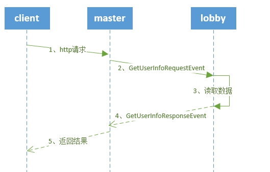

# 游戏外功能

## 运营指令

运营指令：接收外部http请求，处理游戏相关逻辑，比如给某个玩家发物品，公告等。

master是运营执行入口，开发者可以根据需要，把请求分发到lobby/game/service。下面给AwesomeGame新增一个运营指令，功能是打印指定玩家信息。

###  获取玩家数据运营指令

由于lobby是异步定时存档的，因此mysql数据可能不是最新的。这里实现方案是：

*   玩家在lobby，从对应lobby的内存中拉取玩家数据。
*   玩家不在lobby，选择任意一个可用lobby，从db中读取玩家数据。

处理过程如下所示：


master主要接受请求然后转发，核心代码如下所示：	

```python
class AwesomeMaster(MasterSystem):
	def __init__(self, namespace, systemName):
		MasterSystem.__init__(self, namespace, systemName)
		# 注册gm指令
		masterHttp.RegisterMasterHttp('/get-user-info', self, self.OnGetUserInfo)  				self.DefineEvent('GetUserInfoRequestEvent')
		self.ListenForEvent(
			'Minecraft', 'AwesomeLobby', 
			'GetUserInfoResponseEvent', 
			self, self.OnGetUserInfoResponse
		)

	def OnGetUserInfo(self, client_id, request_body):
		'''
		获取gm指令
		'''
		import ujson as json
		request = json.loads(request_body)
		uid = request['uid']
		redis_key_player = "online_user_%d" % uid
		#获取玩家在线状态
		redisPool.AsyncHgetall(
			redis_key_player, 
			lambda record:self._GetUserInfoCb(client_id, uid, record)
		)

	def _GetUserInfoCb(self, client_id, uid, record):
		'''
		回调函数。获取目标lobby，向lobby请求在线人数。
		'''
		serverid = None
		serverlistConf = masterConf.netgameConf['serverlist']
		if record:
			#若玩家在game中，则随机从一个lobby获取在线人数。
			serverid = record.get('serverid', None)
			tmpServerConf = masterConf.serverListMap.get(serverid, None)
			if not tmpServerConf or tmpServerConf['type'] != 'lobby':
				serverid = None
		if not serverid:
			for serverConf  in  serverlistConf:
				#服务器可用且是lobby
				if serverConf['type'] == 'lobby' \
and serverManager.IsValidServer(serverConf['serverid']):
					serverid = serverConf['serverid']
					break
		if not serverid:
			response = self.makeFailResponse(master_http.HTTP_CODE_FAIL, 'no valid lobby.')
			masterHttp.SendHttpResponse(client_id, response)
			return
		request_data = {'uid' : uid, 'client_id' : client_id}
		self.NotifyToServerNode(serverid, 'GetUserInfoRequestEvent', request_data)

	def OnGetUserInfoResponse(self, args):
		'''
		接受玩家数据，返回http请求。
		'''
		client_id = args['client_id']
		entity = args['user_info']
		response = self.makeResponse(master_http.HTTP_CODE_SUCCESS, '', entity)
		masterHttp.SendHttpResponse(client_id, response)
```
Lobby主要获取玩家数据，核心代码如下所示：
```python
class AwesomeServer(ServerSystem):
	def __init__(self, namespace, systemName):
		ServerSystem.__init__(self, namespace, systemName)
        self.ListenForEvent(
            modConfig.Minecraft, modConfig.MasterSystemName,                                         modConfig.GetUserInfoRequestEvent, 
            self, self.OnGetUserInfoRequest)
    
    def OnGetUserInfoRequest(self, args):
		'''
		获取玩家数据。
		'''
		uid = args['uid']
		client_id = args['client_id']
		player_data = self.mPlayerMap.get(uid, None)
		if not player_data:
			if self.mDBType == DbType.Mongo:
				self.mMongoMgr.QueryPlayerData(
				uid, uid,
				lambda data: self._OnGetUserInfoRequestCb(client_id, data))
			elif self.mDBType == DbType.Mysql:
				self.mMysqlMgr.QueryPlayerData(
				uid, uid,
				lambda data: self._OnGetUserInfoRequestCb(client_id, data))
		else:
			self._GetUserInfoResponse(client_id, player_data.toSaveDict())

	def _OnGetUserInfoRequestCb(self, client_id, record):
		'''
		回调函数，处理db操作结果，把玩家数据告知master。
		'''
		if record:
			player_data = playerData.PlayerData()
			player_data.initPlayer(-1, record)
			self._GetUserInfoResponse(client_id, player_data.toSaveDict())
		else:
			self._GetUserInfoResponse(client_id, {})

	def _GetUserInfoResponse(self, client_id, player_info):
		'''
		玩家数据告知master。
		'''
		response_data = {'client_id' : client_id, 'user_info' : player_info}
		self.NotifyToMaster('GetUserInfoResponseEvent', response_data)
```
###  验证

登录到开发机，然后给master发送curl请求，即可获取结果，如下图示：


## 官方运营指令

查看“服务器MOD SDK”中【运营指令】部分，里面介绍了常用的指令，比如禁言、踢人等。

## 总结

- 运营指令的实现通常分为两个步骤：

   - master接受响应指令，将指令请求转发到其他服务器；
  - lobby/game/serivce实现指令功能。

- 官方实现了常见的运营指令，具体可以查看“服务器MOD SDK”中【运营指令】部分。

