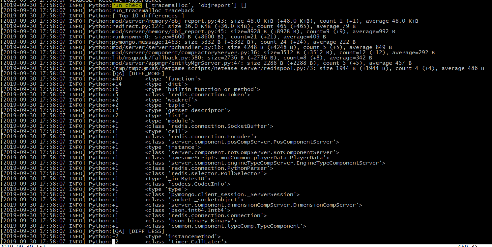
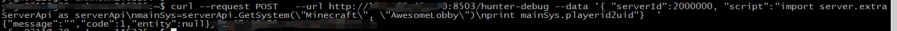
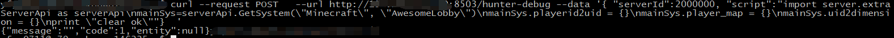

# 优化和维护

优化部分介绍如何查找脚本层内存泄漏。维护部分介绍如何追查线上问题。

## 内存检查

下面结合简易网络服模板介绍如何检查内存泄漏。

### 制造内存泄漏问题

lobby玩家退出时，不清理内存数据。按照下面方式修改代码：

```python
def OnDelServerPlayer(self, args):
	'''
	清除玩家内存数据。
	'''
	player_id = args.get('id','-1')
	uid = self.mPlayerid2uid.get(player_id, None)
	if not uid:
		return
	del self.mPlayerid2uid[player_id]
	# if uid in self.mPlayerMap:
	#	del self.mPlayerMap[uid]
	# if uid in self.mUid2dimension:
	#	del self.mUid2dimension[uid]
```
### 检查内存泄漏

然后给master发送check-memory-run指令，生成一个内存快照，结果如下图示：


查看lobby日志：


用MCStudio进入游戏，然后退出，再给master发送check-memory-run指令，再生成一次内存快照，结果如下图示：


再次查看lobby日志：


分析：

\[Top 10 differences\]记录占用内存最多的10行代码。简单分析下面日志：


obj_report.py文件43行占用内存最多，占用48k内存，实例个数为1，两次内存快照间增加了一个实例，平均每个实例占用48k。、

\[DIFF_MORE\]记录了内存变化最多的类型。简单分析下面日志：


两次内存快照间新增了一个PlayerData类型实例。

接着分析AwesomeGame内存泄漏问题。第一次内存快照时，没有玩家登录，接着玩家登录再登出，然后再生成了一次内存快照。第二次内存快照时，没有玩家在游戏中，因此服务端内存是不会有玩家数据，也即不会有PlayerData类型实例的。但是，\[DIFF_MORE\]中显示内存中还是多了一个PlayerData类型实例，这说明存在内存泄漏。


### 总结

*   check-memory-run指令可以检测两次内存快照间内存变化。
*   内存泄漏检查要点：在游戏平稳时生成内存快照（比如没有玩家登录登出），然后分析内存变化。

## Hunter

开发者先阅读“服务器MOD SDK”中“Hunter调试命令”部分。下面结合“AwesomeGame”网络游戏介绍如何在线调试mod。

### 获取lobby服在线玩家信息

用MCStudio进入游戏，然后给master发送/hunter-debug指令：


实质是在lobby中执行下面代码：

```python
import server.extraServerApi as serverApi
#获取AwesomeServer实例
mainSys=serverApi.GetSystem("Minecraft", "AwesomeLobby")
#打印玩家信息
print mainSys.mPlayerid2uid
```
执行结果需要查看lobby日志：


日志说明，lobby服只有一个玩家，日志打印了该玩家的player id和uid。

### 清空lobby服玩家信息

然后给master发送/hunter-debug指令：


实质是在lobby中执行下面代码：

```python
import server.extraServerApi as serverApi
#获取AwesomeServer实例
mainSys=serverApi.GetSystem("Minecraft", "AwesomeLobby")
#清除玩家信息
mainSys.mplayerid2uid = {}
mainSys.mPlayerMap = {}
mainSys.mUid2dimension = {}
print “clear ok”
```
执行结果需要查看lobby日志：


日志打印”clear ok”，说明清除成功。

### 总结

hunter-debug指令支持在线执行一段python脚本，使用该指令可以方便查看变量信息，修改变量内容。


