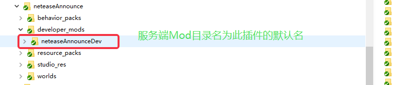

# 控制服务器Mod加载顺序

## 为每个Mod命名

* 在mod的根目录自主添加一个netease_require.json的文件，举例来说，对于【neteaseMonitor】这个Mod，就应该在【developer_mods/neteaseMonitor/】目录下创建netease_require.json文件
* 文件举例
```json
{
  "modName": "neteaseMonitor",
  "modRequire": [
  ]
}
```
*  其中，modName的值【neteaseMonitor】就是当前mod的名字，而modRequire的值为空list，说明当前Mod不需要其他任何前置Mod
*  假如json文件不存在，当前Mod的名字默认等于插件根目录下developer_mods文件夹下的服务端mod文件夹的名字


## 设置Mod的前置Mod
* 同样是在netease_require.json文件中，通过修改modRequire属性来设置当前Mod的前置Mod，服务器启动并加载某个Mod时，会尽量保证这个Mod的前置Mod已经加载完成。（假如设置中，出现循环require，那么会打印ERROR日志，但是依旧会加载mod，所有出现循环require的mod都会在最后加载）
* 举例，【neteaseMonitorSample】这个Mod依赖【neteaseMonitor】，需要在【neteaseMonitor】加载完毕之后才加载【neteaseMonitorSample】，那么【neteaseMonitorSample】的netease_require.json文件如下：
```json
{
	"modName":"neteaseMonitorSample",
	"modRequire":[
		"neteaseMonitor"
	]
}
```
* modRequire中的neteaseMonitor说明当前Mod需要在【neteaseMonitor】之后加载
*  假如json文件不存在，modRequire默认为空list，也就是没有加载顺序要求。