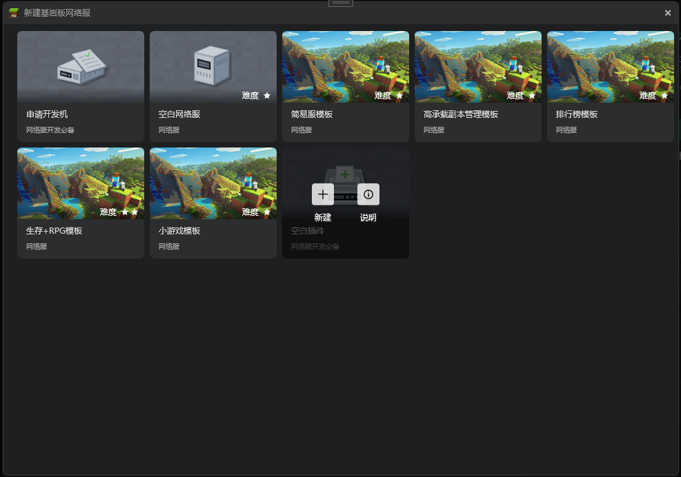
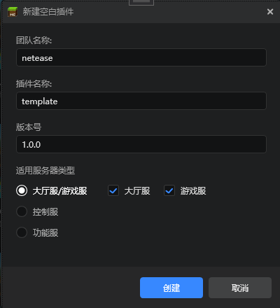
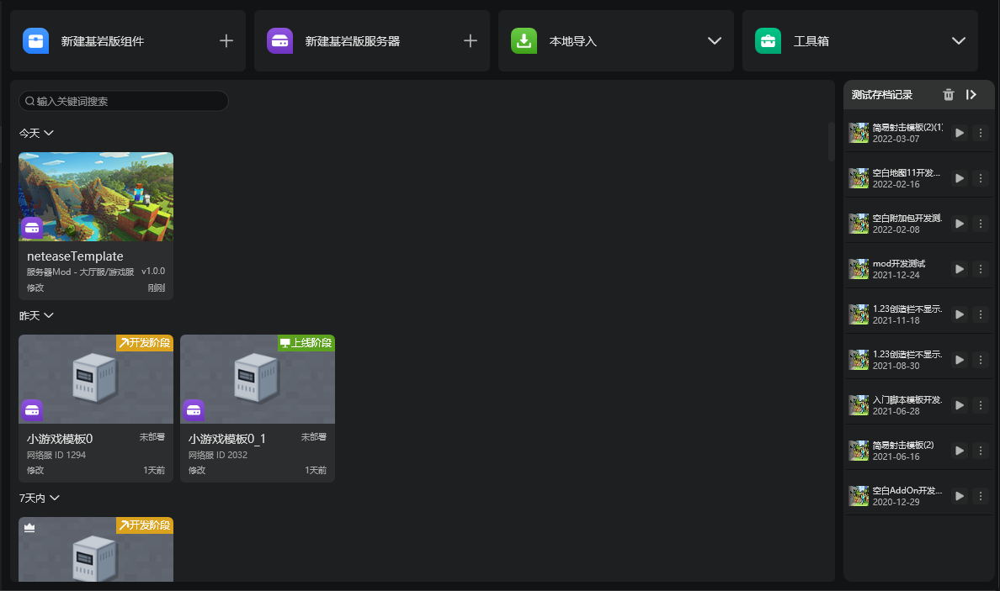

# 使用工作台新建插件
这个文档描述了如何使用工作台新建插件。

1. 在工作台的“创作”分页，点击新建基岩版服务器

2. 点击空白插件的新建按钮，以打开新建插件的弹窗。

3. 空白插件的说明是新建插件的简单介绍，下面的详细说明是插件的B站视频教程的链接。

4. 在基岩版服务器 - 插件分页里也有新建插件按钮，点击这个也可以弹出弹窗。

5. 新建插件的弹窗如下，输入团队名称，插件名称等，并进行勾选，点击创建即可完成一个空白插件的创建。

6. 创建完成的插件会直接显示在工作台中。

