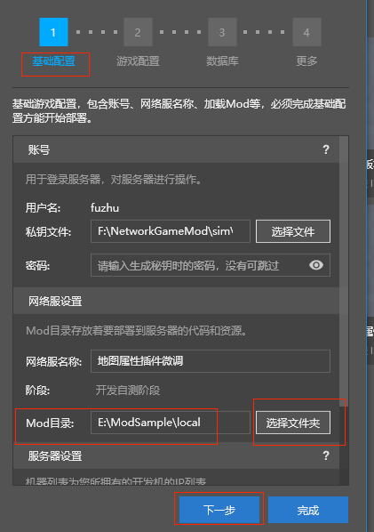

# 地图插件调整（下）


## 微调地图插件
### 阻止破坏耕地
* 查询ModSDK的事件，发现可以用【MobGriefingBlockServerEvent】实现目标功能

* 查询到耕地的identifier为【minecraft:farmland】
* 由于是服务端事件，所以对应代码中应该加入到【mapAttrsServerSys.py】中
```python
def Init(self):
	...
	util.ListenServerEngineEvent("MobGriefingBlockServerEvent", self, self.OnMobGriefingBlock)
	...
	
def OnMobGriefingBlock(self, data):
	# print "OnMobGriefingBlock", data
	if data["blockName"] in ("minecraft:farmland", ):
		data["cancel"] = True
```
### 阻止触发压力板、踩红石矿、踩拌线钩
* 查询ModSDK的事件，发现可以用【MobGriefingBlockServerEvent】实现目标功能

* 由于是服务端事件，所以对应代码中应该加入到【mapAttrsServerSys.py】中
```python
def Init(self):
	...
	util.ListenServerEngineEvent("StepOnBlockServerEvent", self, self.OnStepOnBlock)
	...
	
def OnStepOnBlock(self, data):
	# print "OnStepOnBlock", data
	data["cancel"] = True
```

## 部署修改后的插件
* 打开自定义目录的【neteaseMapAttrs】插件，放置一个【server.properties】文件（调整游戏的模式，方便调试修改后的效果）

* 修改【level-type】为【FLAT】（地形超平坦）
* 修改【gamemode】为【1】（创造模式）

* 为了能够执行创建耕地、放置压力板等操作，需要修改【neteaseMapAttrs】插件中的mod.json，把【open_map_protect】配置修改为false

* 点开【服务器配置】-->【选择文件夹】，修改【Mod目录】为放置修改后插件的自定义目录

* 点击【游戏配置】-->【大厅服】-->【Mod的下拉菜单】，勾选【neteaseMapAttrs(自定义目录)】

* 点击【游戏配置】-->【控制服】-->【Mod的下拉菜单】，勾选【neteaseMapAttrsMaster(自定义目录)】

* 选择【基岩版服务器】-->【网络服开发】-->【地图属性插件微调】-->点击【部署】，等待服务器部署完成

* 点击【开发测试】即可启动客户端，体验微调后的**地图属性插件**的功能

